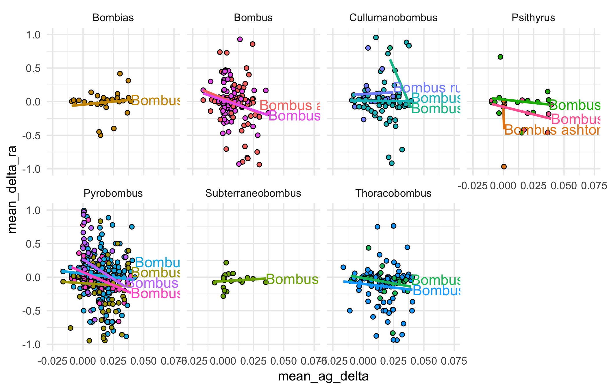
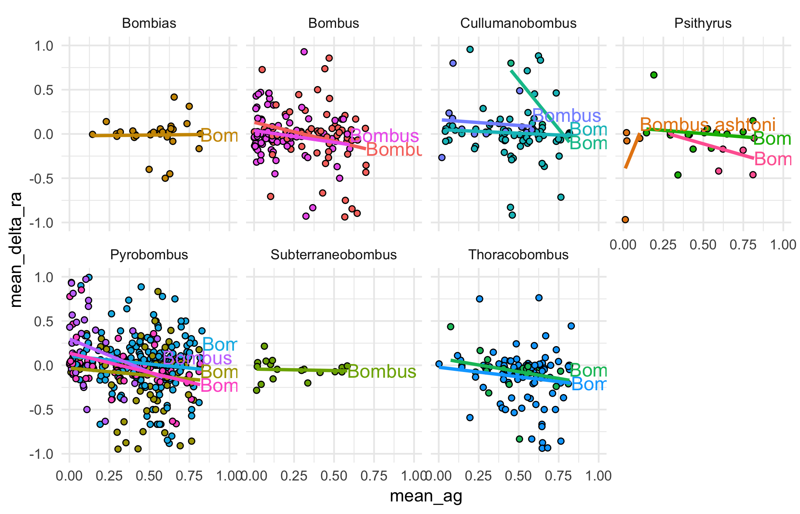
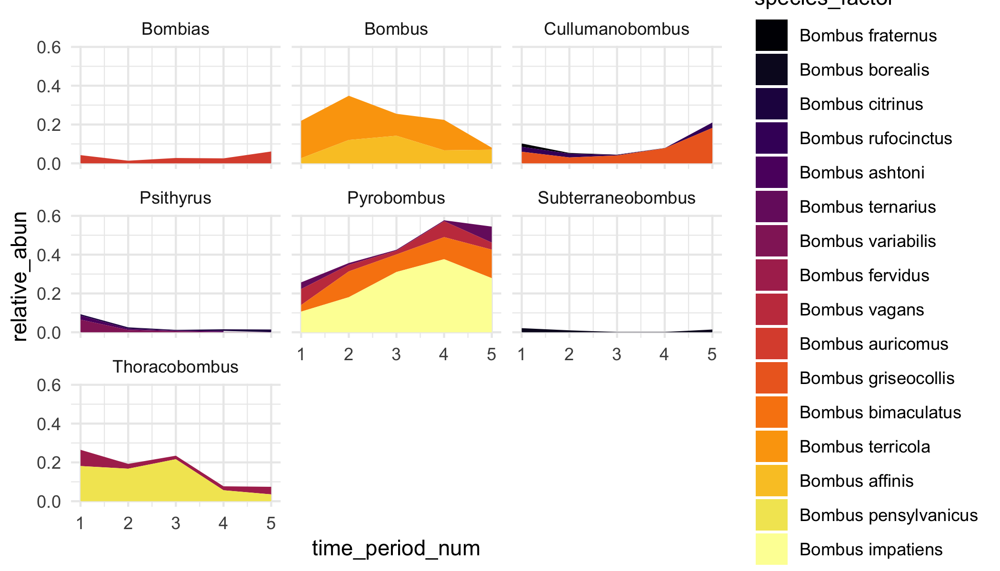

# Historical Ag and Bumble Bee Community/Abundance Changes
## Daily working notes and ideas

#### Summary Figures To Make: 

#### Data Checking

#### Data Cleanup

#### Notes
__January 7, 2019:__ Starting the initial data cleanup.  First step is to get all of the bumble bee ID's into the same format/tidy.  All 3 databases have entirely different data structure/organization.

New data frame columns: 
* `unique.id`
* `og_database`
* `database_id_1`
* `database_id_2`
* `database_id_3`
* `phylum` 
* `class`
* `order`
* `family`
* `genus` 
* `species` 
* `id_to_taxon`
* `sci_name`
* `country`
* `state`
* `county`
* `locality`
* `dec_lat`
* `dec_long`
* `elevation`
* `date` 
* `day`
* `month`
* `year` 
* `institution_code`
* `database_notes_1`
* `database_notes_2`
* `database_notes_3`

__January 8, 2019:__ Initial data cleanup is done.  Confined to lower 48 states, but did not include the IRC specimens yet as the data are horridly messy and need a lot of cleaning up.  Temporal trends in collection events actually look pretty good.  Well over 10000/decade from 1900 onward.  Today, need to clean up and do basic summary of ag data, along with some more basic summaries of bumble bees.  

Still some big differences in collection number per decade - perhaps randomly sample 

__January 14, 2019:__ Back-calculate total county area for all counties. Beyond 1997, will need to hand-calculate proportion of improved farmland from CDL (I think, unless additional data are out there)...

__April 23, 2019:__ Back again while abundance modeling is on hold for a bit! Goals are as follows: 
- [x] Relative changes by period for all spp. 
- [ ] Trait database based on Wood 2019 and others.  
- [x] Geographic scope of paper - entire US, or just eastern US?  May need some expertise help for the western bumble bee spp. and their traits, status, etc. 

__May 9, 2019:__ Issues with GBIF database found.  Apparently, there are records for vosnesenskii being in Illiois and WI?  I think the issue is that the specimens are in databases/collections in those places, but the collections obviously occurred elsewhere.  How to fix? Looks like there's a "basis of record" field in the GBIF data that could help filter out those? 

What constitutes "historical" vs. "contemporary" records?  Most papers it's a 2000 cutoff.  When are declines actually ocurring?  This really argues for looking at changes on a decadal manner to actually "see" changes in spp. composition and abundance, however I don't think we have the data to do so.  Need to check and see. Currently, my cutoff between historical and contemporary is 1970.  

__June 5, 2019:__ Fixed above issues by filtering only species known to be present in the upper midwest.  Also switched  to using a 2000 cutoff for contemporary vs. historical records.  I also plan to create a 4 category category, as well. 

__August 7, 2019:__ As of today, have rough trends in diversity and abundance done.  Now time to actually model change in those metrics as a function of agricultural area/itensity.  Will start by just using the agstat from USDA ag census, and will implement corn yields (bushels/acre) as well as a better metric of "intensity".  See paper by Shriar (2000) on the measurement of ag intensity.  

- change in geographic range?  Similar to Wood et al. (2019)
- use of traits (e.g., tongue length)? 
- crop diversity as metric of ag intensity? 
- crop yield as metric of ag intensity? 
- combine multiple metrics to create an index of agricultural itensity? 

__August 9, 2019:__ Created plot that relates average change in agricultural area (ratio) against average change in relative abundnace between 8 time periods by species.  

Created plot to show relative abundance per species by year as area: 

Want to explore abundance-based similiarity indices to see if communities (@ county level, state level) are becoming more homogeneous over time.  Another way to look at diversity trends over time other than rarefied species richness. Looks like the package `SpadeR` will work - uses Chao et al. publications in the function `SimilarityMult()` to calculate similarity index matrix for species x assemblage input matrix (in my case, assemblege = time bin).  

__August 12, 2019:__ Would be good for a state-level summary to see which states have seen the greatest changes in ag expansion/intensification along side average change in bumble bee relative abundance and estimated species richness/biotic similarity. 

__August 19, 2019:__ calculated change in range both in terms of percent change in counties and spatial change.  Biggest story comes from historical vs. contemporary.

__August 20, 2019:__ Calculated ag intensity metrics tonight.  Crop richness and evenness are pretty straightforward.  Some richness metrics of state x county x year had to be dropped as they're over 1 (counties that had so close to 0 ag that metric is far over 1).  Prop. cropland per county is also a bit off with these data.  About 1/5 of the data are over 1.  Change these values to 1 meaning entire county is under cultivation?  Fixed this - there were livestock density estimates buried in the crop proportions.  Now everything looks good! Combined and exported - ready to be combined with bumble bee data for analysis. 

__August 22, 2019:__ Created a column for unique collector x species x date x location to try and standardize sampling methods.  Takes number of records down from 25,271 to 9,666... Going to take a look at diversity and relative abundance trends to see if they're similar.  If so, like Leif, will do analysis on full rather than reduced dataset.  

* Diversity trends based on 5 or 8 timepoint bins are practically identical.  

* Relative abundance shifts are much cleaner with reduced data set (but generally display the same pattern as the full data set).  As expected, the picture for affinis is much closer to what we might expect (constant decline after 1940) rather than an increase in the last 10 years due to increased efforts in finding it.

Was going to include IRC records, but the data are a mess.  Dates wrong/missing, locality info limited.  Would add an additional ~2500 records if we can get the dates in order.  Good task for Grant on rain day. 

__August 26, 2019:__ Working today on a way to marry the historical ag data with the bumble bee records given disparity in time.  

Got records combined according to Ag census intervals.  Basic LMERs show some unexpected and consistent results, regardless of species: increae in crop_evenness leads to decrease in abundance, buit increase in prop_cropland or n_crops leads to increase in abundance.  Opposite of what is expected.  

A couple things: crop_evenness pattern changes over time.  Also, re-binning of data makes them much more uneven.

__August 29, 2019:__ Getting into shape for doing actual spatial regressions.  Issue currently: to marry data to SPDF of counties, can't have multiple species per county, nor time periods per species... each of spdf can only be of 1 county.  JK theres an argument called `duplicateGeoms` for this exact reason.  Reading is important, mmkay? 

__Sept 3, 2019:__ After meeting with claudio, plan is to pursue spatial regression modeling (either SAR or SEM) for each binned year and for each species for which we have enough data.  

Need to create a function that takes species and year as an input and then runs the model and summarises the output/results neatly and then run for all combinations of species/year.  For some of the ag input variables recently extracted from the ag census, we will be able to do a subset to try and point to more mechanisms of decline (that is if areal extent/crop diversity/evenness) don't pan out to be clear preditctors of relative abundance or changes in relative abundance.  

Need also to create concise summary of the changes in diversity/relative abundance in the absence of any predictors (a la Leif's 2018 paper) to setup the story.

**Species with sufficient data**
1. _B. impatiens_
2. _B. griseocollis_
3. _B. vagans_
4. _B. ternarius _
5. _B. bimaculatus_
6. _B. pensylvanicus_
7. _B. terricola_
8. _B. affinis_

