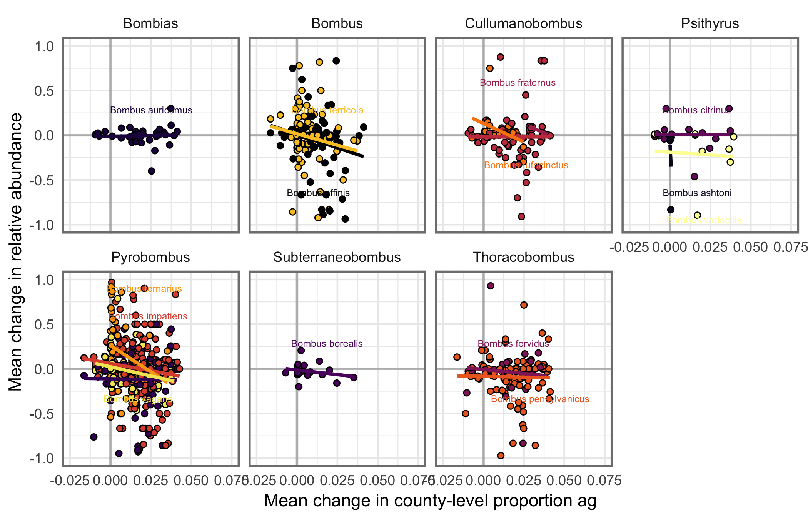
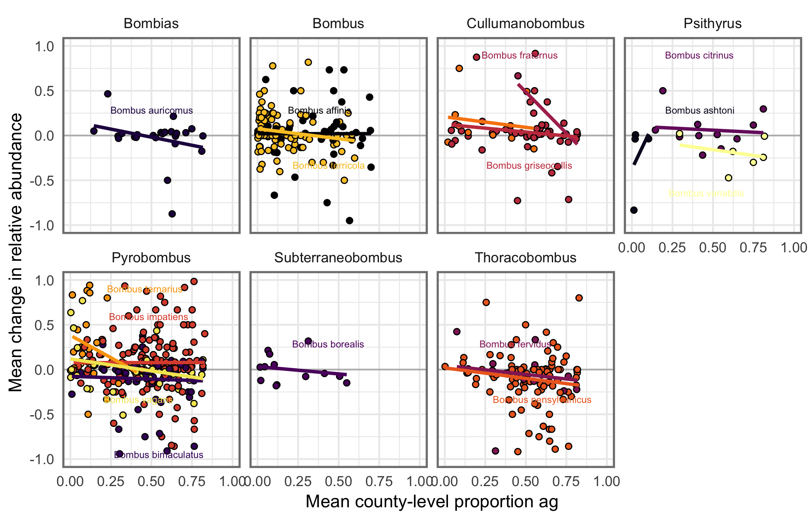
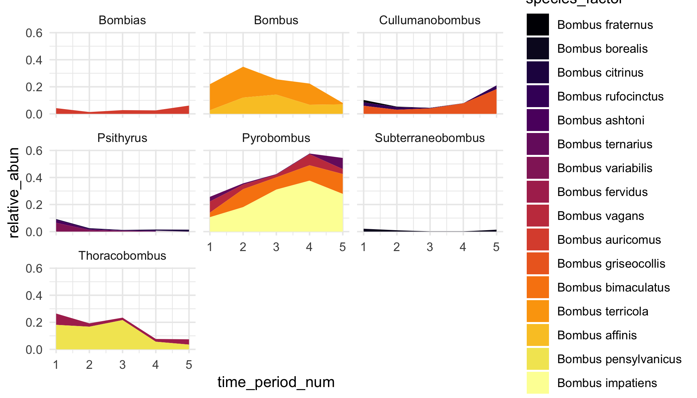

**Name:** Jeremy Hemberger
**Email:** j.hemberger.wisc@gmail.com
**Institution:** University of Wisconsin - Madison | Department of Entomology

# Notes
__January 7, 2019:__ Starting the initial data cleanup.  First step is to get all of the bumble bee ID's into the same format/tidy.  All 3 databases have entirely different data structure/organization.

New data frame columns: 
* `unique.id`
* `og_database`
* `database_id_1`
* `database_id_2`
* `database_id_3`
* `phylum` 
* `class`
* `order`
* `family`
* `genus` 
* `species` 
* `id_to_taxon`
* `sci_name`
* `country`
* `state`
* `county`
* `locality`
* `dec_lat`
* `dec_long`
* `elevation`
* `date` 
* `day`
* `month`
* `year` 
* `institution_code`
* `database_notes_1`
* `database_notes_2`
* `database_notes_3`

__January 8, 2019:__ Initial data cleanup is done.  Confined to lower 48 states, but did not include the IRC specimens yet as the data are horridly messy and need a lot of cleaning up.  Temporal trends in collection events actually look pretty good.  Well over 10000/decade from 1900 onward.  Today, need to clean up and do basic summary of ag data, along with some more basic summaries of bumble bees.  

Still some big differences in collection number per decade - perhaps randomly sample 

__January 14, 2019:__ Back-calculate total county area for all counties. Beyond 1997, will need to hand-calculate proportion of improved farmland from CDL (I think, unless additional data are out there)...

__April 23, 2019:__ Back again while abundance modeling is on hold for a bit! Goals are as follows: 
- [x] Relative changes by period for all spp. 
- [ ] Trait database based on Wood 2019 and others.  
- [x] Geographic scope of paper - entire US, or just eastern US?  May need some expertise help for the western bumble bee spp. and their traits, status, etc. 

__May 9, 2019:__ Issues with GBIF database found.  Apparently, there are records for vosnesenskii being in Illiois and WI?  I think the issue is that the specimens are in databases/collections in those places, but the collections obviously occurred elsewhere.  How to fix? Looks like there's a "basis of record" field in the GBIF data that could help filter out those? 

What constitutes "historical" vs. "contemporary" records?  Most papers it's a 2000 cutoff.  When are declines actually ocurring?  This really argues for looking at changes on a decadal manner to actually "see" changes in spp. composition and abundance, however I don't think we have the data to do so.  Need to check and see. Currently, my cutoff between historical and contemporary is 1970.  

__June 5, 2019:__ Fixed above issues by filtering only species known to be present in the upper midwest.  Also switched  to using a 2000 cutoff for contemporary vs. historical records.  I also plan to create a 4 category category, as well. 

__August 7, 2019:__ As of today, have rough trends in diversity and abundance done.  Now time to actually model change in those metrics as a function of agricultural area/itensity.  Will start by just using the agstat from USDA ag census, and will implement corn yields (bushels/acre) as well as a better metric of "intensity".  See paper by Shriar (2000) on the measurement of ag intensity.  

- change in geographic range?  Similar to Wood et al. (2019)
- use of traits (e.g., tongue length)? 
- crop diversity as metric of ag intensity? 
- crop yield as metric of ag intensity? 
- combine multiple metrics to create an index of agricultural itensity? 

__August 9, 2019:__ Created plot that relates average change in agricultural area (ratio) against average change in relative abundnace between 8 time periods by species.  

Created plot to show relative abundance per species by year as area: 

Want to explore abundance-based similiarity indices to see if communities (@ county level, state level) are becoming more homogeneous over time.  Another way to look at diversity trends over time other than rarefied species richness. Looks like the package `SpadeR` will work - uses Chao et al. publications in the function `SimilarityMult()` to calculate similarity index matrix for species x assemblage input matrix (in my case, assemblege = time bin).  

__August 12, 2019:__ Would be good for a state-level summary to see which states have seen the greatest changes in ag expansion/intensification along side average change in bumble bee relative abundance and estimated species richness/biotic similarity. 

__August 19, 2019:__ calculated change in range both in terms of percent change in counties and spatial change.  Biggest story comes from historical vs. contemporary.

__August 20, 2019:__ Calculated ag intensity metrics tonight.  Crop richness and evenness are pretty straightforward.  Some richness metrics of state x county x year had to be dropped as they're over 1 (counties that had so close to 0 ag that metric is far over 1).  Prop. cropland per county is also a bit off with these data.  About 1/5 of the data are over 1.  Change these values to 1 meaning entire county is under cultivation?  Fixed this - there were livestock density estimates buried in the crop proportions.  Now everything looks good! Combined and exported - ready to be combined with bumble bee data for analysis. 

__August 22, 2019:__ Created a column for unique collector x species x date x location to try and standardize sampling methods.  Takes number of records down from 25,271 to 9,666... Going to take a look at diversity and relative abundance trends to see if they're similar.  If so, like Leif, will do analysis on full rather than reduced dataset.  

* Diversity trends based on 5 or 8 timepoint bins are practically identical.  

* Relative abundance shifts are much cleaner with reduced data set (but generally display the same pattern as the full data set).  As expected, the picture for affinis is much closer to what we might expect (constant decline after 1940) rather than an increase in the last 10 years due to increased efforts in finding it.

Was going to include IRC records, but the data are a mess.  Dates wrong/missing, locality info limited.  Would add an additional ~2500 records if we can get the dates in order.  Good task for Grant on rain day. 

__August 26, 2019:__ Working today on a way to marry the historical ag data with the bumble bee records given disparity in time.  

Got records combined according to Ag census intervals.  Basic LMERs show some unexpected and consistent results, regardless of species: increae in crop_evenness leads to decrease in abundance, buit increase in prop_cropland or n_crops leads to increase in abundance.  Opposite of what is expected.  

A couple things: crop_evenness pattern changes over time.  Also, re-binning of data makes them much more uneven.

__August 29, 2019:__ Getting into shape for doing actual spatial regressions.  Issue currently: to marry data to SPDF of counties, can't have multiple species per county, nor time periods per species... each of spdf can only be of 1 county.  JK theres an argument called `duplicateGeoms` for this exact reason.  Reading is important, mmkay? 

__Sept 3, 2019:__ After meeting with claudio, plan is to pursue spatial regression modeling (either SAR or SEM) for each binned year and for each species for which we have enough data.  

Need to create a function that takes species and year as an input and then runs the model and summarises the output/results neatly and then run for all combinations of species/year.  For some of the ag input variables recently extracted from the ag census, we will be able to do a subset to try and point to more mechanisms of decline (that is if areal extent/crop diversity/evenness) don't pan out to be clear preditctors of relative abundance or changes in relative abundance.  

Need also to create concise summary of the changes in diversity/relative abundance in the absence of any predictors (a la Leif's 2018 paper) to setup the story.

**Species with sufficient data**
1. _B. impatiens_
2. _B. griseocollis_
3. _B. vagans_
4. _B. ternarius _
5. _B. bimaculatus_
6. _B. pensylvanicus_
7. _B. terricola_
8. _B. affinis_

__Sept 23, 2019:__ Have a skeleton function to automatically generate all spatial regression models based on morans I and LeGrange mult. tests.  

If too complicated, will revert to function that simple runs each possible model, but includes test results in final tibble so that unnecessary/supported tests can be dropped.

__Sept 24, 2019:__ Have a work flow for this function, but realizing now that if I am going to run models by each time point, we're very short of data (most data frames have < 20 points).  Models are estimating 6 parameters including fixed and spatial stuff.  

Solution: run models on binned data - increases samples for the model while maintaining predictors variables per each county.  Talk to Claudio about this...

__September 26, 2019:__ Spatial regression function is complete and works.  All but one species x year combination used standard OLS as the model framework (governed by moran and legrange tests).  

No really strong patterns emerge - number of crops (richness) has almost zero effect across the board.  Crop evenness seems to be mostly positive (which makes sense) across species, while prop_cropland is mostly negative (which also makes sense), but we lack statistical significance in all but hyper-abundant species (_B. impatiens_).

Would like to include additional counties as "pseudo-abscences".  Take historical counties and select from that set for each modeling round. 

Also try: 
1. modeling common vs. rare species as bin
2. modeling time period only independent of species 
3. modeling county-level species richness as a function of ag intensity 
4. include addn'l ag metrics including pasture/clover and pesticide/input metrics (likely will need sub-models given data restraints)

__October 1, 2019:__ Added pseudo absences and re-ran regressions.  Essentially the same output.  No clear trends, but maybe thats a cool story? 

Am not able to include all of the additional variables extracted (e.g., clover, avg. farm size, pasture, pesticides).  Will need to run those models likely on binned data (common vs. rare) for a smaller subset of years. 

To do for rest of day: build large script to bootstrap the random county selection and modeling procedure 1000 times and save output in list/df and plot average + basic 95% CI's for each estimate

To create:
1. Global model for each species regardless of time period (include bin_5 as covar)
2. Model county-level spp. richness 
~~3. Model common vs. rare (w/ and w/out pseudo absences)~~

How to deal with abundance of zeros in model now? 

__October 4, 2019:__ Just ran the first rare/common models. Most were run using SEM framework, a couple with lag, and ols as well.  I think there's a case to be made that since the majorit of models selected some sort of spatial structure that we should use SEM for all the models.  May also explore using subgenus as a bin - more biologically relevant (though the common vs rare/declining is also defensible - we would expect some similarity among species with the same trajectory)

**adjust spatial reg. function (eventually) to output all pertinent materials to a list (e.g., dfs, spatial weights matricies, models, and output) as items. 

__October 6, 2019:__ Built a few addintional functions/scripts that run models on binned data, as well as on data that have zeros and 1's removed (to improve normality of dataset).  
Also have played with weighting each model observation by the total number of collection events in that time period x county as a way to say that those counties have a greater survey intensity, therefore should have records more reflective of what's actually there.  May need to figure out a way to weight by not bumble bee watch records - i think that those are skewing the results quite a bit as people are likely to report rare spp. at higher frequency. To verify this, check proportion rare to common for GBIF vs. bumble bee watch

Addn'l, have scaled predictors:
`scale(x, scale = FALSE)` centers the predictors aroudn the mean.  Intercept here is the predicted y when all predictors are at their means.  Does not change coefficient estimates, but does change intercept.

`scale(x)` standardizes the predictors if they arent comparable given very different scales (e.g., proportion vs. acreage).  After, all means are 0 and variances 1.  Coefficients tell us how many SD the response changes given a 1 SD change in an independent variable when all others are held at mean.  Essentially, the largest beta coefficient is the best predictors of the response in this case (sort of - 1 SD change between predictors isn't necessarily comparable).  No need to interpret intercept - should be 0.  Must add `-1` to model formula to skip intercept. 

Evenness doesn't mean what I think it does.  Peak diversity in terms of number of crops grown was right around 1900-1920.  Ever since then, declining till today where it's bewtween 2-15 crops (avg. ).  Within each county, there tends to be a specialization in crops which leads to higher evenness.  We need a better metric here.  

What are the best ways to measure ag intensity? straight proportion?

__October 11, 2019:__ Met with Ben Zuckerberg and his postdoc Laura.  They suggested that occupancy modeling could work for this dataset.  Additionally, suggested presence/absence modeling could be a good approach for my thesis.

Met with Claudio as well, and I think a GLM for each species with the variables of interest and time are appropriate (similar to Bartomeus et al. 2013).  Weight each observation by the number of records in each county * time combination.  Additionally, try standardizing with entire dataset instead of relativizing by each temporal bin.

__October 12, 2019:__ Was able to successfully run GLM models on reduced predictor set that include dhte most possible data (rel_abun ~ prop_cropland + n_crops).  Now working on plotting model effects with raw data included.  

Can we plot GLM output for each species x county x time given the ag vars for each county?  This would give us a map of probability of/proportional abundance over time.

__October 13, 2019:__
So cool!  Got the glm function working and it also spits out predicted plots for each variable!  Some striking patterns (and super significant predictors).  

Affinis surprisingly is predicted to increase over time.  Need to run model with and without bbwatch data or find a better way to standardize for rare species. 

Ran models limiting to single observer x species x location x time and the results are the same (same patterns, just different power in each glm).  

__October 14, 2019:__ 
Metric for GLM model fit: `1 - (Residual Deviance/Null Deviance)` essentially a version of r-squared.