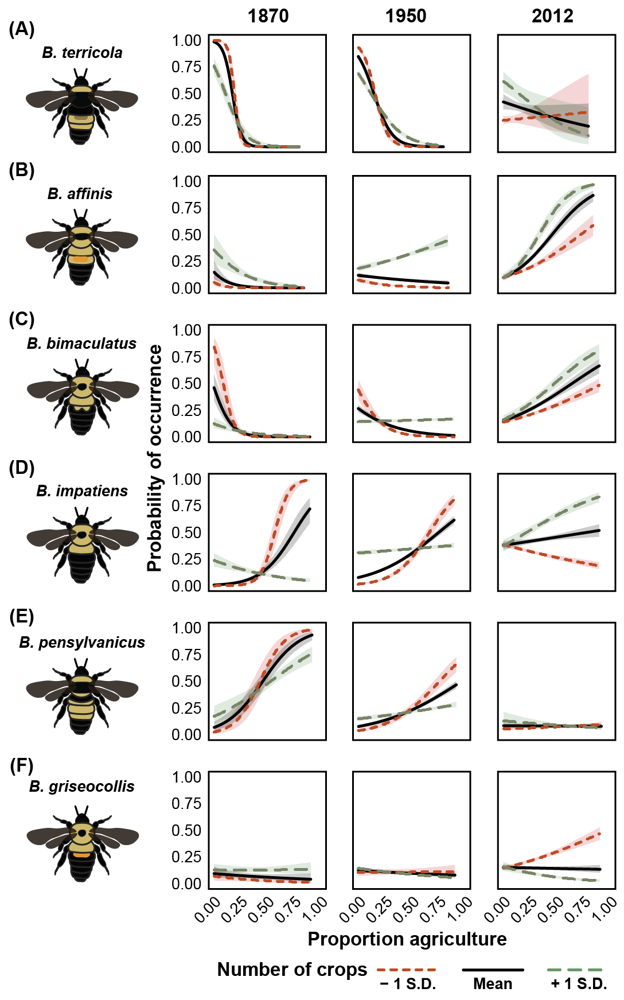

\captionsetup[table]{labelformat=empty}

# Introduction
Agriculture is a primary way in which humans alter terrestrial landscapes and is cited as a principle cause of biodiversity declines worldwide [@Foley2005a; @Foley2011b; @Klein2007g; @Tilman2011; @Tscharntke2012]. In particular, the intensification of agriculture, that is, the widespread planting of crop monocultures, managed for high productivity promoted by fertilizers and pesticides, and high disturbance agronomic practices such as tillage, has been associated with the extensive loss of a number of ecosystem service providing taxa [@Benton2002; @Robinson2002; @Meehan2010a]. There is circumstantial evidence that agricultural practices are an important driver of the recently documented, large-scale decline of insects [@Hallmann2017; @Seibold2019]. Pollinating insects, specifically bees, may be particularly impacted, sounding alarms across the world to consider the consequences for natural and agricultural systems [@Steffan-Dewenter2005c; @Tylianakis2013a].

Bumble bees (Apidae: _Bombus_) are a well-studied bee taxon that includes many species documented to be declining across Europe and North/South America [@Biesmeijer2006; @Colla2008; @Grixti2009; @Cameron2011; @Bartomeus2013; @Morales2013; @Wood2019]. Of several putative drivers of bumble bee decline including climate change [@Kerr2015; @Soroye2020] and pathogens [@Cameron2011; @Szabo2012]. many studies point to agricultural intensification as another key driver of bumble bee population decline [@Grixti2009; @Goulson2015c]. Intensification includes both attributes within a farming system (i.e., pesticide use, number and types of crops used), and the effects on agricultural landscapes (i.e., amount of land in cultivation compared to natural habitats not used for agriculture). Despite the hypothesized threat of agricultural intensification to bumble bees, no studies have specifically tested the hypothesis that long-term patterns of changes in agriculture are associated with changes in bumble bee occurrence. In general, this is due to a paucity of long-term data of both bumble bee occurrence and historical agricultural patterns at sufficiently large spatial scales.

While contemporary studies examining bumble bee responses to agriculture provide some insights, historical data from archives such as museum records, are important tools to explore patterns of bumble bee change over the course of decades, and offer insights of drivers at temporal and spatial scales that elude detailed, small-scale experimental approaches [@Meehan2011; @Rosenheim2017]. The continued addition of records to repositories such as the Global Biodiversity Information Facility (GBIF) combined with modern, extensive surveys of bumble bee fauna (e.g., Bumble Bee Watch, iNaturalist) offer widespread, species-specific spatial distribution patterns. Moreover, analyses of records from such repositories have benefited from analytical approaches that account for known biases in archival data [@Pearce2006; @Bartomeus2013; @Bartomeus2019].

To test the hypothesis that long-term bumble bee occurrence trends are associated with patterns of agricultural intensification, we utilized an extensive data set of historical bumble bee museum records and modern citizen-science surveys for the North Central USA and combined this with a newly available digital dataset of agronomic metrics compiled from United States Census of Agriculture over the period 1870-2018 (Crossley et al. _in review_).

We predicted that increasing agricultural intensification, as measured by the amount cropland and cropland treated with insecticides, would be negatively associated with bumble bee occurrence [@Williams2009; @Goulson2008c; @Goulson2015c; @Samuelson2018]. In contrast, we expected that features of agricultural landscapes that increase diversity, such as higher richness of crops grown, and low intensity agronomic practices, such as the presence of perennial landscape features such as pastures, would be positively associated with bumble bee occurrence [@Sirami2019].

# Results
## Agricultural extent remains similar while crop richness has declined
From the onset of available land-use records in the 1870s, agricultural landcover increased rapidly and began to plateau by the early 1900s. The areal extent of cropland peaked in the study region in 1950 (45% ± 0.9% of county area, mean ± standard error). Since then, it has decreased ~11% to an average of **34% ± 0.9%** in 2017 (Fig. 1A,B). There are within-region differences in agricultural cover with northern areas of the study region remaining relatively low in agricultural cover, while the highest intensity of agricultural cover occurs in the “corn belt” that stretches through southern Minnesota, Iowa, southern Wisconsin, central and northern Illinois, and northern Indiana. Of the 18 crops for which we compiled data, an average of 12 ± 1 were grown per county from 1880 – 1950. Since 1950, this number has declined ~50%, with counties today growing on average 6 ± 1 crops (Fig. 1 C,D).

The additional agricultural intensification variables that we utilized, available for the last 3 decades, showed diverging patterns, with proportion of pasture declining 90% from 1982 to present from an average of 3% of county area in 1982 to 0.3% in 2012, while the proportion of total county area treated with insecticides increased 54% from an average of 11% of county area in 1982 to 17% in 2012. (Fig. S6). These changes occurred over similar spatial extents, primarily concentrated in the corn-belt counties throughout the middle of the study region.

## Bumble bee species richness has declined
Rarefied species richness estimates for the study region declined significantly over the last 130 years; 20% over the study period from approximately 15 to 12 species from 1824-1925 to present, respectively (Fig. 2, Linear model: t~1,13~ = 6.084, p = 0.0283; Permutation test: p = 0.03). A sharp drop in estimated species richness occurred between in the 1950s, followed by a slight rebound in the next 50 years.

# Patterns of bumble bee occurrence are related to agricultural intensity
We found strong, interacting relationships between the predicted probability of occurrence, measures of agricultural intensity, and time, indicating fluctuating species responses based on both the agricultural conditions in the county and the time period. Predicted responses revealed that the probability of species occurrence increased in accordance with crop richness (with the exception of _B. griseocollis_) (Fig. 3). Moreover, most species, namely _B. affinis_, _B. bimaculatus_, _B. impatiens_, revealed high occurrence probabilities in counties under extensive cultivation (proportion cropland > 0.5), provided the number of crops grown was high (> 11 crops per county).

Other species, such _B. pensylvanicus_, revealed increasing sensitivity to intensive agriculture over time. For example, probability of occurrence in areas of historically intensive agriculture (proportion of cropland = 0.9, number of crops < 11) has declined well over 50% from 1900 to present. For _B. pensylvanicus_, the number of crops had little impact in the patterns of predicted occurrence; model predictions revealed a decrease in predicted occurrence across the range of crop richness in our data. Similarly, _B. impatiens_ revealed a strong temporal interaction between proportion cropland, number of crops, and time, with the predicted occurrence in extensive areas with few crops decreasing only after the middle of the 20th century.

Our models also revealed clear spatial patterns for the expected change in predicted species occurrence given county-level statistics of agricultural intensification (Fig. 4A, D). When the temporal trend in predicted occurrence is examined for each species/county, two distinct patterns in the likelihood of occurrence emerge for species of conservation concern, and common species, respectively (Fig. 4B, C, E, F), with the occurrence of species of conservation concern becoming less likely, while the other focal species become increasingly common.

For more recent years (1982-2018) when additional types of agricultural data were available, we found that the extent of pasture and insecticide use also impacted the predicted probability of occurrence. Again, there were significant interactions among the agricultural metrics and time  (see Figs. S1-S6, Table SX) As with previous models, predicted occurrence increased with increasing crop diversity, except for _B. griseocollis_ (Fig. SX) and _B. pensylvanicus_ (Fig. SX). Additionally, the predicted probability of occurrence increased for all species except _B. pensylvanicus_ in counties with increasing proportion pasture and decreasing coverage with insecticides, although the predicted impact of pesticides on occurrence was notably weaker than crop richness or proportion pasture. This pattern was particularly apparent for, _B. terricola_, whose occurrence was only predicted in counties with high crop richness, high proportion of pasture, and low proportion of land treated with insecticides (Fig. SX).

# Discussion
Using bumble bee observations recorded over 130 years across 6 agriculturally important US states and a novel dataset on the historical patterns of agricultural land use and practices, we explored the hypothesis that agricultural intensification is associated with bumble bee occurrence. In doing so, we take special care to account for biases associated with historical collections and employed a variety of techniques including subsampling and sensitivity analyses to determine whether our chosen methods skewed results [@Bartomeus2019]. Irrespective of the approaches used, we consistently identified clear statistical associations between bumble bee species occurrence and metrics of agricultural intensity. After accounting for temporal trends in bumble bee occurrence, it appears that increases in agricultural intensity in the landscape favor a select few bumble bee species at the expense of others.

Contrary to expectations, our results suggest that the extent of agricultural land is not the sole predictor of the fate of bumble bee species, as the manner in which agriculture is practiced also affected occurrence patterns. For example, our model revealed that several bumble bee species had a high predicted probability of occurrence within agriculturally extensive landscapes in the early 1900's. However, a rapid decrease in crop richness from the 1930's onward was associated with a decrease in the predicted occurrence of several bumble bees. Together, these changes suggest that the post-war era intensification of agriculture, with its loss of crop diversity and pastures and increasing pesticide use [@Meehan2011; @Meehan2015; @zym], rather than the areal expansion of agriculture, has been a major driver in the shift of bumble bee communities. Indeed, these patterns parallel the decline of insect pollinators [@Ollerton; @Fox.2013] and biodiversity [@Robinson2002] in the UK, bumble bee declines in Illinois [@Grixti2009], as well as wildlife declines within the same geographic range of our study [@Lark.2020]. Moreover, the predicted occurrence of the majority of bumble bee species examined increased with increasing crop richness across the temporal span of our data, as well as perennial cropping areas such as pasture for more recent records.

Paragraph here about balance of winners/losers?

The patterns revealed in this analysis suggest opportunities for bumble bee conservation within agricultural landscapes. Even landscapes with a high areal extent of agriculture may still support both common and declining bumble bee species provided there is a high diversity of crops, perennial features such as pasture, and limited insecticide use. @Sirami2019 found a similar pattern for farmland biodiversity: increasing the diversity of crops and decreasing field size had a large, positive effect on multi-trophic indices of biodiversity. Our results provide additional evidence that agricultural landscape heterogeneity is key to supporting farmland biodiversity [@Benton2003; @Fahrig2011b]. Such changes may also benefit growers who have hardly seen profit from the corn and soybean dominated markets of the last decade [@USDA]. It is important to note, however, that the ideal agricultural conditions for the occurrence of most bumble bee species we examined, particularly with regard to the number of crops grown, are no longer present in Midwestern agricultural landscapes. As of 2017, almost all counties grow fewer than 10 crops, and most highly agricultural counties are dominated by even a smaller subset, yet.

Agricultural intensification is also correlated with a decrease in the amount of other natural habitats that support diverse floral habitat such as grasslands [@Smith1998; @Brown2011] and bumble bee forage plants [@Carvell2006b; @Scheper2014], as well as increases insecticide use [@Meehan2011; @Meehan2015]. A shift from the diverse cropping systems of the early to mid 1900’s to largely monocultural systems in recent years has also altered the temporal continuity of available floral resources @Schellhorn2015c; @Timberlake2019] and total pollen availability, which has been shown to negatively impact bumble bee health [@Vaudo2015; @Cameron2020], colony growth and development [@Williams2012b; @Hass2018a], and may be of particular concern for species with more limited diet breadths [@Kleijn2008; @Wood2019]. Future studies could be designed to explore, for example, contemporary relationships between bumble bee abundance and gradients of agricultural intensity such as crop diversity and areal amount of agriculture to reveal a more mechanistic understanding of how select agricultural factors are impacting bumble bee populations. Lastly, population changes in other pollinating taxa, especially wild bees, may also be related to the increases in agricultural intensity described here. Compiling occurrence records for those species with sufficient spatiotemporal data coverage would allow a more thorough assessment of the impacts of agricultural intensification on pollinators writ large.

Changes in agricultural intensity are unlikely to be the sole direct cause of bumble bee declines, but could be associated with other impactful agricultural practices [such as pathogen spillover from greenhouse operations, @Szabo2012] or anthropogenic processes [e.g., climate change @Kerr2015; @Soroye2020] that have more direct effects on bumble bees. Global warming over the last century has been linked to a widespread, gradual decline in bumble bee, while the declines in our study only became apparent since the 1950s.  Additionally, a recent focus on pathogen spillover from commercial bumble bees in managed greenhouse operations is thought to be another key factor driving bumble bee declines [@Cameron2011; @Szabo2012 and MORE]. While there is extensive evidence of pathogen impact on bumble bees, the temporal occurrence of declines relative to agricultural intensification that we present precede suspected pathogen-mediated declines [@Szabo2012], and the introduction of commercial bumble bees in US agriculture [CITE]. Together, a loss of suitable habitat via agricultural intensification, changing climatic norms, and the subsequent expansion of pathogens from commercial operations likely synergize to negatively impact bumble bees across the US [@Goulson2015c].

## Conclusions
Over the last 130 years, agricultural intensification has elicited strong pressures on animal populations, potentially favoring particular winners and losers in bumble bee communities in our agricultural landscapes. Our study supports a growing literature documenting the extent and temporal patterns of bumble bee declines in the Midwestern US, and further provides a first test of the hypothesis that agricultural intensification as a driver of changes in bumble bee occurrence and community composition over the last century. This work provides support to the hypothesis that the expansion and practices associated with modern productivity-based agriculture are potential drivers of other catastrophic declines observed in insect and arthropods in agriculturally dominated landscapes [@Hallmann2017; @Seibold2019]. The combination of our historical analysis along with a growing body of observational and experimental evidence suggests that changes to agricultural practices and policies that promote agricultural diversification at the landscape level may needed to limit additional declines of bumble bees in agricultural landscapes.

# Methods
We focused our study in the USA on the North Central states of Minnesota, Wisconsin, Iowa, Illinois, Michigan, and Indiana as these states share a similar biogeographic contexts and agricultural history. We limited our analysis to bumble bee species whose core ranges overlapped these states [@Williams2014], including: _B. affinis_ Cresson; _B. impatiens_ Cresson; _B. griseocollis_ DeGeer; _B. bimaculatus_ Cresson; _B. auricomus_ Robertson; _B. ternarius_ Say; _B. vagans_ Smith; _B. borealis_ Kirby; _B. citrinus_ Smith; _B. pensylvanicus_ De Geer; _B. fervidus_ Fabricius; _B. rufocinctus_ Cresson; and _B. terricola_ Kirby. Four species, _B. fraternus_, _B. perplexus_, _B. ashtoni_ (bohemicus), and _B. variabilis_, were not included in our analyses as they lacked sufficient records to meaningfully interpret changes in relative abundance and county occupancy over time. Of the study species, three (_B. affinis_, _B. terricola_ and _B. pensylvanicus_) are known to be in decline nationally and are of conservation concern [IUCN Red List; @Colla2008; @Jacobson2018a].

## Bumble bee record data
We obtained bumble bee records from the Global Biodiversity Information Facility (GBIF), querying for all records within our study region. These data were combined with records from the North American Bumble Bee Watch program by the Xerces Society for Invertebrate Conservation. In total, 25,271 records were compiled from GBIF from 1877 to 2017 and 2,611 from Bumble Bee Watch from 2007 to 2018 for a total of 27,882 unique records over 358 of 535 total counties in the study region (Fig. S1). The species contained in each dataset were mutually inclusive. We then filtered records to include only those which were appropriately geo-referenced (i.e., had associated longitude and latitude). Each record was assigned to a county based on its collection coordinates so that they could be matched to county-level agricultural census data. Bee and agricultural census data are therefore compared at the county-level.  Because 95% of records were from 1890 and beyond, we are confident that county assignments are accurate, as changes in county geographic extent in this region were largely complete by 1890 (Crossley et al. in review).

Temporal comparisons of museum and incidental records can be challenging due to non-standardized collection techniques as well as collector and spatial biases [@Bartomeus2013; @Richardson2018; @Bartomeus2019]. To account for this, we analyzed records using a variety of techniques to attempt to control for such biases. First, we filtered the dataset to include only “single individual” sampling events (i.e., unique combination of species, date, location, and collector), following @Richardson2018. All analyses described below were conducted using both the full and reduced datasets. Filtering to “single individual” sampling events did not impact our conclusions (Fig. S2), and thus we present results from the full dataset.

## Calculating bumble bee relative abundance
In order to estimate changes in bumble bee populations over time, we calculated the relative abundance of each species within each county by agricultural census year. Bumble bee records were binned with the closest agricultural census year (see section below “Pairing bumble bee records with historical agriculture dataset”), and we divided the total number of records of a given species by the total number of records for all species within each county-census year combination. We only calculated relative abundance where species were observed (i.e., no pseudo-absences were used). Additionally, we limited our analysis to only include county-year combinations with greater than 5 total bumble bee records to eliminate counties with limited sampling effort and where low numbers may artificially inflate the relative abundance of given species.

*Do we want to include this still? Sort of redundant*
## Estimating change in county occupancy
Changes in relative abundance may not fully capture declines if species remain stable in relative abundance in occupied counties while the number of occupied counties decreases over time, i.e., there are range restrictions but the relative abundance where they are found remains unchanged. To explore this possibility, we used the approach of @Bartomeus2013 and created a set of temporal bins of records such that there were approximately the same number of bee observations per temporal bin (`rbin` package in R). We used several binning strategies to determine if the number of bins affected our results [@Bartomeus2013], including a total of 5, 8, and 15 temporal bins. To account for changes in county-level occupancy (i.e., a proxy for the species range), we modeled the number of occupied counties per equal-record temporal bin using the midpoint year for each bin for each bumble bee species predicting number of counties occupied as a function of the time using a generalized linear model.

## Calculating temporal patterns of diversity
To estimate how bumble bee species richness has changed over time, we rarefied bee records to generate estimates of mean species richness for each equal-record temporal bins with 95% confidence intervals using the `iNEXT` package [@Hsieh2016].  All 15 species accumulation curves rapidly reached an asymptote, indicating that sample sizes were sufficient to capture bumble bee community diversity within each bin (Fig. S3). We then fit a linear model to determine the change in species richness over time. Because each time bin contained a different number of years, we used the midpoint of each bin as the value from which to construct the model. We also conducted a permutation test to determine if the correlation between species richness and time could have been observed by chance alone, since the assumption of normally distributed data for such a small sample in our linear model (e.g., n=5 bins) may be violated. Using the maximum number of permutations (given the number of bin time points), we randomly shuffled the temporal bin order, calculating the correlation between bin and species richness estimates in each permutation, with the p-value equaling the fraction of permuted correlation coefficients greater or less than the true chronological correlation coefficient. Estimated species diversity trends were consistent regardless of the number of bins (Fig. S4), however p-values varied with number of bins (significant and marginally significant trend for 15 and 8 bins, respectively, but not for 5 temporal bins).  We present results from the 15-bin analyses for estimation of species richness over time in order to portray the highest resolution of the estimated species richness pattern.

## Historical agricultural data
To assess the extent, diversity, and intensity of agriculture, we used county-level agricultural census data projected and geographically corrected by Crossley et al. (in review). Briefly, Crossley et al. (in review) analyzed the spatial patterns of 18 crops (occupying at least 5% of county area) at the county-level and computed county proportion of crop area and crop richness from 1840-2017, correcting for changing county boundaries using areal-weighting techniques. Our objective was to estimate county-level (n=535 counties) agricultural metrics, which included aspects of both extensive and intensive farming practices. We limited our metric calculations to the 18 most common crops which together represent over 80% of cropland area study region. For each county by census year, we calculated crop richness (range 0-18) and the proportion of county area in cropland (range 0-1) as our metrics of agricultural intensity.

From 1982 onward, the USDA Census of Agriculture also collected data for additional aspects of agricultural management that are hypothesized to influence bumble bees. These included the proportion of land in a county in pasture, as well as proportion of cropland treated with insecticides [@Meehan2011; @Meehan2015; @Meehan2016a]. We extracted these variables from the database but used them in a separate analysis for this more recent period (see "Statistical analyses" section below).

## Pairing bumble bee records with historical agriculture dataset
Because agricultural census data are collected every 10 years, not every bumble bee record was collected in a year coinciding with an agricultural census. Accordingly, we pooled bee records such that they were within ± 5 years of the nearest agricultural census date (e.g., bumble bee records from 1925-1935 were paired with the 1930 Census of Agriculture data). While this pairing may not perfectly reflect the state of agriculture experienced by collected bumble bees, we posit that it is still meaningful given that large, county-level changes in agricultural practices occurring over several decades are unlikely to manifest in time spans less than five years. Nevertheless, to verify this assumption we performed additional analyses with a stricter ± 3-year pairing rule (i.e., dropping bee data from years outside of these narrower windows) and found similar results (Fig. S5). We thus present the analysis with the full dataset and ± 5-year pairing.

## Statistical analyses
### Relating changes in bumble bee relative abundance to agricultural intensity
We constructed statistical models to examine whether changes in metrics of agricultural intensification were related to bumble bee relative abundance. For each bumble bee species, we fit a generalized linear model with a binomial error structure in order to predict county-level relative abundance (for a given agricultural census year, number of records of a given species divided by total number of bumble bee records in that year) according to:

$$
\log\left[ \frac { P( \operatorname{rel\_abun} = \operatorname{1} ) }{ 1 - P( \operatorname{rel\_abun} = \operatorname{1} ) } \right] = \alpha + \beta_{1}(\operatorname{n\_crops}) + \beta_{2}(\operatorname{prop\_cropland}) + \beta_{3}(\operatorname{bin\_ag}) + \beta_{4}(\operatorname{n\_crops} \times \operatorname{bin\_ag}) + \beta_{5}(\operatorname{prop\_cropland} \times \operatorname{bin\_ag}) + \beta_{6}(\operatorname{n\_crops} \times \operatorname{prop\_cropland}) + \beta_{7}(\operatorname{n\_crops} \times \operatorname{prop\_cropland} \times \operatorname{bin\_ag}) + \epsilon
$$

Because binomial models convert relative abundance to probabilistic outcomes, this approach allowed us to determine spatiotemporal patterns in species probability of occurrence at the county level while taking into account variation in agricultural intensification and their interactions. Observations were weighted by the number of bumble bee records in a county by agricultural census year, effectively giving more weight to counties that had greater sampling intensity. We assumed that these counties provided more accurate estimates of species relative abundance at any given time. For all models, we examined variance inflation factor (VIF) for each term and determined there was no problematic multicollinearity (all VIF values below 5).

Because significant interactions were the primary driver of our models, we chose to visualize each species model as a series of interaction plots. Using the `Effects` package [@CITE], we generated model predictions across the range of our data variables. For example, the package selects data values at several equally spaced intervals in order to produce smooth model predictions and 95% confidence intervals. The values from each species prediction were extracted and interaction plots were constructed using the `ggplot` package [@CITE].

Because of the spatial nature of these data, we tested for spatial autocorrelation in model residuals. As the structure of each species GLM model above contains the same counties from multiple agricultural census years, testing for spatial autocorrelation on the entire model is misleading as only spatial autocorrelation within a given agricultural census year may be problematic. As such, we used the agricultural census time period with the greatest number of records for a given species to test for spatial autocorrelation. For each species, we constructed a generalized linear model fitting relative abundance as a function of proportion cropland and number of crops as described above. We then tested model residuals for spatial autocorrelation using a Moran’s I test in the `spdep` package [similar to @Meehan2011; and @Meehan2015] using a p-value of 0.05 at the critical threshold. Of the 13 study species, _B. affinis_, _B. griseocollis_, _B. impatiens_, and _B. ternarius_ showed significant spatial autocorrelation. To account for this, we fit spatial error models for these three species using the `spdep` [@CITE] package and used the GLM framework for the remaining species. We chose spatial error models given the results of Legrange multiplier tests, similar to @Meehan2011.

We also tested for temporal autocorrelation within the residual response of each species in models from the entire span of the dataset from 1870-2018. For each species model, we visually examined residuals plots and residual lag correlation values using the `acf` function in R. As no species showed temporal autocorrelation across the range of the dataset, we did not incorporate any temporal autocorrelation structure into our models.

To determine the average estimated change in spatiotemporal occurrence taking into account all model variables, we used our fitted models from 1870-2018 to predict species occurrence across our study area using county-level agricultural intensification metrics. We selected 3 roughly equally spaced time points that spanned the length of our dataset (1900, 1950, and 2017) for which we used fitted models to generate predictions. These maps help to depict how county-level bumble bee relative abundance changed over time as predicted by agricultural intensification variables. To summarize the change in species occurrence for each county across all agricultural census time points in a single map, we took the predicted occurrence values for each species x county and fit a linear model with agricultural census year as a predictor. Then, the scaled coefficient estimates for each county were placed into 4 quantile bins to indicate whether a species was more or less likely to occur in a given county. Lastly, we plotted the change in occurrence as a time series fitted by a simple generalized additive model to show the temporal trend in species occurrence across all counties.

Another series of models were constructed adding the additional hypothesized drivers of bumble bee relative abundance that were available for the period after 1982. For each species, generalized linear models with a binomial error structure were fit to predict county-level species relative abundance according to:

$$
\log\left[ \frac { P( \operatorname{rel\_abun} = \operatorname{1} ) }{ 1 - P( \operatorname{rel\_abun} = \operatorname{1} ) } \right] = \alpha + \beta_{1}(\operatorname{n\_crops}) + \beta_{2}(\operatorname{prop\_pasture}) + \beta_{3}(\operatorname{prop\_pest}) + \beta_{4}(\operatorname{bin\_ag}) + \beta_{5}(\operatorname{prop\_pasture} \times \operatorname{bin\_ag}) + \beta_{6}(\operatorname{prop\_pest} \times \operatorname{bin\_ag}) + \beta_{7}(\operatorname{n\_crops} \times \operatorname{bin\_ag}) + \beta_{8}(\operatorname{n\_crops} \times \operatorname{prop\_pest}) + \beta_{9}(\operatorname{n\_crops} \times \operatorname{prop\_pasture}) + \beta_{10}(\operatorname{prop\_pasture} \times \operatorname{prop\_pest}) + \epsilon
$$

By adding additional putative drivers to our original model, we were able to see if the response of the proportion cropland and crop richness remained consistent given additional drivers that may be collinear. Because the additional variables are known to be correlated to proportion cropland and crop richness, we examined VIF for each model. In this analysis of the more recent bee observations we removed proportion cropland from models due to high multicollinearity (VIF > 10 in several models).  All data cleanup, analyses, and plot construction were completed using R [Version 3.4.6, @R].

# Acknowledgements
We would like to thank Neal Williams, Christelle Guédot, John Orrock, Russ Groves, Charlie Nicholson, Erin Lowe, Ben Iuliano, Tim Meehan, Jamie Strange, and Sydney Cameron for the valuable feedback that improved this manuscript. Many thanks to Rich Hatfield and the Xerces Society for Invertebrate Conservation for providing Bumble Bee Watch data. Data and code for all analyses, figures, and the manuscript will be made publicly available upon publication at https://github.com/jhemberger.
\clearpage

\newpage
# Figures and Tables
{ width=100% }
**Figure 1:** Patterns of agricultural intensification in two metrics: (A, B) proportion of county under cultivation and (C, D) number of crops grown per county. Inset graphs (B,D) depict general trend of these variables for each state in the study area as modeled by a Loess curve.
\clearpage

\newpage
{ width=100% }
**Figure 2:** Temporal trend of rarified bumble bee species richness from 1877-present. Each point represents a date range that is standardized to contain an approximately equal number of bumble bee records (thus the date range differs for each point), and it is plotted at the midpoint year of the date range. Error bars are 95% confidence intervals. The fitted line is a linear model predicting estimated species richness as a function of temporal bin order using the midpoint of the temporal bin as the predictor. Carpet plot represents temporal collection year for all records from 1877 to present.
\clearpage

\newpage
{ width=100% }
**Figure 3:**
\clearpage

{ width=100% }
\newpage
**Figure 4:**
\clearpage

\newpage
{ width=100% }
**Figure 5:**
\clearpage

\newpage
# Supplementary Materials
{ width=100% }
**Figure S1:** The location of bumble bee records binned from ±5 years of each US Census of Agriculture year considered in our analysis. The number of records is noted below the year. Points are partially transparent and jittered slightly for visibility.
\clearpage

# References
