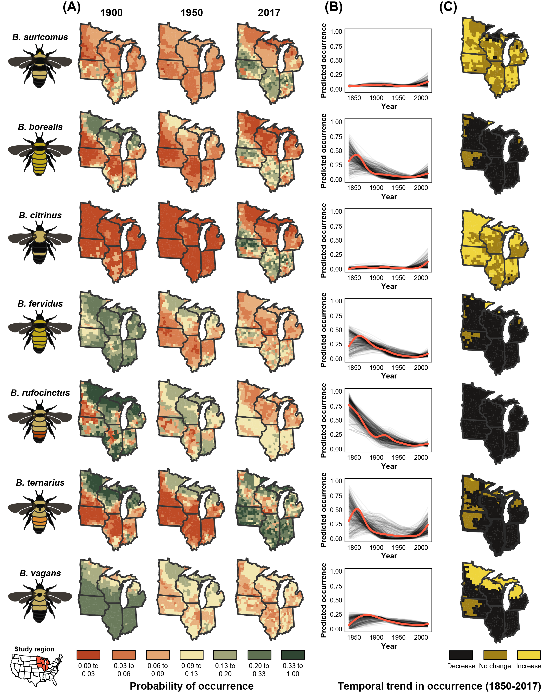
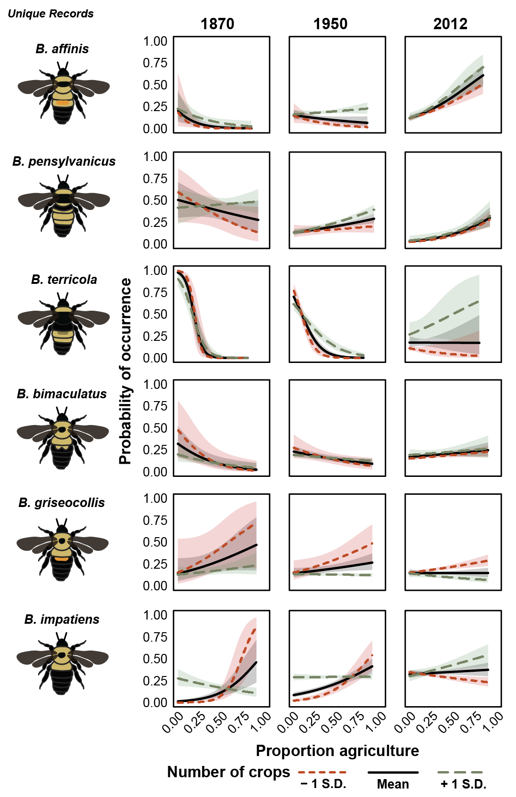
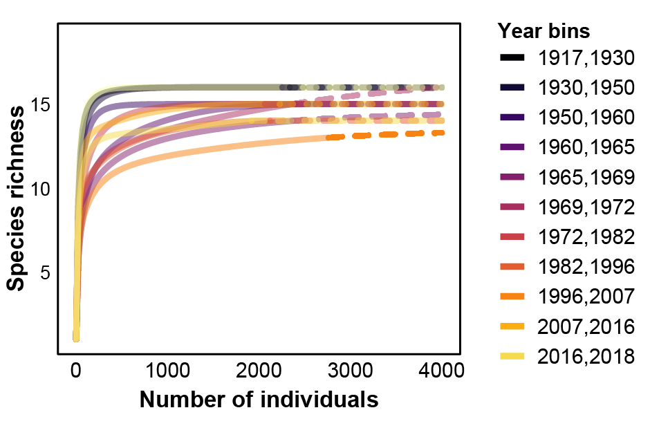

# Significance statement
Recent concerns about global insect and bee declines have suggested that modern agricultural expansion and productivity-focused agricultural intensification are a potential reason for the observed declines. However, this hypothesis has not been formally tested, largely due to a lack of historical data on the relationship between agricultural land use change and important taxa. We combined datasets from 130 years of bumble bee records, important species of both agricultural and conservation concern, and a synthesis of long-term agricultural census records to show that agricultural intensification, including the extent of agricultural land, richness of crops grown, as well as management practices implemented on the ground, are key predictors of bumble bee occurrence and for some species are associated with their declines.

# Results
## Change in county occupancy varies by species
Over the last 130 years, the fraction of counties in which species were found, a proxy of spatial extent of a species’ distribution, showed 4 species increasing in occupancy over time, 5 stable, and 4 declining (Fig. 3). There was a marked expansion of common species (e.g., _B. griseocollis_, _B. bimaculatus_, _B. auricomis_, and _B. impatiens_).  In contrast, all species that are currently of conservation concern (_B. pensylvanicus_, _B. affinis_, and _B. terricola_, _B. fervidus_) showed decreases in the number of counties in which they were found over time, despite an increase in sampling effort during the more recent time periods.

# Patterns of bumble bee occurrence are related to agricultural intensity
Overall, we found that 7 of 13 species decreased in relative abundance, while 4 remained stable and 2 increased over the study period, even after accounting for agricultural intensification variables used in this analysis (Fig. 4A, Table S2, Fig. S7).  Moreover, patterns in bumble bee relative abundance showed strong associations with agricultural intensification metrics (Fig. 4B, C). Generally, species whose relative abundance increased over time, such as _B. impatiens_ (Fig. 5 A, B), were generally unaffected by higher proportions of agriculture. In contrast, for species whose relative abundance declined over time, such as _B. terricola_ (Fig. 5 C, D), counties with higher proportions of agriculture were associated with larger declines in species relative abundance.  Crop richness, though, had either a positive or neutral effect on relative abundance for almost all study species.

A larger amount of cropland in a county, after accounting for changes in bee relative abundance over time, was associated with a decrease in relative abundance 6 species and an increase in 5 species showed a positive association with increasing agriculture (Fig. 4B). Among species whose relative abundance declined from 1870-2018, the proportion of county in agriculture was negatively associated with relative abundance in 4 species. The strongest decline in relative abundance associated with proportion of cropland was for _B. terricola_.

In contrast, an increasing crop species richness within a county was associated with an increase in bumble bee relative abundance of 4 species, while 3 species decreased in abundance. The responses of declining species to crop richness was mixed, with 1 decreasing, 1 increasing, and 5 remaining stable in relative abundance as crop richness increased (Fig. 4C). However, the effects of crop richness on bumble bee relative abundance were generally smaller than the negative effects of increasing the amount of cropland in a county.  The relative abundance of one declining species, _B. fervidus_, was negatively related to all crop metrics.

# Discussion
With few exceptions, species whose occurrence was found to be increasing or stable either had positive or neutral relationships with agricultural intensification metrics. For example, species such as _B. impatiens_ appear to thrive in areas and/or times of intensive agricultural intensification. In contrast, species in decline such as _B. terricola_ were sensitive to agricultural intensification and were less common in areas with proportionally more cultivated land.

*Similar to recent studies examining trends in biodiversity [e.g., @Dornelas2019], our analyses reveal a net balance in the number of increasing and decreasing bumble bee species. Of the 13 species analyzed, only 6 were found to increase over the study dataset (1870-2017), while 1 remained at similar levels, and 6 were found to have declined in occurrence. The declining species in our study match those found to be in decline elsewhere, including in individual state analyses within our study region @Grixti2009; @Wood2019], the US East coast [@Richardson2018; @Jacobson2018a], Canada [@Colla2008], and North America [@Cameron2011; @Colla2012]. A few species are of particular concern (e.g., _B. terricola_ and _B. pensylvanicus_), both of which we observed decline in occurrence over the study period, follow patterns seen in other studies [@Jacobson2018a; @Wood2019], and suggest that protection efforts may be warranted if these patterns of decline continue. For the federally endangered _B. affinis_, we found that county occupancy declined significantly, though interestingly in counties where it is found in the upper Midwestern US, relative abundance did not change, contrary to other longitudinal studies [@Colla2012; @Richardson2018]. When examining patterns of _B. affinis_ decline across its entire range, there is clear evidence for extensive range reductions and local extirpations [@Cameron2011; @Colla2012; @Wood2019]. The subset of the range observed in our study has the most extensive modern records of _B. affinis_, suggesting that our observed regional patterns may differ from range-wide population trends.*

## Appendix 1: Record locations and sample sizes
{ width=100% }
**Figure S1:** The location of bumble bee records binned from ±5 years of each US Census of Agriculture year considered in our analysis. The number of records is noted below the year. Points are partially transparent and jittered slightly for visibility.
\clearpage

\newpage
## Appendix 2: Analysis filtering data to unique species x location x collector x date combinations

To determine whether sampling effort by individuals skewed the results of our analysis, we fit our primary model (relative abundance ~ proportion cropland + number of crops + agricultural census year; results shown in Fig. 5) to a reduced dataset, filtering records to include only unique combinations of species, location, collector, and collection date. We found similar results in terms of the effect magnitude of predictors (proportion of cropland and number of crops), as well as the direction of the effect across study species.

{ width=100% }

**Figure S2:** Fitted model coefficients (± 95% confidence interval) for each study species for (A) temporal trend of the species, (B) proportion of county in cropland, and (C) the number of crops grown in a county. Models were fitted using the entire dataset from 1870-present but filtered to unique species x location x collector x date combinations. Point colors indicate species relative abundance trend from 1870-present: yellow points denote species whose relative abundance declined, gray points denote no change in relative abundance, and black points denote increases in relative abundance.
\clearpage

\newpage
## Appendix 3: Species rarefaction curves
{ width=100% }
**Figure S3:** Sample-based species accumulation curves for each of 15 temporal bins (different colors) from which estimated species richness was calculated (Fig. 2). Each accumulation curve is constructed for temporal bins with a roughly equal number of records. Solid lines are interpolated from data, while dashed lines are extrapolated to a 6,000 record limit.
\clearpage

\newpage
## Appendix 4: Species richness estimation for varying bin numbers
{ width=100% }
**Figure S4:** Trend in rarified bumble bee species richness from 1877-present for alternative numbers of temporal bins, each representing approximately equal numbers of bumble bee records: (A) 5 temporal bins and (B) 8 temporal bins. Each point is plotted at the midpoint of the temporal bin date range. Error bars are 95% confidence intervals. The fitted line is a linear model predicting estimated species richness as a function of temporal bin order using the midpoint year of the temporal bin as the predictor. Carpet plot represents temporal collection year for all records from 1877 to present.
\clearpage

\newpage
## Appendix 5: Analysis restricting to records within ± 2 years of agricultural census
As agricultural census records are collected every 10 years, we were required to pair bumble bee records to the nearest agricultural census (a difference of up to ± 5 years). This requirement might skew results if agricultural metrics display non-linear trends between census years. To determine if this was the case, we filtered records such that only bumble bee within ± 2 years of an agricultural census data were included. Modeling these data resulted in broadly similar patterns of species relative abundance trends and response to proportion agriculture. The response of species to number of crops showed the effect magnitude increase for some species, but the rank order of species responses was mostly similar (Fig. S2).

{ width=100% }

**Figure S5:** Fitted model coefficients (± 95% confidence interval) for each study species for (A) temporal trend of the species, (B) proportion of county in cropland, and (C) the number of crops grown in a county. Models were fitted using the entire dataset from 1870-present, but filtered to only include bumble bee records within ± 2 years of an agricultural census. Point colors indicate species relative abundance trend from 1870-present: yellow points denote species whose relative abundance declined, gray points denote no change in relative abundance, and black points denote increases in relative abundance.
\clearpage

\newpage
## Appendix 6: Spatiotemporal patterns of additional agricultural metrics
{ width=100% }
**Figure S6:** Patterns of agricultural intensification in two additional metrics from 1982-2012: (A) proportion of county area in pasture and (C) proportion of county area treated with insecticides. Color palettes derived using quantile binning. Inset graphs (B,D) depict general trend of these two variables for each state in the study area as modeled by a Loess curve. Values beneath years are mean proportion ± SEM.
\clearpage

\newpage
## Appendix 7: Raw changes in species relative abundance over time
For each species, we calculated relative abundance for each temporal bin as the number of records of a given species divided by the total number of records for all species in that temporal bin. We then tested whether there was a statistically clear change in relative abundance over time by fitting generalized linear models with binomial error distributions for each species using time (i.e., temporal bin) as the sole predictor with each point weighted by the number of records (17).

Of the 13 species included in our simple analysis of change in relative abundance over time, 6 saw statistically clear reductions in relative abundance: _B. borealis_, _B. fervidus_, _B. pensylvanicus_, _B. rufocinctus_, _B. terricola_, _B. vagans_ (Table S1). Similar to the patterns of estimated species richness, reductions in the relative abundance of these declining species seem to begin in the middle of the 20th century. There were 7 species which increased in relative abundance over time period covered by this dataset: _B. affinis_, _B. auricomus_, _B. bimaculatus_, _B. citrinus_, _B. griseocollis_, _B. impatiens_, and _B. ternarius_.

**Table S1:** Relative abundance estimates for each species across 8 time bins, sized in order to contain approximately equal numbers of bumble bee records per bin. Coefficient estimates and p-values derived from models fit to estimate trends in relative abundance over time, where relative abundance of each species is predicted by time bin fit using a generalized linear model, with N records representing the number of records for a given species.
{ width=100% }
\clearpage

\newpage
## Appendix 8: Model results 1876-2018
**Table S2:** Generalized linear model results for each study species including the sample size (number of counties for which relative abundance is calculated), model term, scaled coefficient estimate, 95% confidence interval and p-value. Each county is weighted by the total number of bumble bee records for a given time point (agricultural census year).
{ width=100% }
\clearpage

\newpage
## Appendix 9: Model results 1982-2018
**Table S3:** Generalized linear model results for each study species including the sample size (number of counties for which relative abundance is calculated), model term, scaled coefficient estimate, 95% confidence interval and p-value. Each county is weighted by the total number of bumble bee records for a given time point (agricultural census year).
{ width=100% }
\clearpage

\newpage
## Appendix 10: Probability of occupancy and temporal relative abundance trends for all study species
{ width=100% }
{ width=100% }

**Figure S7:** Fitted temporal trend of relative abundance when modeled with agricultural intensity metrics along with the predicted probability of occurrence for each study species in each county given crop diversity and proportion cropland in each county. Darker colors denote smaller probability of occurrence, while lighter colors indicate larger probability of occurrence. Solid red lines denote statistically clear trend in relative abundance over time (p < 0.05), while dashed lines denote statistically unclear trends (p > 0.05). Points on temporal trend are slightly jittered for visibility. Red points on each map are randomly selected occurrence records with a maximum of 50 plotted per year.