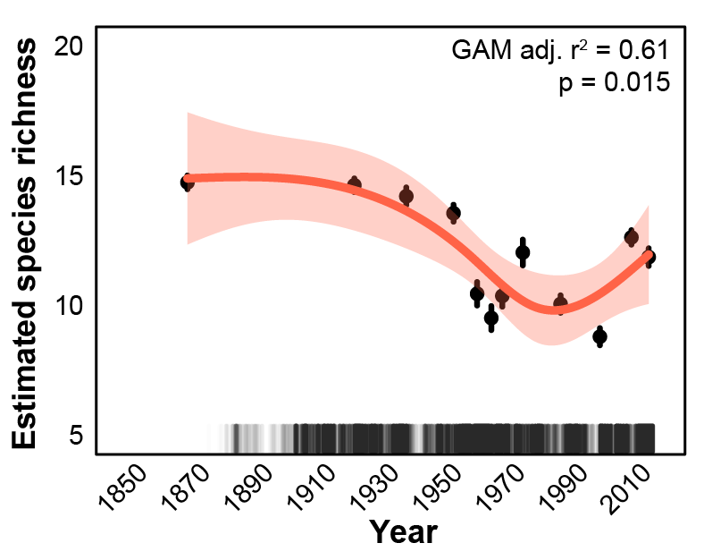
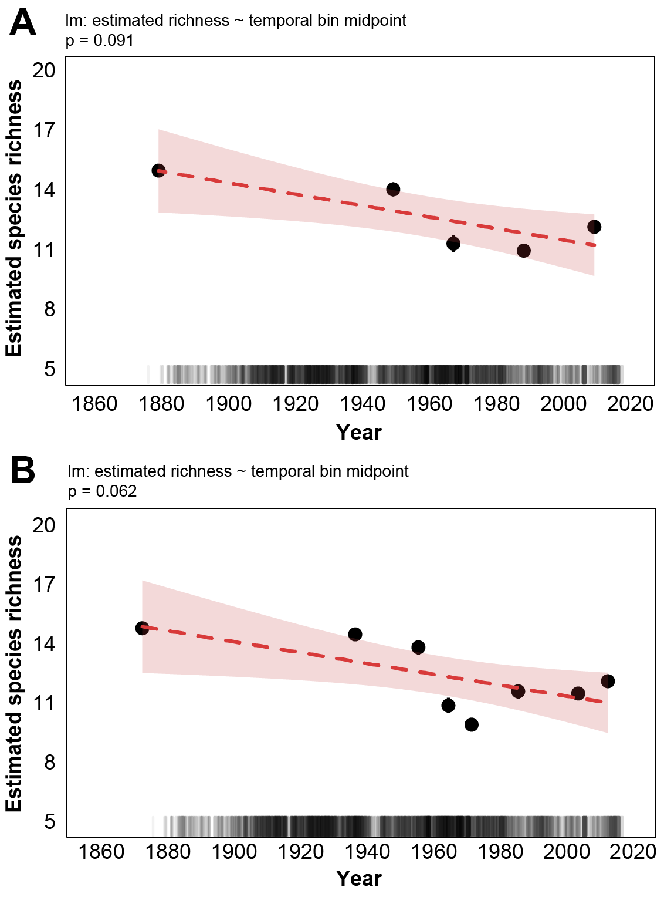

\captionsetup[table]{labelformat=empty}

# Introduction
Agriculture is a primary way in which humans alter terrestrial landscapes and is cited as a principle cause of biodiversity declines worldwide [@Foley2005a; @Foley2011b; @Klein2007g; @Tilman2011; @Tscharntke2012]. In particular, the intensification of agriculture, that is, the widespread planting of crop monocultures, managed for high productivity promoted by fertilizers and pesticides, and high disturbance agronomic practices such as tillage, has been associated with the extensive loss of a number of ecosystem service providing taxa [@Benton2002; @Robinson2002; @Meehan2010a]. There is circumstantial evidence that agricultural practices are an important driver of the recently documented, large-scale decline of insects [@Hallmann2017; @Seibold2019]. Pollinating insects, specifically bees, may be particularly impacted, necessitating consideration of the consequences for natural and agricultural systems [@Steffan-Dewenter2005c; @Tylianakis2013a].

Bumble bees (Apidae: _Bombus_) are a well-studied bee taxon that includes many species documented to be declining across Europe and North/South America [@Biesmeijer2006; @Colla2008; @Grixti2009; @Cameron2011; @Bartomeus2013; @Morales2013; @Wood2019]. Of several putative drivers of bumble bee decline including climate change [@Kerr2015; @Soroye2020] and pathogens [@Cameron2011; @Szabo.2012], many studies also point to agricultural intensification as key driver of bumble bee population decline [@Grixti2009; @Goulson2015c]. Intensification includes both attributes within a farming system (i.e., pesticide use, number and types of crops used), and the effects on agricultural landscapes (i.e., amount of land in cultivation compared to natural habitats not used for agriculture). Despite the hypothesized threat of agricultural intensification to bumble bees, no studies have specifically tested the hypothesis that long-term patterns of changes in agriculture are associated with changes in bumble bee occurrence. In general, this is due to a paucity of long-term data of both bumble bee occurrence and historical agricultural patterns at sufficiently large spatial scales.

While contemporary studies examining bumble bee responses to agriculture provide some insights, historical data from archives such as museum records, are important tools to explore patterns of bumble bee change over the course of decades, and offer insights of drivers at temporal and spatial scales that elude detailed, small-scale experimental approaches [@Meehan2011; @Rosenheim2017]. The continued addition of records to repositories such as the Global Biodiversity Information Facility (GBIF) combined with modern, extensive surveys of bumble bee fauna (e.g., Bumble Bee Watch, iNaturalist) offer widespread, species-specific spatial distribution patterns. Moreover, analyses of records from such repositories have benefited from analytical approaches that account for known biases in archival data [@Pearce2006; @Bartomeus2013; @Bartomeus2019].

To test the hypothesis that long-term bumble bee occurrence trends are associated with patterns of agricultural intensification, we utilized an extensive data set of historical bumble bee museum records and modern citizen-science surveys for the Midwest USA and combined this with a newly available digital dataset of agronomic metrics compiled from United States Census of Agriculture over the period 1870-2018 (Crossley et al. _in review_). We predicted that increasing agricultural intensification, as measured by the amount of cropland, would be negatively associated with bumble bee occurrence [@Williams2009; @Goulson2008c; @Goulson2015c; @Samuelson2018]. In contrast, we expected that features of agricultural landscapes that increase diversity, such as higher richness of crops grown, would be positively associated with bumble bee occurrence [@Sirami2019].

# Results
## Agricultural extent remains similar while crop richness has declined
From the onset of available land-use records in the 1870s, agricultural land cover increased rapidly and began to plateau by the early 1900s. The areal extent of cropland peaked in the study region in 1950 (45% ± 0.9% of county area, mean ± standard error). Since then, it has decreased ~11% to an average of 34% ± 0.9% in 2017 (Fig. 1A,B). There are within-region differences in agricultural cover with northern areas of the study region remaining relatively low in agricultural cover, while the highest intensity of agricultural cover occurs in the “corn belt” that stretches through southern Minnesota, Iowa, southern Wisconsin, central and northern Illinois, and northern Indiana. Of the 18 crops for which we compiled data, an average of 12 ± 1 were grown per county from 1880 – 1950. Since 1950, this number has declined ~50%, with counties today growing on average 6 ± 1 crops (Fig. 1 C,D).

## Bumble bee species richness has declined
Rarefied species richness estimates for the study region declined significantly over the last 130 years. There was a 20% decrease in species richness over the study period from approximately 15 during the period between 1870-1925, to 12 species presently (Fig. 2, Linear model: t~1,13~ = 6.084, p = 0.0283; Permutation test: p = 0.03). A sharp drop in estimated species richness occurred between in the 1950s, followed by a slight rebound in the next 50 years.

## Patterns of bumble bee occurrence are related to agricultural intensity
To discuss the general results of this work, we focus our results on the 6 species with the greatest number of county-level relative abundance records within our study region (> 150 records), 3 of which are thought to be increasingly common (_B. bimaculatus_, _B. griseocollis_, and _B. impatiens_) as well as 3 that are of conservation concern (_B. affinis_, _B. pensylvanicus_, and _B. terricola_). The patterns discussed here are qualitatively consistent for the additional 7 species, however the lower number of observations for these species (< 100 county x time point records) given model complexity warrants caution (Fig. S1, S2).

We found significant relationships between the predicted probability of bumble bee occurrence and measures of agricultural intensification over time, but these patterns varied across species.  Contrary to our predictions, for most species an increase in the proportion of agriculture was not necessarily associated with a decrease in predicted occurrence. Rather, several species increased in predicted occurrence in counties with increasing agricultural extent, especially in more recent years (Fig. 3).  More critically, the effects of the increase of agricultural cover in a county was dependent on the number of agricultural crops grown.  For example, _B. affinis_, _B. bimaculatus_, and _B. impatiens_ revealed high occurrence probabilities in counties under extensive cultivation (proportion cropland > 0.5), provided the number of crops grown was high (> 11 crops per county). Moreover, the positive effect of crop richness on occurrence for these three species increased in strength over time.

Other species, such _B. pensylvanicus_, revealed increasing sensitivity to intensive agriculture over time. For example, probability of occurrence in areas of historically intensive agriculture (proportion of cropland = 0.9, number of crops < 11) has declined well over 50% from 1900 to present. Additionally, the number of crops had little impact in the patterns of predicted occurrence of _B. pensylvanicus_; model predictions revealed a decrease in predicted occurrence across the range of crop richness in our data.

_Bombus impatiens_ revealed a strong temporal interaction between proportion cropland, number of crops, with the predicted occurrence in agriculturally extensive areas with few crops decreasing only after the middle of the 20th century, coincident with the rise of soybean cultivation and decline in crop richness, generally (Fig. S3). In recent years, declines of _B. impatiens_ concomitant with increasing proportion cropland were predicted to be reversed with increasing crop diversity.

When we predicted occurrence for each species using fitted models and county-level agricultural metrics (Fig. 4a), two distinct patterns emerge: species of conservation concern are far less likely to occur across a wide swath of the study region, whereas increasingly common species are predicted to occur at relatively high probabilities throughout the study region (Fig. 4b). Together, these patterns describe contrasting realities for bumble bee species in the Midwest with regard to agricultural conditions on the ground, with a majority of the examined species (including the additional 7 study species, Fig. S1, 2) predicted to be less likely to occur over time (Fig. 4b, c).

# Discussion
Using bumble bee observations recorded over 130 years across 6 agriculturally important US states and a novel dataset on the historical patterns of agricultural land use and practices, we explored the hypothesis that agricultural intensification is associated with bumble bee declines. In doing so, we took special care to account for biases associated with historical collections and employed a variety of techniques including subsampling and sensitivity analyses to determine whether our chosen methods skewed results [@Bartomeus2019]. Irrespective of the approaches used, we consistently identified clear statistical associations between bumble bee species occurrence and agricultural conditions in the landscape, with a 20% decline in bumble bee species richness concomitant with an increase in cropland and a decrease in crop richness over the last century. Overall, it appears that increases in agricultural intensity in the landscape favor a select few bumble bee species at the expense of many others.

Our analyses suggest that high crop diversity has a broadly positive influence on bumble bee species occurrence, regardless of the amount of cropland in the landscape. Moreover, while an increase in the amount of cropland was occasionally detrimental to predicted species occurrence (e.g., _B. affinis_), this effect could be mitigated by increasing crop diversity in the landscape. For example, our model revealed that several bumble bee species had a high predicted probability of occurrence within agriculturally extensive landscapes in the early 1900's. However, a rapid decrease in crop richness from the 1930's onward was associated with a decrease in the predicted occurrence of several bumble bees. Of the crops included in our analyses, a large decrease occurred in cover and hay crops, which include bumble bee food plants in the family Fabaceae, as well as other bumble bee attractive crops including buckwheat and pulses. Together, these changes suggest that the post-war era intensification of agriculture, with its loss of crop diversity, bumble bee attractive crops, and pasture, as well as increasing insecticide use [@Meehan2011; @Meehan2015; @zym], rather than the areal expansion of agriculture, has been a major driver of bumble bee community change. While our results showed heterogeneity across species, agricultural intensification has been suggested as a primary factor in the decline of insect pollinators [@Ollerton.2014; @Fox.2013] and biodiversity [@Robinson2002] in the UK, as well as bumble bee declines in Illinois [@Grixti2009], as well as wildlife declines within the same geographic range of our study [@Lark.2020].

Agricultural intensification is associated decreases in the amount of other natural habitats that support diverse floral resources [@Smith1998; @Brown2011; @Carvell2006b; @Scheper2014], as well as increases in insecticide use [@Meehan2011; @Meehan2015]. A shift from the diverse cropping systems of the early to mid 1900’s to largely monocultural systems in recent years has also altered the temporal continuity of available floral resources and total pollen availability [@Schellhorn2015c; @Timberlake2019], which negatively affects bumble bee health [@Vaudo2015; @Cameron2020], and colony growth and development [@Williams2012b; @Hass2018a], and may be of particular concern for species with restricted diet breadths [@Kleijn2008; @Wood2019]. Future field-based experiments should be designed to explore, for example, contemporary relationships between bumble bee abundance and gradients of agricultural intensity such as crop diversity and areal amount of agriculture to reveal a more mechanistic understanding of how select agricultural factors are impacting bumble bee populations. Additionally, population changes in other pollinating taxa, especially wild bees, may also be related to the increases in agricultural intensity described here [@Bartomeus2013; @Kennedy2013]. Compiling occurrence records for other wild bee species with sufficient spatiotemporal data coverage would allow a more thorough assessment of the impacts of agricultural intensification on pollinators writ large.

Similar to recent studies examining trends in biodiversity [e.g., @Dornelas2019], our analyses reveal a net balance in the number of increasing and decreasing bumble bee species. Of the 13 species analyzed, only 4 showed an increase in predicted occurrence given agricultural conditions in the landscape (1870-2017), 9 were found to have declined in occurrence. The declining species in our study match those found to be in decline elsewhere, including in individual state analyses within our study region @Grixti2009; @Wood2019], the US East coast [@Richardson2018; @Jacobson2018a], Canada [@Colla2008], and North America [@Cameron2011; @Colla2012]. A few species are of particular concern (e.g., _B. affinis_, _B. pensylvanicus_ and _B. terricola_), all three of which we observed decline in occurrence over the study period, follow patterns seen in other studies [@Jacobson2018a; @Wood2019], and suggest that protection efforts may be warranted if these patterns of decline continue.

The patterns revealed in this study suggest opportunities for bumble bee conservation even within predominately agricultural landscapes. Such landscapes may still support both common and declining bumble bee species provided there is a high diversity of crops, perennial features such as pasture, and limited insecticide use. @Sirami2019 found a similar pattern for farmland biodiversity: increasing the diversity of crops and decreasing field size had a large, positive effect on multi-trophic indices of biodiversity. Our results provide additional evidence that agricultural landscape heterogeneity is key to supporting farmland biodiversity [@Benton2003; @Fahrig2011b]. It is important to note, however, that the ideal agricultural conditions for the occurrence of many of the bumble bee species we examined have long since disappeared. As of 2017, the mean number of crops grown across all study counties was 6, half of the richness from the early 1900's. Combatting bumble bee population declines might involve programs that incentivize reintroducing more diverse crop mixtures, especially including those that benefit bees [e.g, cover crops @Mallinger.2019; @Schulte.2017; @Wilson.20176h]. Such efforts would not only benefit bumble bees and biodiversity generally, but also but may also provide economic relief to growers experiencing plummeting profits from corn and soy [@USDA.commodity].

Other factors that have changed in the last century, such as pathogen spillover from greenhouse operations [@Colla.2006; @Szabo.2012] and climate change [@Kerr2015; @Soroye2020], have also been associated with bumble bee declines, but the contribution of increasing agricultural intensity to changes in bumble bee occurrence appear distinct. Rising global temperatures over the last century have been linked to the widespread, gradual decline in bumble bees species richness, while the declines of occurrence in our study only became apparent since the early to mid 1900's. Additionally, pathogen spillover from commercial bumble bees in managed greenhouse operations is cited as another key factor driving bumble bee declines [@Colla.2006; @Cameron2011; @Szabo.2012], but the timing of observed declines linked to agricultural intensification precede commercialization of bumble bee pollination in the late 1980's [@Velthuis.2006] and expansion of greenhouse pollination of crops such as tomatoes in the USA [@Szabo.2012]. Ultimately, the loss of suitable habitat via agricultural intensification, changing climatic norms, and the recent expansion of pathogens from commercial operations likely act synergistically in contributing to the decline of bumble bees in the USA [@Goulson2015c].

## Conclusions
Over the last 130 years, agricultural intensification has elicited strong pressures on natural animal populations. Our study found direct support for the hypothesis that agricultural intensification has contributed to changes in bumble bee occurrence and community composition over the last century in the Midwest USA, in line with reports of broad arthropod declines in other agriculturally dominated landscapes [@Hallmann2017; @Seibold2019]. The combination of our historical analysis along with a growing body of observational and experimental evidence suggests that changes to agricultural practices and policies that promote agricultural diversification at the landscape level may be needed to limit additional declines of bumble bees in agricultural landscapes.

# Methods
We focused our study in the USA on the Midwest states of Indiana, Illinois, Iowa, Michigan, Minnesota, and Wisconsin, as these states share a similar biogeographic contexts and agricultural history. We limited our analysis to bumble bee species whose core ranges overlapped these states [@Williams2014], including: _B. affinis_ Cresson; _B. impatiens_ Cresson; _B. griseocollis_ DeGeer; _B. bimaculatus_ Cresson; _B. auricomus_ Robertson; _B. ternarius_ Say; _B. vagans_ Smith; _B. borealis_ Kirby; _B. citrinus_ Smith; _B. pensylvanicus_ De Geer; _B. fervidus_ Fabricius; _B. rufocinctus_ Cresson; and _B. terricola_ Kirby. Four species, _B. fraternus_, _B. perplexus_, _B. ashtoni_ (bohemicus), and _B. variabilis_, were not included in our analyses as they lacked sufficient records to meaningfully interpret changes in relative abundance and county occupancy over time. Of the study species, three (_B. affinis_, _B. terricola_ and _B. pensylvanicus_) are known to be in decline nationally and are of conservation concern [IUCN Red List; @Colla2008; @Jacobson2018a].

## Bumble bee record data
We obtained bumble bee records from the Global Biodiversity Information Facility (GBIF), querying for all records within our study region. These data were combined with records from the North American Bumble Bee Watch program by the Xerces Society for Invertebrate Conservation. In total, 24,524 records were compiled from GBIF from 1870 to 2017 and 2,606 from Bumble Bee Watch from 2007 to 2018 for a total of 27,130 unique records over 358 of 535 total counties in the study region (Fig. S4). The species contained in each dataset were mutually inclusive. We then filtered records to include only those which were appropriately geo-referenced (i.e., had associated longitude and latitude). Each record was assigned to a county based on its collection coordinates so that they could be matched to county-level agricultural census data. Bee and agricultural census data are therefore compared at the county-level.  Because 95% of records were from 1890 and beyond, we are confident that county assignments are accurate, as changes in county geographic extent in this region were largely complete by 1890 (Crossley et al. in review).

Temporal comparisons of museum and incidental records can be challenging due to non-standardized collection techniques as well as collector and spatial biases [@Bartomeus2013; @Richardson2018; @Bartomeus2019]. To account for this, we analyzed records using a variety of techniques to attempt to control for such biases (all of which are described in the following sections). First, we filtered the dataset to include only “single individual” sampling events (i.e., unique combination of species, date, location, and collector), following @Richardson2018. All analyses described below were conducted using both the full and reduced datasets. Filtering to “single individual” sampling events did not impact our conclusions Fig. S5), and thus we present results from the full dataset.

## Calculating bumble bee relative abundance
In order to estimate changes in bumble bee populations over time, we calculated the relative abundance of each species within each county by agricultural census year. Bumble bee records were binned with the closest agricultural census year (see section below “Pairing bumble bee records with historical agriculture dataset”), and we divided the total number of records of a given species by the total number of records for all species within each county-census year combination. We only calculated relative abundance where species were observed (i.e., no pseudo-absences were used). Additionally, we limited our analysis to only include county-year combinations with greater than 5 total bumble bee records to eliminate counties with limited sampling effort and where low numbers may artificially inflate the relative abundance of given species.

*Do we want to include this still? Sort of redundant*
## Estimating change in county occupancy
Changes in relative abundance may not fully capture declines if species remain stable in relative abundance in occupied counties while the number of occupied counties decreases over time, i.e., there are range restrictions but the relative abundance where they are found remains unchanged. To explore this possibility, we used the approach of @Bartomeus2013 and created a set of temporal bins of records such that there were approximately the same number of bee observations per temporal bin (`rbin` package in R). We used several binning strategies to determine if the number of bins affected our results [@Bartomeus2013], including a total of 5, 8, and 15 temporal bins. To account for changes in county-level occupancy (i.e., a proxy for the species range), we modeled the number of occupied counties per equal-record temporal bin using the midpoint year for each bin for each bumble bee species predicting number of counties occupied as a function of the time using a generalized linear model.

## Calculating temporal patterns of diversity
To estimate how bumble bee species richness has changed over time, we rarefied bee records to generate estimates of mean species richness for each equal-record temporal bin with 95% confidence intervals using the `iNEXT` package [@Hsieh2016].  All 15 species accumulation curves rapidly reached an asymptote, indicating that sample sizes were sufficient to capture bumble bee community diversity within each bin (Fig. S6). We then fit a linear model to determine the change in species richness over time. Because each time bin contained a different number of years, we used the midpoint of each bin as the value from which to construct the model. We also conducted a permutation test to determine if the correlation between species richness and time could have been observed by chance alone, since the assumption of normally distributed data for such a small sample in our linear model (e.g., n = 5 bins) may be violated. Using the maximum number of permutations (given the number of bin time points), we randomly shuffled the temporal bin order, calculating the correlation between bin and species richness estimates in each permutation, with the p-value equaling the fraction of permuted correlation coefficients greater or less than the true chronological correlation coefficient. Estimated species diversity trends were consistent regardless of the number of bins (Fig. S7), however p-values varied with number of bins (significant and marginally significant trend for 15 and 8 bins, respectively, but not for 5 temporal bins).  We present results from the 15-bin analyses for estimation of species richness over time in order to portray the highest resolution of the estimated species richness pattern.

## Historical agricultural data
To assess the extent, diversity, and intensity of agriculture, we used county-level agricultural census data projected and geographically corrected by Crossley et al. (in review). Briefly, Crossley et al. (in review) analyzed the spatial patterns of 18 crops (occupying at least 5% of county area) at the county-level and computed county proportion of crop area and crop richness from 1870-2017, correcting for changing county boundaries using areal-weighting. Our objective was to estimate county-level (n = 535 counties) agricultural metrics, which included aspects of both extensive and intensive farming practices. We limited our metric calculations to the 18 most common crops which together represent over 80% of cropland area study region. For each county by census year, we calculated crop richness (range 0-18) and the proportion of county area in cropland (range 0-1) as our metrics of agricultural intensity.

## Pairing bumble bee records with historical agriculture data
Because agricultural census data are collected every 10 years, not every bumble bee record was collected in a year coinciding with an agricultural census. Accordingly, we pooled bee records such that they were within ± 5 years of the nearest agricultural census date (e.g., bumble bee records from 1925-1935 were paired with the 1930 Census of Agriculture data). While this pairing may not perfectly reflect the state of agriculture experienced by collected bumble bees, we posit that it is still meaningful given that large, county-level changes in agricultural practices occurring over several decades are unlikely to manifest in time spans less than five years. Nevertheless, to verify this assumption we performed additional analyses with a stricter ± 3-year pairing rule (i.e., dropping bee data from years outside of these narrower windows) and found similar results (Fig. S8). We thus present the analysis with the full dataset and ± 5-year pairing.

## Statistical analyses
### Relating changes in bumble bee relative abundance to agricultural intensity
We constructed statistical models to examine whether changes in metrics of agricultural intensification were related to bumble bee relative abundance. For each bumble bee species, we fit a generalized linear model with a binomial error structure in order to predict county-level relative abundance (for a given agricultural census year, number of records of a given species divided by total number of bumble bee records in that year) according to:

_**Model equation:**_
$$
\begin{aligned} \log\left[ \frac { P( \operatorname{rel\_abun} = \operatorname{1} ) }{ 1 - P( \operatorname{rel\_abun} = \operatorname{1} ) } \right] = \alpha + \beta_{1}(\operatorname{n\_crops}) + \beta_{2}(\operatorname{prop\_cropland}) + \beta_{3}(\operatorname{bin\_ag})\\ + \beta_{4}(\operatorname{n\_crops} \times \operatorname{bin\_ag}) + \beta_{5}(\operatorname{prop\_cropland} \times \operatorname{bin\_ag}) + \beta_{6}(\operatorname{n\_crops} \times \operatorname{prop\_cropland})\\ + \beta_{7}(\operatorname{n\_crops} \times \operatorname{prop\_cropland} \times \operatorname{bin\_ag}) + \epsilon \end{aligned}
$$

Because binomial models convert relative abundance to probabilistic outcomes, this approach allowed us to determine spatiotemporal patterns in species probability of occurrence at the county level while taking into account variation in agricultural intensification and their interactions. Observations were weighted by the number of bumble bee records in a county by agricultural census year, effectively giving more weight to counties that had greater sampling intensity. We assumed that these counties provided more accurate estimates of species relative abundance at any given time.

Because significant interactions were the primary driver of our models, we present each species model as a series of interaction plots using the `interactions` and `jtools` packages [@jtools; @interactions]. Briefly, the interactions package generates model predictions and confidence intervals across the temporal span of our data using the mean and mean ± 1 standard deviation for values of proportion cropland and number of crops.

Because of the spatial nature of these data, we tested for spatial autocorrelation in model residuals. As the structure of each species GLM model above contains the same counties from multiple agricultural census years, testing for spatial autocorrelation on the entire model is misleading as only spatial autocorrelation within a given agricultural census year may be problematic. As such, we used the agricultural census time period with the greatest number of records for a given species to test for spatial autocorrelation. For each species, we constructed a generalized linear model fitting relative abundance as a function of proportion cropland and number of crops as described above. We then tested model residuals for spatial autocorrelation using a Moran’s I test in the `spdep` R package [@spdep; similar to @Meehan2011; and @Meehan2015] using a p-value of 0.05 at the critical threshold. Of the 13 study species, _B. affinis_, _B. impatiens_, _B. ternarius_, and _B. vagans_ showed significant spatial autocorrelation. To account for this, we fit spatial error models for these three species using the `spdep` package and used the GLM framework for the remaining species. We chose spatial error models given the results of Legrange multiplier tests, similar to @Meehan2011. As the spatial models constructed are unable to be used with the `interactions` package, we compared prediction results from the GLM and spatial models and determined, as values were most values were nearly identical (95% ± 0.05 of one another), used GLM models for visualization of predictor interactions.

We also tested for temporal autocorrelation within the residual response of each species in models from the entire span of the dataset from 1870-2017. For each species model, we visually examined residuals plots and residual lag correlation values using the `acf` function in base R. As no species showed temporal autocorrelation across the range of the dataset, we did not incorporate any temporal autocorrelation structure into our models.

To determine the average estimated change in spatiotemporal species occurrence taking into account all model variables, we used our fitted models from 1870-2017 to predict species occurrence across our study area using county-level agricultural intensification metrics at each agricultural census year (19 total). County-level predictions were then visualized spatially to depict how county-level bumble bee occurrence changed over time as a function of agricultural conditions in the county. To summarize the change in species occurrence for each county across all agricultural census time points in a single map, we took the predicted occurrence values for each species x county and fit a linear model with agricultural census year as a predictor. Then, the scaled coefficient estimates for all species x county models were placed into 4 quantile bins in order to provide a categorization of whether a species was more or less likely to occur in a given county over time. Lastly, we plotted the change in predicted occurrence across all counties as a time series fitted by a simple generalized additive model to show the temporal trend in species occurrence.

# Data availability statement
All curated data necessary to repeat the analyses in this manuscript are available on FigShare.

# Code availability statement
R code used to curate data and conduct analyses will be made available upon publication in a public repository (www.github.com/jhemberger) and on FigShare.

# Acknowledgements
We would like to thank Neal Williams, Christelle Guédot, John Orrock, Russ Groves, Charlie Nicholson, Erin Lowe, Ben Iuliano, Tim Meehan, Jamie Strange, and Sydney Cameron for the valuable feedback that improved this manuscript. Many thanks to Rich Hatfield and the Xerces Society for Invertebrate Conservation for providing Bumble Bee Watch data. Data and code for all analyses, figures, and the manuscript will be made publicly available upon publication at https://github.com/jhemberger.
\clearpage

\newpage
# Figures and Tables
{ width=100% }
**Figure 1:** Patterns of agricultural intensification in two metrics: (A, B) proportion of county under cultivation and (C, D) number of crops grown per county. Inset graphs (B,D) depict general trend of these variables for each state in the study area as modeled by a Loess curve.
\clearpage

\newpage
{ width=100% }
**Figure 2:** Temporal trend of rarified bumble bee species richness from 1877-present. Each point represents a date range that is standardized to contain an approximately equal number of bumble bee records (thus the date range differs for each point), and it is plotted at the midpoint year of the date range. Error bars are 95% confidence intervals. The fitted line is a linear model predicting estimated species richness as a function of temporal bin order using the midpoint of the temporal bin as the predictor. Carpet plot represents temporal collection year for all records from 1877 to present.
\clearpage

\newpage
{ width=100% }
**Figure 3:** Interaction plots for species of conservation concern (first 3 rows) and common species (bottom 3 rows). Each line represents the expected trend (with 95% confidence interval) of probability of occurrence over time in a county given: a value of proportion cropland (panel columns: mean ± 1 standard deviation) and number of crops (line color and type: mean ± 1 standard deviation) in that county.
\clearpage

\newpage
{ width=100% }
**Figure 4:** (A) Predicted probability of occurrence for each county within the study region from red (less likely) to green (more likely) in 1900, 1950, and 2017. (B) Overall likelihood of occurrence from black (more likely) to yellow (less likely). Each county value for likelihood of occurrence is determined from quantile-binned slope coefficient estimates from a linear model predicting county probability of occurrence over 19 agricultural census time points. (C) Predicted temporal trend in probability of occurrence across all counties given agricultural conditions in each county. Each point is a single county x year (jittered slightly for visibility), with a random subset of 1,000 points plotted (out of ~11,000 total). Temporal trend line is based on a simple generalized additive model to visualize the trend. All predictions were generated using county-level agricultural statistics and models (equation 1) fit for each species.
\clearpage

\newpage
# Supplementary Materials
**Table S1:** Generalized linear model results for each study species (model equation 1) including the model type,  sample size (number of counties for which relative abundance is calculated), Moran I p-value (for Spatial error model types only), model McFadden Pseudo coefficient of determination, model term, scaled coefficient estimate, 95% confidence interval and p-value. Each county is weighted by the total number of bumble bee records for a given time point (agricultural census year).
{ width=100% }
\clearpage

\newpage
{ width=100% }

\newpage
{ width=100% }
**Figure S1:** Interaction plots for other study species. Each line represents the expected trend (with 95% confidence interval) of probability of occurrence over time in a county given: a value of proportion cropland (panel columns: mean ± 1 standard deviation) and number of crops (line color and type: mean ± 1 standard deviation) in that county.
\clearpage

\newpage
{ width=100% }
**Figure S2:** (A) Predicted probability of occurrence for each county within the study region from red (less likely) to green (more likely) in 1900, 1950, and 2017. (B) Overall likelihood of occurrence from black (more likely) to yellow (less likely). Each county value for likelihood of occurrence is determined from quantile-binned slope coefficient estimates from a linear model predicting county probability of occurrence over 19 agricultural census time points. (C) Predicted temporal trend in probability of occurrence across all counties given agricultural conditions in each county. Each point is a single county x year (jittered slightly for visibility), with a random subset of 1,000 points plotted (out of ~11,000 total). Temporal trend line is based on a simple generalized additive model to visualize the trend. All predictions were generated using county-level agricultural statistics and models (equation 1) fit for each species.
\clearpage

\newpage
{ width=100% }
**Figure S3:** The relative proportion of county area of the 18 crop types included within the study from 1840-2017. Other category includes 13 crops that together compose less than 5% of county area at any time point.
\clearpage

\newpage
{ width=100% }
**Figure S4:** The location of bumble bee records binned from ±5 years of each US Census of Agriculture year considered in our analysis. The number of records is noted below the year. Points are partially transparent and jittered slightly for visibility.
\clearpage

\newpage
**Analysis filtering data to unique species x location x collector x date combinations**
To determine whether sampling effort by individuals skewed the results of our analysis, we fit our primary model (relative abundance ~ proportion cropland + number of crops + agricultural census year; results shown in Fig. 5) to a reduced dataset, filtering records to include only unique combinations of species, location, collector, and collection date. We found similar results in the trend and statistical effect of each interaction.

{ width=100% }
**Figure S5:** Interaction plots for species of conservation concern (first three rows) and common species (last 3 rows). Each line represents the expected trend (with 95% confidence interval) of probability of occurrence over time in a county given: a value of proportion cropland (panel columns: mean ± 1 standard deviation) and number of crops (line color and type: mean ± 1 standard deviation) in that county.
\clearpage

\newpage
{ width=100% }
**Figure S6:** Individual-based species accumulation curves for each of 15 temporal bins (different colors) from which estimated species richness was calculated (Fig. 2). Each accumulation curve is constructed for temporal bins with a roughly equal number of records. Solid lines are interpolated from data, while dashed lines are extrapolated to a 6,000 record limit.
\clearpage

\newpage
{ width=100% }
**Figure S7:** Trend in rarified bumble bee species richness from 1877-2017 for alternative numbers of temporal bins, each representing approximately equal numbers of bumble bee records: (A) 5 temporal bins and (B) 8 temporal bins. Each point is plotted at the midpoint of the temporal bin date range. Error bars are 95% confidence intervals. The fitted line is a linear model predicting estimated species richness as a function of temporal bin order using the midpoint year of the temporal bin as the predictor. Carpet plot represents temporal collection year for all records from 1877 to 2017.
\clearpage

\newpage
**Analysis restricting to records within ± 3 years of agricultural census**
As agricultural census records are collected every 10 years, we were required to pair bumble bee records to the nearest agricultural census (a difference of up to ± 5 years). This requirement might skew results if agricultural metrics display non-linear trends between census years. To determine if this was the case, we filtered records such that only bumble bee within ± 3 years of an agricultural census data were included. Modeling these data resulted nearly identical interaction patterns of predicted occurrence and agricultural metrics.

{ width=100% }
**Figure S8:** Interaction plots for species of conservation concern (first three rows) and common species (last 3 rows). Each line represents the expected trend (with 95% confidence interval) of probability of occurrence over time in a county given: a value of proportion cropland (panel columns: mean ± 1 standard deviation) and number of crops (line color and type: mean ± 1 standard deviation) in that county.
\clearpage

# References
