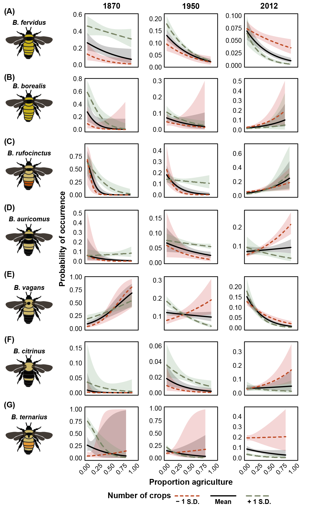

\captionsetup[table]{labelformat=empty}

# Introduction
Extensive range contractions [@Kerr2015] and possible local extinctions [@Rasmont2012] of a number of bee species has sounded an alarm among entomologists and ecologists across the world [@Steffan-Dewenter2005c; @Tylianakis2013].  Of bee population trends that have been documented, bumble bees (Apidae: _Bombus_) are perhaps the most well-studied with reports of many species declining across Europe and North/South America [@Biesmeijer2006; @Colla2008; @Grixti2009; @Cameron2011; @Bartomeus2013; @Morales2013; @Wood2019].  Owing to their importance as pollinators in both commercial crops [@Klein2007g] and natural systems [@Ollerton2011], understanding the factors driving bumble bee decline is critical.

A number of studies have posited mechanisms underpinning bumble bee declines, including climate change [@Kerr2015; @Marshall2017; @Sirois-Delisle2018], habitat loss [@Grixti2009; @Goulson2015c], the proliferation of parasites and disease [@Cameron2011, @McArt2017], and competition with managed bees [@Torne-Noguera2016; @Cane2017; @Mallinger2017a; @Ropars2019].  Among the potential drivers, the expansion and intensification of agriculture is consistently cited as a key factor in long-term declines of once common species in both the US [@Grixti2009; @Colla2008; @Jacobson2018a] and Europe [@Goulson2005b; @Carvell2006b].  A switch from the more diverse and less intensive agricultural systems of the early 1900's to the largely monocultural, heavy-input systems of today may lead to the loss of preferred host plant species and nesting/overwintering habitat - a threat particularly salient to bumble bees unable to adapt to these changes [@Wood2019].

In the United States, analysis of museum records suggests that bumble bee declines began during periods of agricultural intensification in the mid 20th century [@Grixti2009].  Despite several long-term analyses highlighting concerning population trends as well as studies describing the importance of historical land-use [@Cusser2018], no studies have yet explicitly linked metrics of agricultural intensification or production to bumble bee declines due to a paucity of long-term data of both bumble bee occurrence and historical agricultural production, as well as the difficulty in assessing potential drivers experimentally.  Additionally, variable temporal patterns of species declines have been documented (e.g., long-term declines of European species [@Williams2007] vs. recent crash of _Bombus affinis_ Cresson in North America [@Giles2006], suggesting that the mechanisms driving declines may be species- and/or region-specific.  Moreover, some species populations appear stable, or may be increasing in both abundance and range [e.g., _Bombus impatiens_ Cresson: @Richardson2018; @Wood2019].

Several approaches have been developed to overcome data restrictions in order to understand the drivers of bumble bee decline, including experiments leveraging space-for-time substitution, as well as employing historical museum collections to understand species trends [@Bartomeus2019].  While unable to draw specific, causal connections, the use of historical data provides a unique perspective on temporal trends that even the most thorough experimental approaches cannot provide.  Several statistical approaches have been developed to account for the known biases of museum collection records, allowing new data sources to be implemented and used to explore bumble bee population trends [@Pearce2006; @Bartomeus2013; @Bartomeus2019].  The continued addition of museum collection records to repositories such as the Global Biodiversity Information Facility (GBIF) combined with extensive, modern surveys of bumble bee fauna (e.g., Bumble Bee Watch) and data describing detailed agricultural production trends in the United States (Crossley et al. _in review) offer a unique opportunity to assess the agricultural factors associated with species population trends over time.

Testing specific proposed relationships of agricultural intensification to bumble bee species declines is paramount to creating targeted, evidence-based conservation efforts specific to threatened species.  To this end, we explore the relationships between bumble bee population trends and agricultural intensification in the north-central United States using an extensive data set of historical bumble bee museum records, modern citizen-science surveys, and agronomic metrics distilled from United States Census of Agriculture records.  Our results not only confirm existing long-term bumble bee population trends, but also describe clear associations among declines and several measures of agricultural intensification.  Together, our results suggest that alterations to our agricultural systems are essential if we hope to stem further loss of bumble bee species in our working landscapes.

# Methods
In an effort to strengthen comparisons and analyses, we focused our study on the north-central US states of Minnesota, Wisconsin, Iowa, Illinois, Michigan, and Indiana as these states share a similar agricultural history.  We also limited our analysis to species whose core ranges overlapped these states to limit range edge effects, including: _Bombus affinis_ Cresson, 1863; _Bombus impatiens_ Cresson, 1863; _Bombus griseocollis_ DeGeer, 1773; _Bombus bimaculatus_ Cresson, 1863; _Bombus auricomus_ Robertson, 1903; _Bombus ternarius_ Say, 1837; _Bombus vagans_ Smith, 1854; _Bombus borealis_ Kirby, 1837; _Bombus citrinus_ Smith, 1854; _Bombus pensylvanicus_ De Geer, 1773; _Bombus fervidus_ Fabricius, 1798; _Bombus rufocinctus_ Cresson, 1863; and _Bombus terricola_ Kirby, 1837.  Additionally, several bumble bee species known to be in decline nationally (including _B. affinis_, _B. terricola_ and _B. pensylvanicus_) have core historic ranges in the north-central US.

### Bumble bee specimen data
We obtained bumble bee records using the Global Biodiversity Information Facility (GBIF), querying for all records within our study region.  These data were combined with records from the North American Bumble Bee Watch program (www.bumblebeewatch.org) provided by the Xerces Society for Invertebrate Conservation.  We then filtered records to include only species known to occur within our study region and which were appropriately geo-referenced (longitude and latitude).  Each record was assigned to a county based on its collection coordinates so that they could be matched to county-level agricultural census data.  Because 95% of records were from 1890 and beyond, we are confident that our county assignments are accurate as changes in county geographic extent in this region were largely complete by 1890.

Temporal comparisons of museum and incidental records can be problematic due to collector/spatial bias and non-standardized collection techniques [@Bartomeus2013; @Richardson2018; @Bartomeus2019].  To account for this, we analyzed records using a variety of techniques to control for potential biases.  First, we filtered the dataset to include only single individual 'sampling events' (unique combination of species, date, location, and collector), following @Richardson2018.  All analyses were conducted using both the full and reduced datasets, but showed no difference in species patterns.  We therefore present results from the full dataset.  For analyses comparing temporal trends in diversity, we created temporal bins of records such that there were approximately the same number of records per temporal bin, following @Bartomeus2013.  Bins were created using quantiles and the `rbin` package.  We created several binning strategies to determine if the number of bins affected our results [@Bartomeus2013], including a total of 3, 5, 8, and 15 temporal bins.  Because trends were similar regardless of the number of bins, we present results from the 8-bin analyses for changes in relative abundance and results from the 15-bin analyses for estimation of species richness over time.  This binning strategy was used only for analyses only of bumble bee records, not those in tandem with agricultural census data.

### Calculating temporal patterns of abundance and diversity
To confirm the reports of decline in a number of bumble bee species in the US [@Grixti2009; @Bartomeus2013; @Richardson2018; @Jacobson2018a; @Wood2019], we first examined temporal trends in relative abundance and species diversity for our study region independent of the agricultural census records.  For each species, we calculated relative abundance for each temporal bin as the number of records of a given species divided by the total number of records for all species in that temporal bin.  We then tested whether there was a statistically clear change in relative abundance over time by fitting generalized linear models with binomial error distributions for each species using temporal bin as the sole predictor and each point weighted by the number of records [similar to @Bartomeus2013].

In order to estimate species richness changes over time, we rarefied records to generate estimates of mean species richness for each of 15 temporal bins with 95% confidence intervals using the `iNEXT` package [@Hsieh2016].  We then fit a linear model to determine if there was a statistically clear change in species richness over time.  Because each time bin contained a different number of years, we used the midpoint of each bin as the value from which to construct the model.  We also conducted a permutation test to determine a p-value of the relationship as the assumption of normally distributed data for such a small sample may be violated.  Over 1000 permutations, we randomly shuffled the temporal bin order, calculating the correlation between bin and species richness estimates each permutation, with the p-value equalling the fraction of permuted correlations greater or less than the true chronological correlation value.

### Historical agriculture data
To assess the extent, diversity, and intensity of agriculture, we used county-level agricultural census data (projected and geographically corrected by Crossley et al. _in review_). These records contain information about farm number and size, crop extent, yields, inputs, and expenses incurred by farms.  Our objective was to estimate county-level agricultural intensity, which includes aspects of both extensive and intensive farming practices.  Following Crossley et al., we limited our analysis to the 18 most extensive crops which together represent over 90% of agricultural products across our study region (Crossley et al. _in review_). For each county by census year, we calculated crop richness and the proportion of county area in cropland as two measures of agricultural intensity (Fig. 2).

We also extracted other crops/aspects of farm management hypothesized to be associated with bumble bee reductions.  These included acreage of specific agricultural crops and practices known to affect bumble bees including pasture and acreage treated with arthropod-targeting pesticides.  Because these two variables were not available across the same temporal extent as crop richness and proportion of county in cropland, we conducted a separate analysis from 1974 onward where clover and pasture acreage, as well as pesticide treated acreage were available at the county level.

### Pairing bumble bee records with historical agriculture dataset
Because agricultural census data are collected every decade, not every bumble bee record was collected in a year concurrently with a census.  As such, we paired records such that they were ± 5 years of the nearest agricultural census date (e.g., bumble bee records from 1926-1935 were paired with the 1930 agricultural census).  While this pairing may not perfectly reflect the state of agriculture experienced by collected bumble bees, we posit that it is still a meaningful pairing given that a difference of up to 5 years is not likely to manifest in large, county-level changes in agricultural practices that we observed occurring over several decades.  Additionally, our analyses yielded similar results with a more strict ± 2 year pairing rule, as such we present the analysis with the full dataset and ± 5 year pairing.

### Relating changes in relative abundance to agricultural intensity
We constructed models to determine whether changes in agricultural intensification were related to those in bumble bee relative abundance.  For each species, we fitted a generalized linear model with a binomial error structure to predict county-level relative abundance as a function of number of crops grown within a county, the proportion of county area in agriculture and the year of the agricultural census data associated with that bumble bee record, allowing us to determine a temporal trend in species relative abundance taking into account agricultural intensification.  In this analysis, relative abundance was calculated for each county by agricultural census year combination rather than across equally sized temporal record bins used to determine general species trends.  This allowed us to examine more fine-scale changes in relative abundance over time associated with changes in agricultural practices by more accurately pairing bumble bee records with agricultural census data.  Observations were weighted by the number of bumble bee records in a county by agricultural census year - effectively giving more weight to counties that had greater sampling intensity.  We felt that these counties provided more accurate estimates of species relative abundance at any given time.  Additionally, we further limited our analysis to only include counties with greater than 5 total bumble bee records to eliminate the presence of singleton counties.  Allowing singletons might artificially inflate the relative abundance of given species as they would be recorded as 100% of the abundance of each singleton county.

Because of the spatial nature of these data, we tested each species model for spatial autocorrelation by fitting data to generalized least squares models and then testing model residuals using a Moran's I test using the `spdep` package [@PACKAGE; similar to @Meehan2011; and @Meehan2015].  We also checked for temporal autocorrelation within the response of each species.  Because neither spatial nor temporal autocorrelation were found to be problematic, we utilized the generalized linear model framework described above across all species.

To depict the estimated change relative abundance and range, we used our fitted models to predict relative abundance across historical ranges of each species within our study area using county-level agricultural intensification metrics. These maps describe the predicted probability of occurrence in each county as function of crop diversity and proportion of a county in cropland over time.  We selected 6 time points for which to fit models: 1870, 1900, 1930, 1959, 1974, and 2012 to depict how county suitability has changed over time.   While not a true species distribution model, these maps allow us to highlight the most suitable areas for a given species in terms of their relationship to agricultural intensification.

Another series of models were constructed to test more detailed hypothesized drivers of bumble bee decline.  Generalized linear models with a binomial error structure were fit to predict county-level species relative abundance as a function of pasture acreage, acreage treated with arthropod-targeting insecticides, and the agricultural census year.  Because the agricultural census did not begin capturing pesticide input data until 1982, these models were fit on a subset of data from 1982 to present.  By adding these more mechanistic drivers to the broad scale intensification metrics, we are able to see if the response of the broad scale metrics remains consistent given additional drivers.  If so, we can be confident that the results from the more temporal expansive analysis with broad drivers of agricultural intensification are tenable to explain the patterns of bumble bee relative abundance observed.

### Estimating change in county occupancy
Changes in relative abundance may not fully capture declines if species remain stable in occupied counties while the number of occupied counties decreases over time.  To account for changes in county-level occupancy (i.e., a proxy for range), we modeled the number of occupied counties per equal-record temporal bin for each study species using a generalized linear model, predicting number of counties as a function of temporal bin.

# Results
A total of 27,882 bumble bee occurrence records were compiled from GBIF and Bumble Bee Watch (Fig. S2).  The species contained in each dataset were mutually inclusive.  We removed _Bombus fraternus_, _Bombus perplexus_, _Bombus ashtoni (bohemicus)_, and _Bombus variabilis_ from our analyses as all four species lacked sufficient records to make meaningful temporal interpretations of their change in relative abundance and county occupancy.  Of the 535 counties within the study region, 358 contained at least 1 bumble bee record.

### Changes in species richness and relative abundance
Rarefied species richness estimates for each temporal bin show estimated species richness declining 20% from 15 species in 1824-1925 to 12 species presently (Fig. 1) - a significant negative trend (t1,13 = 6.084, p = 0.0283).  All fifteen temporal bin species accumulation curves rapidly reached an asymptote, indicating that sample sizes were sufficient to capture the diversity of communities within each bin (Fig. S3).  A sharp drop in estimated species richness occurred between 1952 and 1959 despite standardized sample sizes, followed by a slight rebound in the next 50 years.

Of the 13 species included in our simple analysis of change in relative abundance over time, 6 saw statistically clear reductions in relative abundance (_B. borealis_, _B. fervidus_, _B. pensylvanicus_, _B. rufocinctus_, _B. terricola_, _B. vagans_: Table 1), while 7 increased in relative abundance over time (_B. affinis_, _B. auricomus_, _B. bimaculatus_, _B. citrinus_, _B. griseocollis_, _B. impatiens_, and _B. ternarius_).  Similar to estimated species richness, reductions in species relative abundance seem to begin in the middle of the 20th century, while those species increasing showing more consistent trends -  increasing steadily throughout the study period.

### Changes in agricultural intensification
The areal extent of cropland peaked in our region in 1950 (average of 45% ± 22% of county area).  Since then, it has decreased almost 10% to an average of 34% ± 20% (Fig. 2A,B).  Intensive agriculture has remained relatively sparse in the north of our study region, while the highest intensity occurs in the "corn belt" that stretches through southern Minnesota, Iowa, southern Wisconsin, central and northern Illinois, and northern Indiana.  Throughout the last century, the number of agricultural crops crown has decreased substantially (Fig. 2C,D).  Of the 18 crops for which we compiled data, an average of 12 ± 1 were grown from 1880 - 1950.  Since 1950, this number has declined, with counties today growing on average 6 ± 1 crops.

The more fine-scale agricultural intensification variables we measured showed diverging patterns, with pasture acreage declining rapidly from 1982 to present, while acreage treated with insecticides increased (Fig. S4).  These changes occurred over similar spatial extents, primarily concentrated in the corn-belt counties throughout the middle of the study region.

### Patterns of bumble bee relative abundance are related to agricultural intensity
Patterns in bumble bee relative abundance were clearly associated with trends in agricultural intensification metrics (Fig. 3, Table S1).  Species increasing in relative abundance over time tended to be associated with increased county-level proportion of agriculture as well as crop diversity (Fig. 3B,C).  Among species estimated to be in decline, county-level proportion of agriculture was negatively associated with relative abundance in all but two species, _B. griseocollis_ and _B. pensylvanicus_ (Fig. 3B).  The responses of species in decline to crop richness were generally positive, with a majority increasing in relative abundance in accordance with crop richness (Fig. 3C).  When we used county-level agricultural statics to predict the probability of species occurrence, we saw clear patterns of range expansion and reduction associated with the intensification of agriculture over time (Fig. 4).

Seven of the thirteen species examined showed declining trends in relative abundance when species trends were modeled with agricultural intensity metrics, while three increased in relative abundance and three were found to not change (Fig. 3A, Fig. 4).  These estimates of temporal change in relative abundance modeled concurrently with metrics of agricultural intensity aligned well with changes estimated from generalized linear models fitted with time period as the sole predictor (Table 1 and Table S1).  One species, _B. griseocollis_, was shown to increase in relative abundance when modeled using time only, while marginally decrease when modeled with agricultural intensity metrics.  This difference is likely due to the weighting factors and effective sample size within each model.

We also found that more detailed agricultural metrics modeled from 1982 to present were clearly associated with patterns of relative abundance (Fig 4C,D,E, Table S2).  Pasture acreage had a consistently positive association on relative abundance (Fig. 5D) despite the fact that acres of pasture per county has markedly decreased over the last century (Fig. S2B).  Insecticide treated acres had a consistently negative effect on species relative abundance, except for 4 species (Fig. 5E, _B. auricomus, _B. bimaculatus_, _B. rufocinctus_ and _B. ternarius_) for which there was no effect.  _B. auricomus_ and _B. bimaculatus_ were also found to be positively or neutrally associated with proportion cropland (Fig. 5B - which is correlated with insecticide treated acreage), while _B. rufocinctus_ and _B. ternarius_ were both negatively associated with proportion cropland.  Species of conservation concern were all negatively associated with insecticide treated acreage.

### Changes in county occupancy
Overall, most species have increased in county occupancy over time (Fig. 6).  Notably, species of concern (_B. affinis_, _B. terricola_, and _B. pensylvanicus_) showed either a decrease in or no growth in county occupancy over time despite the increase in sampling effort that has occurred over the last few decades.

# Discussion
Entomologists and ecologists have long posited that increases in agricultural intensity are a driving force behind bumble bee population declines [@Kremen2002; @Goulson2008c].  Several experimental approaches have buttressed this proposed relationship, but studies explicitly tying long-term trends in agriculture to trends in bumble bee populations are still lacking.  Results from this study provide correlative support to this hypothesized relationship by examining trends in agricultural growing practices and bumble bee records over 140 years across 6 agronomically critical states within the US.  Our results confirm the alarming decline of a number of bumble bee species and provide support to the notion that increases in agricultural intensity are a factor driving the decline of insects [@Hallmann2017; @Seibold2019].  Our study joins a number of taxa-specific studies that highlight the threat of modern agricultural practices to biodiversity [e.g., birds @Benton2002; @Meehan2010a, OTHERS?].

Of the 13 species in this study, 3 were found to increase, 3 remain at similar, and 7 to have declined in relative abundance when modeled with agricultural intensity metrics.  The declining species in our study match those found to be in decline elsewhere, including individual state analyses within our study region [@Grixti2009; @Wood2019], the US East coast [@Richardson2018; @Jacobson2018a], Canada [@Colla2008], and North America, generally [@Cameron2011; @Colla2012].  Those showing the most concerning trends include _B. terricola_ and _B. pensylvanicus_, both of which significantly decreased in relative abundance (both when measured by temporal bin analysis and with agricultural intensification metrics) as well as showed distinct decreases in county occupancy over time, having decreasing from peak occupancy between 1930-1950 to present (Fig. 6).

We found that the intensification of agriculture through increases in crop land area and reduced diversity of crops was consistently associated with reduction in bumble bee relative abundance.  With few exceptions, species whose relative abundance was found to be increasing or stable had either positive or neutral relationships with agricultural intensity metrics, while those in decline were negatively associated with increased agricultural intensity.

We suspect that reductions in suitable nesting and foraging habitat associated with agricultural intensification are the likely mechanisms underlying the observed relationships between bumble bees and proportion cropland and crop diversity.  Increases in agricultural land have been implicated in the loss of diverse floral habitat such as tall-grass prairies [@Smith1998; @Brown2011], as well as large-scale reductions in bumble bee forage plants [@Carvell2006b].  A shift from the diverse cropping systems of the early to mid 1900's to largely monocultural systems in recent years has undoubtedly altered total floral resource availability and temporal continuity [@Schellhorn2015c] and has been shown to negatively impact bumble bee colony development [@Hass2018a].  While some mass-flowering crops might benefit bumble bee colony growth [@Westphal2009a], they may also favor species that can tolerate highly variable temporal resources [@Schmid-Hempel1998a; Hemberger et al. in revision] and provide little dietary diversity for foraging bees.  Such a limit on pollen and nectar diversity may have adverse consequences for bumble bees [@Vaudo2015].  Additionally, landscapes that restrict floral resource availability during key time periods might limit bumble bee colony growth [@Williams2012b] and subsequent queen production [@Crone2016], thereby reducing population stability over time.

Any changes in floral resource composition brought about by agronomic practices (e.g., changing the number of identity of planted crops, or the control of weedy wildflower species) may favor species with larger diet breadths [@Kleijn2008].  For example, species in the Pyrobombus subgenus are known to visit a greater diversity of floral resources, including a number of invasive weeds and agricultural crops [@Wood2019].  Such traits are likely to allow this group to act as "agricultural utilizers" or "dwellers", while those declining (e.g., species in Bombus _sensu strictu_ and Thoracobombus) might be considered "agricultural avoiders" [@Fischer2015] - unable to adapt to the novel conditions brought about by the rapid changes in plant diversity and abundance, as well as the novel abiotic conditions associated with modern agroecosystems.  Our results align well with this hypothesis: species in Pyrobombus are those most increasing in relative abundance (e.g., _B. impatiens_, _B. bimaculatus_) with strong, positive associations with agricultural intensity metrics, while species in Bombus _sensu strictu_ and Thoracobombus (e.g., _B. terricola_ and _B. pensylvanicus_) are those with the most alarming trends in relative abundance and strong, negative associations with agricultural intensity.  Overall, these results fit into a broader framework of species "winners" and "losers" as a result of anthropogenic activity [@McKinney1999; @Dornelas2019].

The largely positive response of relative abundance to crop richness suggests that increasing agricultural landscape heterogeneity could have benefits for both common and declining bumble bee species.  Increasing landscape heterogeneity is known to benefit a number of ecosystem services [@Fahrig2011b; @Turner2012] and biodiversity [@Benton2003; @Sirami2019], even with relatively simple changes in cropland heterogeneity (e.g., decreasing field size).  Such adjustments to agronomic practices could have even larger, positive effects on biodiversity than increasing the amount of semi-natural habitat in the landscape [@Sirami2019] in addition to being easier to implement and easier to incentivize through traditional farm policy frameworks.  As natural habitats have becoming increasingly rare, alterations that we can make to our land use practices [e.g., @Landis2017] will be the key toward building multi-functional agroecosystems that both provide food and fiber for humans, as well as conserve essential ecosystem service providing organisms and biodiversity writ large.

Generally, our analysis from 1982-present showed that increases in the acreage of cropland treated with pesticides tended to be associated with decreased relative abundance of all but three species which had no relationship (_B. rufocinctus_, _B. auricomus_, and _B. ternarius_).  The relative abundance of _B. rufocinctus_ and _B. ternarius_, however, was negatively impacted by proportion cropland, suggesting these species still are affected by large-scale agricultural intensification.  There is clear evidence that exposure to pesticides, including both insecticides and fungicides, is detrimental to bumble bee foraging [@Feltham2014], colony development [@Whitehorn2012; @Crall2018], and may also facilitate increased pathogen prevalence [@McArt2017].

We also found that pasture acreage was positively associated with bumble bee relative abundance for all but three species that showed no relationship.  Pastures and grasslands are often a source of floral habitat for foraging bumble bees both in the US and in Europe [@Carvell2006b] as these open areas often contain plants in the family Fabaceae, a preferred source of bumble bee forage [@Goulson2005b] especially in several Midwestern bumble bees species [@Fye1954a].   While pastures and fabaceous cover crops were used heavily in the early 20th century  to return nitrogen to soils, technological advancements following the second world war (namely artificial nitrogenous fertilizers) led quickly to the decline in these crops [@Williams1986; @Williams2009].

Several species showed interesting temporal patterns of relative abundance and/or relationships to agricultural intensity.  One species of note is the increasingly common two-spotted bumble bee, _B. bimaculatus_, the only species predicted to be increasing in relative abundance that showed strong, a negative relationship with crop area but a strong, positive relationship with crop diversity.  _B. bimaculatus_ is known nest within woodlands and indeed favor early-emerging woodland plants [@Wood2019].  Cropland proportion is known to be negatively correlated to natural habitats such as woodland [@Brown2000; @Hemberger2018], and we find that counties that contain increased numbers of crops tend to be correlated with lower proportion cropland - a pattern that has emerged within the last 50 years.  Cropland in this region has also decreased slightly in the last 80 years, having been replaced primarily by deciduous forest [@Rhemtulla2007a].  This change has potentially increased suitable habitat for _B. bimaculatus_.  We conclude that, while not as direct, the rise of _B. bimaculatus_ is still likely related to land use changes associated with agricultural intensification in the north central US.

Additionally, we found no decline in the relative abundance of the federally endangered _B. affinis_ across our study region.  This result contradicts findings by almost all other longitudinal studies in which _B. affinis_ is considered.  In this case, presence-only relative abundance may not offer the best metric by which to judge species declines.  For example, if _B. affinis_ has been extirpated from a wide swath of its range [as is likely given evidence by @Colla2008; @Cameron2011; @Richardson2018; @Wood2019], but remained equally abundant in the localities it still occupies, presence-only relative abundance would not capture that change.  As such, we examined the number of occupied counties over time, and see a distinct unimodal relationship for _B. affinis_, whereby peak county occupancy occurs in the mid 20th century, followed by a sharp decline until recently.  This recent increase in occupancy was recorded thanks to the efforts of the citizen science program Bumble Bee Watch.  County level occupancy may simply be a function of sampling effort, however sampling effort (as measured by total bees recorded per time period) remained at or above average following peak county occupancy in 1959.  Together, these results suggest that while _B. affinis_ has certainly declined in county occupancy within our study region, it may remain at similar or even increased relative abundance in the refuge counties that it still occupies.  Importantly, the locations in which _B. affinis_ remains include working landscapes with predominately agricultural and urban land-uses.  Altogether, this suggests that suspending anthropogenic activities may not be necessary to protect this species.  Future studies should examine these landscapes more closely as they may hold important information about the habitat requirements of _B. affinis_.

Another interesting pattern we observed was that of _B. pensylvanicus_, which showed a strong, positive relationship with proportion of agriculture.  This is likely due to the fact that _B. pensylvanicus_ has historically been associated with agricultural landscapes containing open pasture and hayfields [@Franklin1913], areas likely to be within counties having a larger total proportion of agricultural area.  However, we did not find any relationship between _B. pensylvanicus_ and pasture acreage in our secondary analysis.  This suggests that other agricultural practices, namely insecticide use or other aspects of agricultural land management, and/or pathogens [@Cameron2011] may be at play.  Indeed, we found a strong, negative relationship between _B. pensylvanicus_ relative abundance and pesticide treated acreage while controlling for the proportion of agricultural land and crop richness.  Together, these data suggest that the most suitable landscapes for _B. pensylvanicus_ are also highly detrimental to it (i.e., open croplands that are heavily treated with insecticides), resulting in declines in both relative abundance and county occupancy.

It is important to place the observed changes in relative abundance and county occupancy into a larger context.  Examining changes from 1877 to present day may not accurately capture the pre-European settlement baseline of the study species examined.  Many counties were already extensively altered by both agriculture and deforestation [@Rhemtulla2007a].  In some cases (e.g., Michigan), these alterations may have provided more floral resources by creating open habitat, resulting in the increase of some bumble bee species [@Wood2019].  In shifting from the agronomic practices of the early 20th century to the more industrialized, intensive practices of the later 20th century, the suitability for those previously favored bumble bees decreased paving way for the rise of others.  The lack of true historical baselines does not mean that the declines described in this study are normal or unworthy of immediate conservation action.  The scale and intensity of agricultural intensification over the last 60 years is unprecedented and the risks to bumble bees clear.  The dualism of bumble bee species responses to agricultural intensification both historically and contemporarily suggests that species habitat requirements are variable - something we must explicitly consider in planning bumble bee conservation strategies.

Museum records are an invaluable source of data for studies examining changes in species range and long term population trends [@Bartomeus2019], as well as understanding the ecological drivers that underpin changes in species assemblages over time [@Wood2019].  A strength of leveraging long-term museum records, including our approach in this study, include the ability to examine spatial and temporal scales that are not amenable to experimental methods [@Meehan2011].  However, care must be taken to account for biases associated with historical collections.  For example, museum collection records do not necessarily adhere to standard ecological practices of ensuring random, equal-effort samples over adequate space and time [@Richardson2018].  To account for known issues, we employed a variety of techniques including subsampling and sensitivity analyses to determine whether our chosen methods skewed results [for a thorough analysis of techniques to leverage historical collections, see @Bartomeus2019].  Irrespective of the approaches used, we consistently identified declines in over half of study species with clear associations to metrics of agricultural intensity.  We also caution against the over-interpretation of the correlative patterns observed in this study.  While the observed patterns offer evidence to further test mechanisms of decline, we stress that correlative approaches must be paired with manipulative experiments that can more explicitly test mechanisms over manageable spatial and temporal scales [e.g., understanding how human-mediated factors of bumble bee declines interface with bumble bee physiology: @Woodard2017a].  Our use of public historical records highlights the importance of providing resources and funding to both academic and national natural history collections: the inferences available from these data are invaluable.

### Conclusions
By relating changes in county-level agricultural intensity to changes in the relative abundance of bumble bee species across the upper Midwest, we provide evidence that agricultural intensification is a key driver of shifts in bumble bee community composition and abundance over the last century.  Over the past century, agricultural intensification has elicited a strong, selective pressure, inadvertently selecting winner and loser species in bumble bee communities.  Our work supports an existing body of evidence from both manipulative and observational studies, including recent, catastrophic declines documented in insect and arthropod abundance in agriculturally dominated landscapes. There is still a great need for additional experimentation to understand how land use drivers might interact with other known causes of bumble bee decline, namely climate change and pathogen and disease prevalence.  The combination of our results leveraging museum records and historical data along with a growing body of experimental evidence suggests that changes to our agricultural practice and policies are required in order to limit additional declines of Midwestern bumble bees.

# Acknowledgements
We would like to thank Christelle Guédot, John Orrock, and Russ Groves for the valuable feedback that improved this manuscript.  We also acknowledge Rich Hatfield at the Xerces Society for Invertebrate Conservation for providing the Bumble Bee Watch data.  Data and code for all analyses, figures, and the manuscript will be made publicly available upon publication at https://github.com/jhemberger.
\clearpage

\newpage

# Figures and Tables
**Table 1:** Relative abundance estimates for each species across 8 time bins, sized in order to contain approximately equal numbers of bumble bee records per bin.  Coefficient estimates and p-values derived from models fit to estimate trends in relative abundance over time, where relative abundance of each species is predicted by time bin fit using a generalized linear model, with N records representing the number of records for a given species.

{ width=100% }

\clearpage

\newpage

{ width=60% }

**Figure 1:** Trend in rarified bumble bee species richness from 1877-present.  Each point represents a date range that is standardized to contain an approximately equal number of bumble bee records, and it is plotted at the midpoint year of the date range.  Error bars are 95% confidence intervals.  The fitted line is a linear model predicting estimated species richness as a function of temporal bin order using the midpoint of the temporal bin as the predictor.  Carpet plot represents temporal collection year for all records from 1877 to present.

\clearpage

\newpage
{ width=100% }

**Figure 2:** Patterns of agricultural intensification in two metrics: (a) proportion of county under cultivation and (c) number of crops grown per county.  Color palettes derived using quantile binning.  Inset graphs (b,d) depict general trend of these variables for each state in the study area as modeled by a Loess curve.  Values beneath years are mean ± SEM.

\clearpage

\newpage
{ width=100% }

**Figure 3:** Fitted model coefficients (± 95% confidence interval) for each study species for (A) temporal trend of the species, (B) proportion of county in cropland, and (C) the number of crops grown in a county. Models were fitted using the entire dataset from 1870-present. Point colors indicate species relative abundance trend from 1870-present: yellow points denote species whose relative abundance declined, gray points denote no change in relative abundance, and black points denote increases in relative abundance.

\clearpage

\newpage

{ width=100% }

\clearpage

\newpage

{ width=100% }

**Figure 4:** Fitted temporal trend of relative abundance when modeled with agricultural intensity metrics along with the predicted probability of occurrence for each study species in each county given crop diversity and proportion cropland in each county.  Darker colors denote smaller probability of occurrence, while lighter colors indicate larger probability of occurrence.  Solid red lines denote statistically clear trend in relative abundance over time (p < 0.05), while dashed lines denote statistically unclear trends (p > 0.05).  Points on temporal trend are slightly jittered for visibility.  Red points on each map are randomly selected occurrence records with a maximum of 50 plotted per year.

\clearpage

\newpage

{ width=100% }

**Figure 5:** Fitted model coefficients (± 95% confidence interval) for each study species for (A) temporal trend of the species, (B) proportion of county in cropland, and (C) the number of crops grown in a county, (D) acres of pasture grown in a county, and (E) acres treated with insecticides.  Models were fitted using data from 1982-present (only years for which pesticide and pasture acreage are available across all counties).  Point colors indicate species relative abundance trend from 1982-present: yellow points denote species whose relative abundance declined, gray points denote no change in relative abundance, and black points denote increases in relative abundance.

\clearpage

\newpage

{ width=100% }

**Figure 6:** (A) Fitted model coefficients for each species for change in county occupancy over time.  (B) For each species, plotted temporal trends of county occupancy over time with fitted GLM models with 95% confidence interval. Point colors indicate species relative abundance trend from 1870-present: red points denote species whose relative abundance declined, black points denote no change in relative abundance, and blue points denote increases in relative abundance.

\clearpage

\newpage

# Supplementary Material

**Supplementary Table 1:** Generalized linear model results for each study species including the sample size (number of counties for which relative abundance is calculated), model term, scaled coefficient estimate, 95% confidence interval and p-value.  Each county is weighted by the total number of bumble bee records for a given time point (agricultural census year).

{ width=60% }

\clearpage

\newpage

**Supplementary Table 2:** Generalized linear model results for each study species including the sample size (number of counties for which relative abundance is calculated), model term, scaled coefficient estimate, 95% confidence interval and p-value.  Each county is weighted by the total number of bumble bee records for a given time point (agricultural census year).

{ width=60% }

\clearpage

\newpage

{ width=80% }

**Supplementary Figure 1:** Trend in rarified bumble bee species richness from 1877-present for alternative numbers of temporal bins, each representing approximately equal numbers of bumble bee records: (A) 5 temporal bins and (B) 8 temporal bins.  Each point is plotted at the midpoint of the temporal bin date range.  Error bars are 95% confidence intervals.  The fitted line is a linear model predicting estimated species richness as a function of temporal bin order using the midpoint year of the temporal bin as the predictor.  Carpet plot represents temporal collection year for all records from 1877 to present.

\clearpage

\newpage

{ width=80% }

**Supplementary Figure 2:** The location of bumble bee records for each US Census of Agriculture year considered in our analysis.  The number of records is noted below the year.  Points are partially transparent and jittered slightly for visibility.

\clearpage

\newpage

{ width=60% }

**Supplementary Figure 3:** Sample-based species accumulation curves for each of 15 temporal bins (different colors) from which estimated species richness was calculated (Fig. 1).  Each accumulation curve is constructed for temporal bins with a roughly equal number of records.

\clearpage

\newpage

{ width=100% }

**Supplementary Figure 4:** Patterns of agricultural intensification in two additional metrics from 1982-2012: (a) proportion of county area in pasture and (c) proportion of county area treated with insecticides.  Color palettes derived using quantile binning.  Inset graphs (b,d) depict general trend of these two variables for each state in the study area as modeled by a Loess curve.  Values beneath years are mean proportion ± SEM.

\clearpage

# References