\captionsetup[table]{labelformat=empty}

# Significance statement
_Authors must submit a statement of no more than **120** words about the significance of their research paper written at a level understandable to an undergraduate-educated scientist outside their field of specialty. The primary goal of the Significance Statement is to explain the relevance of the work in broad context to a broad readership. Significance statements are not required for Brief Reports._

Recently documented declines of beneficial insects, specifically pollinators, within agricultural landscapes threatens to reduce farmland productivity and suggests that agricultural practices are responsible. Until now, a lack of historical data on important taxa, such as bumble bees, and agricultural practices have limited our ability to test agriculture's role in pollinator declines over time. Here, we use 140 years of bumble bee and agricultural production records to show that metrics of agricultural intensification are strong predictors of bumble bee fate. Declines are not only linked to the extent of agricultural land, but to the manner in which agriculture is practiced on the ground; increasing crop diversity and limiting insecticide use could provide the most benefit to struggling bumble bees. (118 words)

# Introduction
Habitat loss via human alteration of terrestrial landscapes is cited as a principle cause of biodiversity declines worldwide [@Foley2005a; @Klein2007g; @Foley2011b; @Tilman2011; @Tscharntke2012].  Of human alterations, the intensification of agriculture has been associated with the extensive loss of a number of ecosystem service providing taxa [e.g., birds @Benton2002; @Robinson2002; @Meehan2010a], and there is circumstantial evidence that agricultural practices are driving the recently documented, large-scale decline of insects [@Hallmann2017; @Seibold2019].   Pollinating insects, specifically bees, have been particularly hard-hit, sounding an alarm among conservationists across the world [@Steffan-Dewenter2005c; @Tylianakis2013a].

Bumble bees (Apidae: Bombus) are among the most well-studied insect taxa with reports of many species declining across Europe and North/South America [@Biesmeijer2006; @Colla2008; @Grixti2009; @Cameron2011; @Bartomeus2013; @Morales2013; @Wood2019]. Studies consistently point to agricultural intensification (defined here as agricultural practices leading to expansive monocultures associated with high inputs of agrichemicals and disturbances) as a key driver of bumble bee population decline [@Grixti2009; Goulson2015c]. Intensification includes both attributes within a farming system (i.e., pesticide use, number and types of crops used), and the effects on agricultural landscapes (i.e., amount of land in cultivation). Despite the suspected threat of agricultural intensification on bumble bees, no studies have yet tied long-term patterns of agriculture and bumble bees owing to a paucity of long-term data of both bumble bee occurrence and historical agricultural patterns at large spatial scales.

While contemporary studies examining bumble bee responses to agriculture provide some insight, context from historical data, such as museum records, is essential to provide an accurate, data-driven diagnosis of bumble bee decline, as well as provide possible solutions that may elude experimental approaches [@Meehan2011]. While unable to draw specific causal connections, several statistical approaches have been developed to account for known biases in the analysis of museum collections [@Pearce2006; @Bartomeus2013; @Bartomeus2019]. The continued addition of collection records to repositories such as the Global Biodiversity Information Facility (GBIF) combined with modern, extensive surveys of bumble bee fauna (e.g., Bumble Bee Watch, iNaturalist) offer a wealth of species-specific spatial distribution patterns. Moreover, new data describing detailed agricultural production trends in the United States (Crossley et al. in review) permit multi-species exploration of the drivers of change for bumble bee populations, allowing us a unique opportunity to address the question: do patterns in historical agricultural intensification predict the current fate of bumble bee species?

To this end, we explore the relationships between long-term bumble bee population trends and historical patterns of agricultural intensification in the north-central US using an extensive data set of historical bumble bee museum records, modern citizen-science surveys and an unprecedented dataset of agronomic metrics recently digitized from United States Census of Agriculture over the period 1870-2018. To the above question, we hypothesized that increasing levels agricultural intensification as measured by increasing cropland, number of crops grown, and the proportion pasture and land treated with insecticides are associated with: (1) a decrease in the relative abundance of species of conservation concern; and (2) an increase in the relative abundance of species thought to be stable.

# Methods
We focused our study on the North Central US states of Minnesota, Wisconsin, Iowa, Illinois, Michigan, and Indiana as these states share a similar biogeographic contexts and agricultural history. We limited our analysis to bumble bee species whose core ranges overlapped these states and to limit comparisons of species at their range limits, including: _B. affinis_ Cresson, 1863; _B. impatiens_ Cresson, 1863; _B. griseocollis_ DeGeer, 1773; _B. bimaculatus_ Cresson, 1863; _B. auricomus_ Robertson, 1903; _B. ternarius_ Say, 1837; _B. vagans_ Smith, 1854; _B. borealis_ Kirby, 1837; _B. citrinus_ Smith, 1854; _B. pensylvanicus_ De Geer, 1773; _B. fervidus_ Fabricius, 1798; _B. rufocinctus_ Cresson, 1863; and _B. terricola_ Kirby, 1837. _Bombus fraternus_, _B. perplexus_, _B. ashtoni (bohemicus)_, and _B. variabilis_ were removed from our analyses as these species lacked sufficient records to meaningfully interpret changes in relative abundance and county occupancy over time. Of these, three species (_B. affinis_, _B. terricola_ and _B. pensylvanicus_) are known to be in decline nationally and are of particular conservation concern [@Colla2008; @Jacobson2018a].  All data cleanup, analyses, and plots were conducted in R [Version 3.4.6, @R].

## Bumble bee record data
We obtained bumble bee records using the Global Biodiversity Information Facility (GBIF), querying for all records within our study region. These data were combined with records from the North American Bumble Bee Watch program (www.bumblebeewatch.org) provided by the Xerces Society for Invertebrate Conservation. In total, 25,271 records were compiled from GBIF from 1877 to 2017 and 2,611 from Bumble Bee Watch from 2007 to 2018 for a total of 27,882 unique records over 358 of 535 total counties in the study region (Fig. S1). The species contained in each dataset were mutually inclusive. We then filtered records to include only those which were appropriately geo-referenced (i.e., having associated longitude and latitude).  Each record was assigned to a county based on its collection coordinates so that they could be matched to county-level agricultural census data. Because 95% of records were from 1890 and beyond, we are confident that county assignments are accurate, as changes in county geographic extent in this region were largely complete by 1890 [Crossley et al. in review].

Temporal comparisons of museum and incidental records can be problematic due to non-standardized collection techniques as well as collector and spatial biases [@Bartomeus2013; @Richardson2018; @Bartomeus2019]. To account for this, we analyzed records using a variety of techniques to control for potential biases. We filtered the dataset to include only single individual 'sampling events' (unique combination of species, date, location, and collector), following @Richardson2018. All analyses presented below were conducted using both the full and reduced datasets. As we found little impact in the analyses between the full and filtered dataset (Appendix 1), we present results from the full dataset.

## Calculating temporal patterns of diversity
We examined temporal trends in species diversity for our study region independent of the agricultural census [@Grixti2009; @Bartomeus2013; @Richardson2018; @Jacobson2018a; @Wood2019]. In this analysis, we used the approach of @Bartomeus2013 and created temporal bins of records such that there were approximately the same number of bee observations per temporal bin using quantiles and the `rbin` package. We created several binning strategies to determine if the number of bins affected our results [@Bartomeus2013], including a total of 3, 5, 8, and 15 temporal bins. Because trends were similar regardless of the number of bins, we present results from the 15-bin analyses for estimation of species richness over time.

In order to estimate species richness changes over time, we rarefied records to generate estimates of mean species richness for each of 15 temporal bins with 95% confidence intervals using the iNEXT package [@Hsieh2016]. We then fit a linear model to determine if there was a statistically clear change in species richness over time. Because each time bin contained a different number of years, we used the midpoint of each bin as the value from which to construct the model. We also conducted a permutation test to determine a p-value for the relationship, as the assumption of normally distributed data for such a small sample may be violated. Over 1,000 permutations, we randomly shuffled the temporal bin order, calculating the correlation between bin and species richness estimates in each permutation, with the p-value equaling the fraction of permuted correlations greater or less than the true chronological correlation value.

## Estimating change in county occupancy
Changes in relative abundance may not fully capture declines if species remain stable in occupied counties while the number of occupied counties decreases over time. To account for changes in county-level occupancy (i.e., a proxy for range), we modeled the number of occupied counties per equal-record temporal bin for each study species using a generalized linear model, predicting number of counties as a function of temporal bin.

## Historical agriculture data
To assess the extent, diversity, and intensity of agriculture, we used county-level agricultural census data projected and geographically corrected by Crossley et al. (in review). Our objective was to estimate county-level (n=535 counties) agricultural metrics, which included aspects of both extensive and intensive farming practices. Following Crossley et al., we limited our analysis to the 18 most common crops which together represent a majority of cropland area study region (Crossley et al. in review). For each county by census year, we calculated crop richness and the proportion of county area in cropland as two measures of agricultural intensity.

We also extracted additional aspects of farm management hypothesized to be drivers of bumble bee declines. These included acreage of specific agricultural land-uses and practices known to affect bumble bees including pasture acreage and acreage treated with insecticides. Because these two variables were not available across the same temporal range as crop richness and proportion of county in cropland, we conducted a separate analysis from 1982 onward where pasture acreage and insecticide-treated acreage were available at the county level. For our analyses, we converted absolute values of pasture and insecticide-treated acreage to proportion of county area.

## Pairing bumble bee records with historical agriculture dataset
Because agricultural census data are collected every decade, not every bumble bee record was collected in a year concurrent with a census. Accordingly, we paired records such that they were within ± 5 years of the nearest agricultural census date (e.g., bumble bee records from 1926-1935 were paired with the 1930 agricultural census). While this pairing may not perfectly reflect the state of agriculture experienced by collected bumble bees, we posit that it is still meaningful given that large, county-level changes in agricultural practices occurring over several decades are unlikely to manifest in time spans less than five years. To verify this assumption, we performed additional analyses with a stricter ± 3-year pairing rule and found similar results (Appendix 2). We thus present the analysis with the full dataset and ± 5-year pairing.

## Relating changes in relative abundance to agricultural intensity
We constructed statistical models to examine whether changes in metrics of agricultural intensification were related to bumble bee relative abundance. For each bumble bee species, we fit a generalized linear model with a binomial error structure to predict county-level relative abundance (for a given agricultural census year, number of records of a given species divided by total number of bumble bee records) as a function of number of crops grown within a county, the proportion of county area in agriculture and the year of the agricultural census data associated with that bumble bee record, allowing us to determine a temporal trend in species relative abundance while taking into account agricultural intensification. Observations were weighted by the number of bumble bee records in a county by agricultural census year, effectively giving more weight to counties that had greater sampling intensity. We assumed that these counties provided more accurate estimates of species relative abundance at any given time. Additionally, we further limited our analysis to only include county-by-year combinations with greater than 5 total bumble bee records to eliminate the presence of counties with little sampling effort, and for which low numbers may artificially inflate the relative abundance of given species.

Because of the spatial nature of these data, we tested for spatial autocorrelation in the residuals using a Moran's I test in the `spdep` package [similar to @Meehan2011; and @Meehan2015]. We also tested for temporal autocorrelation within the response of each species. Because neither spatial nor temporal autocorrelation were found to be problematic, we utilized the generalized linear model framework described above across all species.

To illustrate the estimated change in relative abundance and range, we used our fitted models to predict occurrence across historical ranges of each species within our study area using county-level agricultural intensification metrics. These maps describe the predicted probability of occurrence in each county as function of crop diversity and proportion of a county in cropland. We selected 6 time points for which to fit models: 1870, 1900, 1930, 1959, 1974, and 2012 to depict how county-level agricultural suitability for bumble bees has changed over time.

Another series of models were constructed to test additional hypothesized drivers of bumble bee decline. Generalized linear models with a binomial error structure were fit to predict county-level species relative abundance as a function of the proportion of county in pasture, proportion of county treated with insecticides, and the agricultural census year. Because the agricultural census did not begin capturing insecticide input data until 1982, these models were fit on a subset of data from 1982 to present. By adding additional putative drivers to our original model, we are able to see if the response of the proportion cropland and crop richness remains consistent given additional drivers that may be collinear. If the responses remain consistent, it suggests that the results from the long-term data set using only proportion cropland and crop richness are important for explaining the patterns of bumble bee relative abundance observed even if the additional drivers, pasture and insecticides, are also strong predictors. We examined variance inflation factors (VIF) for each model to determine whether variables were problematically multi-collinear. Finally, while a number of other drivers might be directly or interactively influence bumble bee relative abundance [e.g., climate], other studies have shown independent effects of land-use change and climate [@Kerr2015; @Soroye2020], suggesting that it is sufficient to examine agricultural intensification metrics on their own.

# Results
## Changes in agricultural intensification
The areal extent of cropland peaked in the study region in 1950 (45% ± 22% of county area). Since then, it has decreased almost 10% to an average of 34% ± 20% (Fig. 3A,B). Agriculture has remained relatively sparse in the north of our study region, while the highest intensity occurs in the "corn belt" that stretches through southern Minnesota, Iowa, southern Wisconsin, central and northern Illinois, and northern Indiana. Throughout the last century, the number of agricultural crops crown has decreased (Fig. 3C,D). Of the 18 crops for which we compiled data, an average of 12 ± 1 were grown per county from 1880 - 1950. Since 1950, this number has declined 50%, with counties today growing on average 6 ± 1 crops.

The additional agricultural intensification variables we utilized showed diverging patterns, with proportion of pasture declining 90% from 1982 to present from an average of 3% of county area in 1982 to 0.3% in 2012, while the proportion of total county area treated with insecticides increased 54% from an average of 11% of county area in 1982 to 17% in 2012. (Fig. S5). These changes occurred over similar spatial extents, primarily concentrated in the corn-belt counties throughout the middle of the study region.

## Temporal changes in species richness & county occupancy
Rarefied species richness estimates for each temporal bin show a significant 20% decline in estimated species richness over the study period, from approximately 15  to 12 species from 1824-1925 to present, respectively (Fig. 1, t1,13 = 6.084, p = 0.0283). All fifteen temporal bin species accumulation curves rapidly reached an asymptote, indicating that sample sizes were sufficient to capture bumble bee community diversity within each bin (Fig. S2). A sharp drop in estimated species richness occurred between 1952 and 1959, followed by a slight rebound in the next 50 years. The pattern of decreasing species richness persisted in coarser bin resolutions (Fig. S3).

Overall, species county occupancy patterns varied; roughly one third of species increased, remained stable, and declined, respectfully (Fig. S4). Notably, all species of conservation concern showed decreases in county occupancy over time, despite an increase in sampling effort during the later time periods.

## Patterns of bumble bee relative abundance are related to agricultural intensity
Patterns in bumble bee relative abundance showed strong associations with agricultural intensification metrics. Overall, we found that 7 of 13 species decreased in relative abundance, while 3 remained stable and 3 increased over the study period (Fig. 4, Table S1). These estimates of temporal change in relative abundance modeled concurrently with metrics of agricultural intensity aligned well with changes estimated from generalized linear models fitted with time period as the sole predictor (Appendix 3). Species increasing in relative abundance over time tended to be positively associated with increases in proportion of agriculture as well as crop richness (Fig. 4B,C). Among species estimated to be in decline, the proportion of county in agriculture was negatively associated with relative abundance in all but three species (Fig. 4B). The responses of declining species to crop richness was generally positive, with a majority increasing in relative abundance as crop richness increased (Fig. 4C).

When we used county-level agricultural statistics to predict the probability of species occurrence, we saw a marked expansion of common species in space (e.g., _B. impatiens_, _B. bimaculatus_), whereas probability of occupancy decreases across the region for many species, especially those of conservation concern (e.g., _B. terricola_, _B. affinis_, _B. pensylvanicus_, Fig. 3E-H, Fig. S6).

Models that included pasture and insecticide metrics, available from 1982 to present, also showed clear patterns with relative abundance (Fig 4,D,E, Table S3). Pasture acreage had a consistently positive association with relative abundance (Fig. 6D), although the acres of pasture per county has markedly decreased over the last century (Fig. S4B). Proportion of county area treated with insecticides had a consistently negative effect on species relative abundance, except for 3 species that exhibited a positive response (Fig. 6E, _B. auricomus_, _B. impatiens_, and _B. pensylvanicus_) and 3 species which were positively associated with increased insecticide application (_B. affinis_, _B. rufocinctus_ and _B. vagans_). One species of conservation concern, _B. terricola_, had the strongest negative relationship with proportion of county treated with insecticides.

# Discussion
Using bumble bee observations recorded over 140 years across 6 north-central US states and an novel dataset on the historical patterns of agricultural land use and practices (extent of cropland, diversity of crops grown, extent of pasture, pesticide use), we explored the hypothesis that agricultural intensification is associated with bumble bee declines. Our results support existing evidence of bumble bee declines throughout the US and suggest that increases in agricultural intensification favor a select few species at the expense of the majority.

In contrast to recent studies [e.g., Dornelas2019], our analyses did not reveal a balance in the number of increasing and decreasing bumble bee species. Of the 13 species analyzed, only 3 were found to increase over the study dataset (1870-2017), while 3 remained at similar levels, and 7 were found to have declined in relative abundance. The declining species in our study match those found to be in decline elsewhere, including in individual state analyses within our study region [@Grixti2009; @Wood2019], the US East coast [@Richardson2018; @Jacobson2018a], Canada [@Colla2008], and North America, generally [@Cameron2011; @Colla2012]. A few species are of particular concern (e.g., _B. terricola_ and _B. pensylvanicus_), both of which we observed decline significantly in relative abundance and range extent over the study period. The patterns of these species of concern match other studies [@Jacobson2018a; @Wood2019] and suggest that protection efforts are urgently needed.

Our results suggest that the extent of agricultural cultivation is not the sole predictor of the fate of bumble bee species: the manner and pattern in which agriculture is practiced is key. With few exceptions, species whose relative abundance was found to be increasing or stable had either positive or neutral relationships with agricultural intensity metrics, while those in decline were negatively associated with increased agricultural intensity.  That is, some species (e.g, _B. impatiens_) thrive in areas and/or times of intense cultivation, while others (e.g., _B. terricola_) struggle.  Additionally, the land-use type (e.g., pasture) and an increased diversity of crops generally had positive effects on bumble bee relative abundance, while inputs such as pesticides yielded positive effects for only three species.

Given this, landscapes with a high areal extent of agriculture may still support both common and declining bumble bee species provided there is a high diversity of crops, open habitats such as pasture, and limited insecticide use. @Sirami2019 found a similar pattern for farmland biodiversity writ large: increasing the diversity of crops and decreasing field size had a large, positive effect on indices of biodiversity. Our results provide additional evidence that agricultural landscape heterogeneity is key to supporting farmland biodiversity [@Benton2003; @Fahrig2011b].

An increase in proportion of agriculture and reduction crop richness may not be the direct causal factors, but rather the consequences of these practices on the ground may indirectly impact bumble bees.  For example, agricultural intensification reduces diverse, landscape-scale floral habitat such as tall-grass prairies @Smith1998; @Brown2011] and bumble bee forage plants [@Carvell2006b; @Scheper2014], as well as increases insecticide use [@Meehan2011; @Meehan2015]. A shift from the diverse cropping systems of the early to mid 1900's to largely monocultural systems in recent years has also altered the temporal continuity of available floral resources [@Schellhorn2015c; @Timberlake2019a] and total pollen availability, which has been shown to negatively impact bumble bee colony development [@Hass2018a]. Some mass-flowering monocultures might benefit bumble bee colony growth [@Westphal2009a], possibly sustaining species that can tolerate highly variable temporal resources [@Schmid-Hempel1998a; Hemberger et al. in revision], however they provide little dietary diversity for foraging bees. Such a limit on pollen and nectar diversity may have adverse consequences for bumble bee health [@Vaudo2015], especially those species with a limited diet breadth [@Kleijn2008; @Wood2019]. Lastly, landscapes that restrict floral resource availability during key demographic periods might limit bumble bee colony growth [@Williams2012b] and subsequent queen production [@Crone2016], reducing population stability over time.

Contrary to other longitudinal studies [@Colla2012; @Richardson2018], we found no evidence of decline in the relative abundance of the federally endangered _B. affinis_ across our study region, however county occupancy, here a proxy for range, did decline significantly. Additionally, when examining patterns of _B. affinis_ decline across its entire range, there is clear evidence for extensive range reductions and local extirpations [@Cameron2011; @Colla2012]. Indeed, the subset of the range observed in our study has the most extensive modern records of _B. affinis_, suggesting that our observed regional patterns may differ from range-wide population trends.  Given this, it is important to note that examining temporal patterns in relative abundance necessitates that as one species relative abundance increases, others must decrease.  Relative abundance cannot capture declines in absolute abundance, which may also be occurring simultaneously.

Care must be taken to account for biases associated with historical collections. For example, museum collection records do not necessarily adhere to standard ecological practices of ensuring random, equal-effort samples over adequate space and time [@Richardson2018]. To account for known issues, we employed a variety of techniques including subsampling and sensitivity analyses to determine whether our chosen methods skewed results [for a thorough analysis of techniques to leverage historical collections, see @Bartomeus2019]. Irrespective of the approaches used, we consistently identified declines in over half of study species with clear associations to metrics of agricultural intensity.

While there is much contemporary evidence for the consequences of agricultural intensification on bumble bee communities, other variables may also be driving the observed shifts in abundance and occupancy. For example, climate change has reduced bumble bee ranges in both North America and Europe [@Kerr2015]. In their analysis, @Soroye2020 found that climate impacted bumble bee occupancy, however land-use driven occupancy changes were independent from climate effects. That is to say that while climate may be driving large-scale range shifts, land-use still has strong, negative effects on bumble bee occupancy – an effect that we show strong evidence for here.

The scale and intensity of agricultural intensification over the last 60 years is unprecedented and the risks to bumble bees clear, however it is important to place the observed changes in relative abundance and county occupancy into a larger context. Examining changes from 1870 to present day may not accurately capture the pre-European settlement baseline of the study species examined. By 1870, many counties were already extensively altered by both agriculture and deforestation [@Rhemtulla2007a]. In some cases (e.g., Michigan), these alterations may have provided more floral resources by creating open habitat, resulting in the increase of some bumble bee species [@Wood2019]. In shifting from the agronomic practices of the early 20th century to the more industrialized, intensive practices of the later 20th century, the habitat suitability for those previously favored bumble bees decreased paving way for the rise of others. The lack of true historical baselines, however, does not mean that the declines described in this study are normal or unworthy of immediate conservation action.

## Conclusions
We provide the historical context of the extent and duration of bumble bee declines in a critical agricultural region of the US, further solidifying the evidence that agricultural intensification is a key driver of shifts in community composition and abundance over the last century. Over the last 140 years, agricultural intensification has elicited strong, selective pressures inadvertently choosing winners and losers in bumble bee communities. Our work supports an existing body of evidence, including recent, catastrophic declines in insect and arthropod abundance in agriculturally dominated landscapes [@Hallmann2017; @Seibold2019]. The combination of our historical analysis along with a growing body of observational and experimental evidence suggests that changes to agricultural practice and policies are required in order to limit additional declines of bumble bees in agricultural landscapes.

# Acknowledgements
We would like to thank Neal Williams, Christelle Guédot, John Orrock, Russ Groves, Charlie Nicholson, Erin Lowe, Ben Iuliano, Tim Meehan, and Sydney Cameron for the valuable feedback that improved this manuscript. Many thanks to Rich Hatfield and the Xerces Society for Invertebrate Conservation for providing Bumble Bee Watch data. Data and code for all analyses, figures, and the manuscript will be made publicly available upon publication at https://github.com/jhemberger.
\clearpage

\newpage

# Figures and Tables

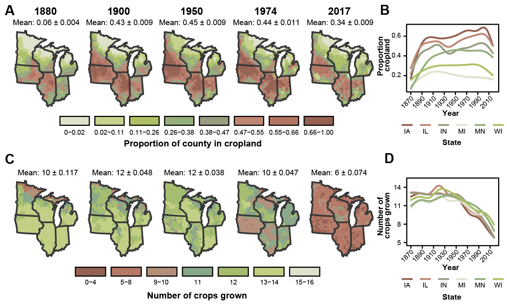{ width=60% }

**Figure 1:** Trend in rarified bumble bee species richness from 1877-present. Each point represents a date range that is standardized to contain an approximately equal number of bumble bee records (thus the date range differs for each point), and it is plotted at the midpoint year of the date range. Error bars are 95% confidence intervals. The fitted line is a linear model predicting estimated species richness as a function of temporal bin order using the midpoint of the temporal bin as the predictor. Carpet plot represents temporal collection year for all records from 1877 to present.

\clearpage

\newpage
{ width=100% }

**Figure 2:** Patterns of agricultural intensification in two metrics: (A) proportion of county under cultivation and (C) number of crops grown per county. Inset graphs (B,D) depict general trend of these variables for each state in the study area as modeled by a Loess curve. Predicted probability of occurrence for two example species, _B. impatiens_ (E,F) and _B. terricola_ (G,H) in each county given crop diversity and proportion cropland in each county. Darker colors denote smaller probability of occurrence, while lighter colors indicate larger probability of occurrence. Red points on each map are randomly selected occurrence records with a maximum of 50 plotted per year. (F,H) Fitted temporal trend of relative abundance when modeled with agricultural intensity metrics. Solid red lines denote statistically clear trend in relative abundance over time (p < 0.05), while dashed lines denote statistically unclear trends (p > 0.05). Points on temporal trend are slightly jittered for visibility. Color palettes derived using quantile binning. Values above maps are mean ± SEM for each response.

\clearpage

\newpage
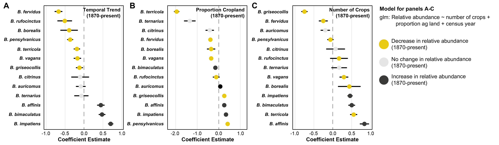{ width=100% }

**Figure 3:** Fitted model coefficients (± 95% confidence interval) for the relative abundance of each study species for (A) temporal trend of the species, (B) proportion of county in cropland, and (C) the number of crops grown in a county. Models were fitted using the entire dataset from 1870-present. The relative abundance trend from 1870-present (a) denotes point colors for b & c: yellow points are species whose relative abundance declined, gray points are no change in relative abundance, and black points denote increases in relative abundance.

\clearpage

\newpage

{ width=100% }

**Figure 4:** Fitted model coefficients (± 95% confidence interval) for each study species for (A) temporal trend of the species, (B) proportion of county in cropland, and (C) the number of crops grown in a county, (D) acres of pasture grown in a county, and (E) acres treated with insecticides. Models were fitted using data from 1982-present (only years for which pesticide and pasture acreage are available across all counties). Point colors indicate species relative abundance trend from 1982-present: yellow points denote species whose relative abundance declined, gray points denote no change in relative abundance, and black points denote increases in relative abundance.

\clearpage

\newpage

# Supplementary Material
### Appendix 1

**Analysis filtering data to unique _species x location x collector x date_ combinations**

To determine whether sampling effort by individuals skewed the results of our analysis, we fit our primary model (`relative abundance ~ proportion cropland + number of crops + agricultural census year`; results shown in Fig. 3) to a reduced dataset, filtering records to include only unique combinations of species, location, collector, and collection date.  We found similar results in terms of the effect magnitude of predictors (proportion of cropland and number of crops), as well as the direction of the effect across study species (Fig. SA1.1).

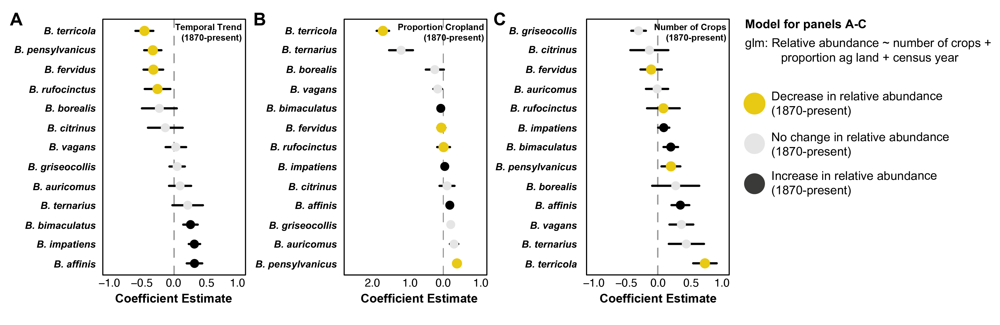{ width=60% }
**Figure SA1.1** Fitted model coefficients (± 95% confidence interval) for each study species for (A) temporal trend of the species, (B) proportion of county in cropland, and (C) the number of crops grown in a county. Models were fitted using the entire dataset from 1870-present, but filtered to unique species x location x collector x date combinations. Point colors indicate species relative abundance trend from 1870-present: yellow points denote species whose relative abundance declined, gray points denote no change in relative abundance, and black points denote increases in relative abundance.

\clearpage

\newpage
### Appendix 2

**Analysis restricting to records within ± 2 years of agricultural census**

As agricultural census records are collected every 10 years, we were required to pair bumble bee records to the nearest agricultural census (a difference of up to ± 5 years).  This requirement might skew results if agricultural metrics display non-linear trends between census years.  TO determine if this was the case, we filtered records such that only bumble bee within ± 2 years of an agricultural census data were included.  Modeling these data resulted in broadly similar patterns of species relative abundance trends and response to proportion agriculture.  The response of species to number of crops showed the effect magnitude increase for some species, but the rank order of species responses was mostly similar (Fig. SA2.1).

{ width=60% }
**Figure SA1.1** Fitted model coefficients (± 95% confidence interval) for each study species for (A) temporal trend of the species, (B) proportion of county in cropland, and (C) the number of crops grown in a county. Models were fitted using the entire dataset from 1870-present, but filtered to only include bumble bee records within ± 2 years of an agricultural census. Point colors indicate species relative abundance trend from 1870-present: yellow points denote species whose relative abundance declined, gray points denote no change in relative abundance, and black points denote increases in relative abundance.

\newpage
### Appendix 3
**Raw changes in species relative abundance over time**

For each species, we calculated relative abundance for each temporal bin as the number of records of a given species divided by the total number of records for all species in that temporal bin. We then tested whether there was a statistically clear change in relative abundance over time by fitting generalized linear models with binomial error distributions for each species using time (i.e., temporal bin) as the sole predictor with each point weighted by the number of records [similar to @Bartomeus2013].

Of the 13 species included in our simple analysis of change in relative abundance over time, 6 saw statistically clear reductions in relative abundance: _B. borealis_, _B. fervidus_, _B. pensylvanicus_, _B. rufocinctus_, _B. terricola_, _B. vagans_ (Table S1). Similar to the patterns of estimated species richness, reductions in the relative abundance of these declining species seem to begin in the middle of the 20th century.  There were 7 species which increased in relative abundance over time period covered by this dataset: _B. affinis_, _B. auricomus_, _B. bimaculatus_, _B. citrinus_, _B. griseocollis_, _B. impatiens_, and _B. ternarius_.

**Table SA3.1:** Relative abundance estimates for each species across 8 time bins, sized in order to contain approximately equal numbers of bumble bee records per bin.  Coefficient estimates and p-values derived from models fit to estimate trends in relative abundance over time, where relative abundance of each species is predicted by time bin fit using a generalized linear model, with N records representing the number of records for a given species.

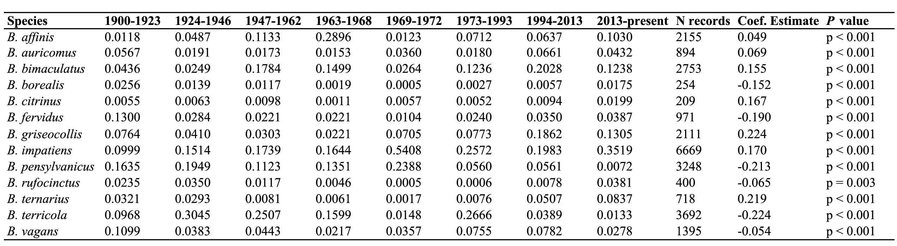{ width=100% }

\clearpage

**Supplementary Table 1:** Generalized linear model results for each study species including the sample size (number of counties for which relative abundance is calculated), model term, scaled coefficient estimate, 95% confidence interval and p-value.  Each county is weighted by the total number of bumble bee records for a given time point (agricultural census year).

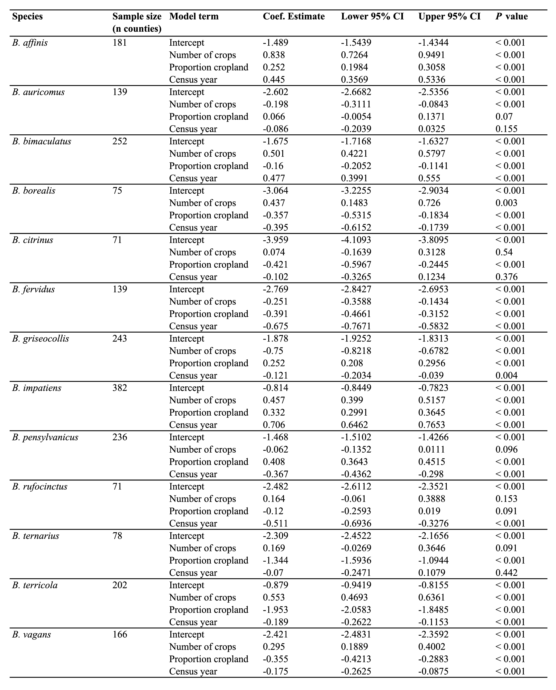{ width=60% }

\clearpage

**Supplementary Table 3:** Generalized linear model results for each study species including the sample size (number of counties for which relative abundance is calculated), model term, scaled coefficient estimate, 95% confidence interval and p-value.  Each county is weighted by the total number of bumble bee records for a given time point (agricultural census year).

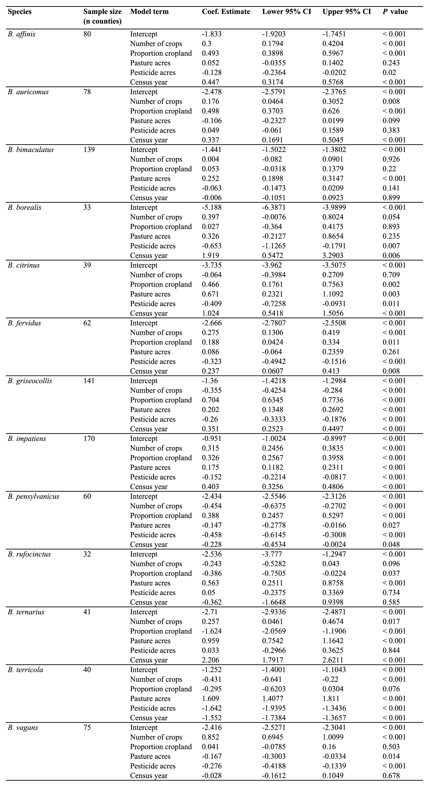{ width=60% }

\clearpage

\newpage

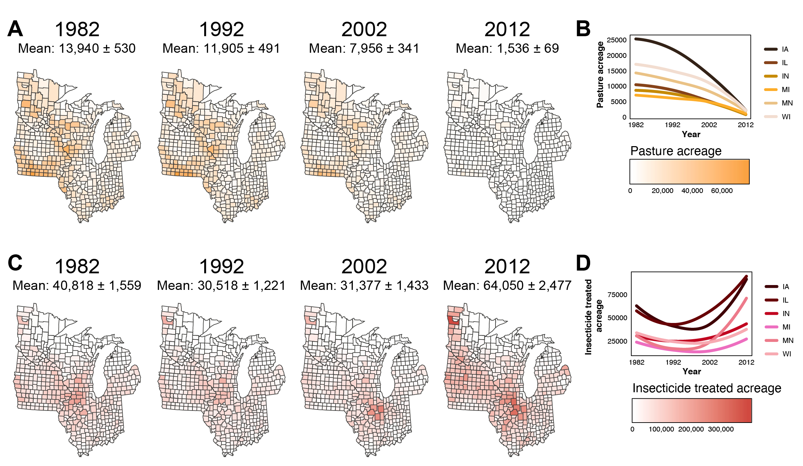{ width=80% }

**Supplementary Figure 1:** The location of bumble bee records for each US Census of Agriculture year considered in our analysis.  The number of records is noted below the year.  Points are partially transparent and jittered slightly for visibility.

\clearpage

\newpage

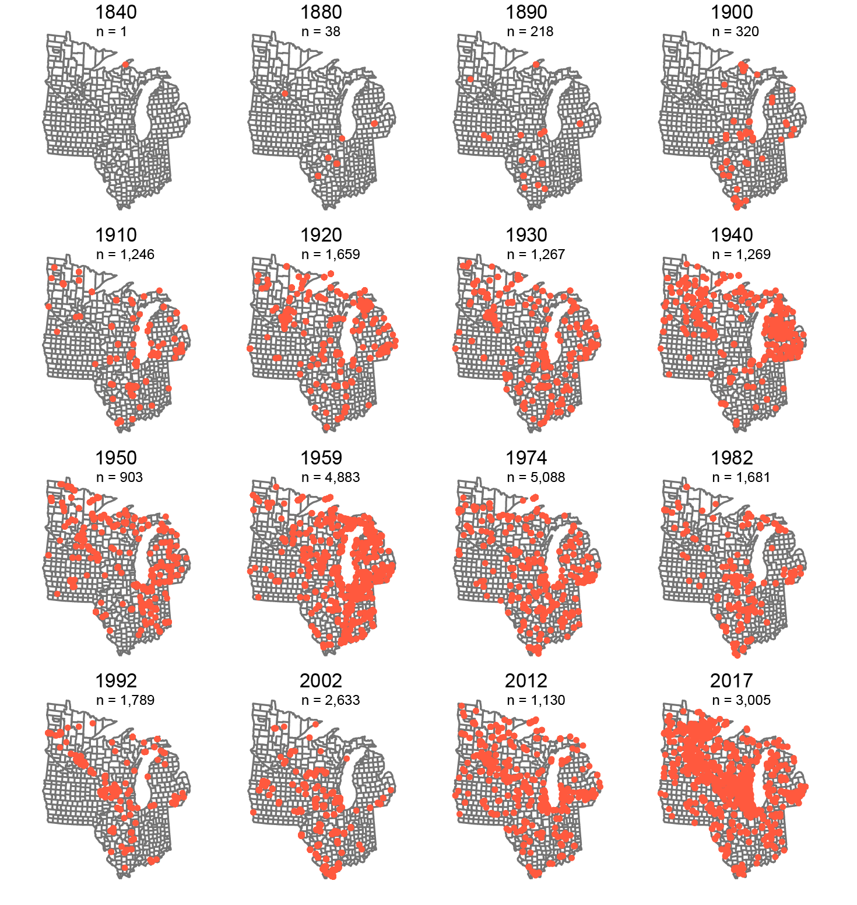{ width=60% }

**Supplementary Figure 2:** Sample-based species accumulation curves for each of 15 temporal bins (different colors) from which estimated species richness was calculated (Fig. 1). Each accumulation curve is constructed for temporal bins with a roughly equal number of records.  Solid lines are interpolated from data, while dashed lines are extrapolated to a 6,000 record limit.

\clearpage

\newpage

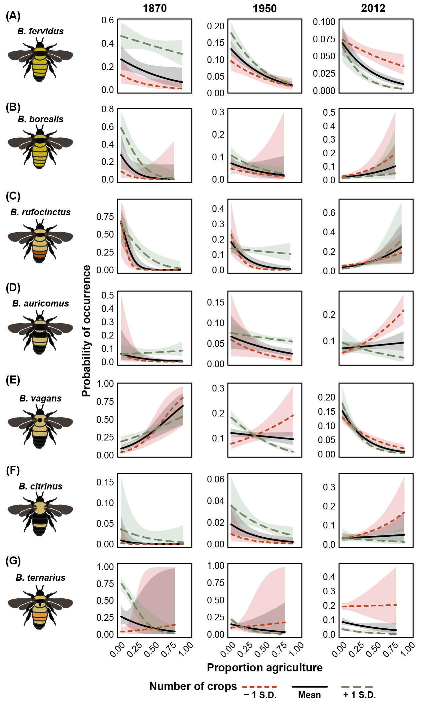{ width=60% }

**Supplementary Figure 3:** Trend in rarified bumble bee species richness from 1877-present for alternative numbers of temporal bins, each representing approximately equal numbers of bumble bee records: (A) 5 temporal bins and (B) 8 temporal bins.  Each point is plotted at the midpoint of the temporal bin date range.  Error bars are 95% confidence intervals.  The fitted line is a linear model predicting estimated species richness as a function of temporal bin order using the midpoint year of the temporal bin as the predictor.  Carpet plot represents temporal collection year for all records from 1877 to present.

\clearpage

\newpage

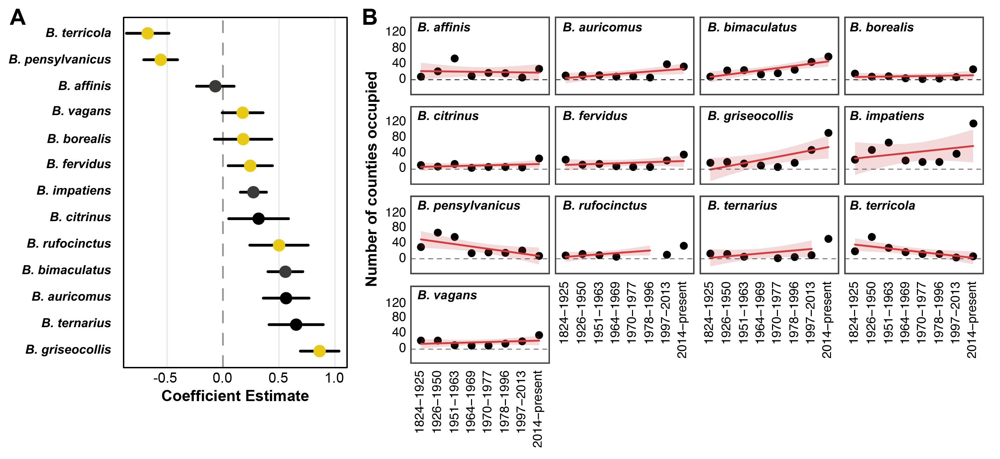{ width=100% }

**Supplementary Figure 4:** (A) Fitted model coefficients for each species for change in county occupancy over time. (B) For each species, plotted temporal trends of county occupancy over time with fitted GLM models with 95% confidence interval. Point colors indicate species relative abundance trend from 1870-present (see Fig. 3a): yellow points denote species whose relative abundance declined, gray points denote no change in relative abundance, and black points denote increases in relative abundance.

\clearpage

\newpage

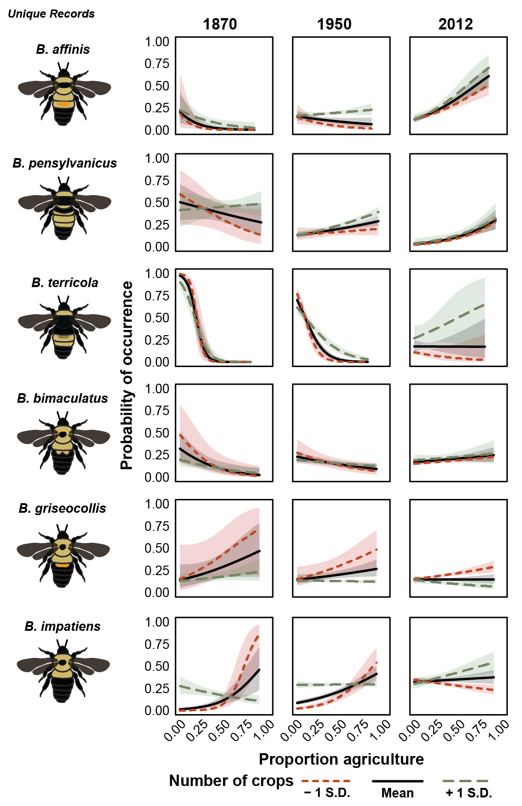{ width=100% }

**Supplementary Figure 5:** Patterns of agricultural intensification in two additional metrics from 1982-2012: (a) proportion of county area in pasture and (c) proportion of county area treated with insecticides.  Color palettes derived using quantile binning.  Inset graphs (b,d) depict general trend of these two variables for each state in the study area as modeled by a Loess curve.  Values beneath years are mean proportion ± SEM.

\clearpage

\newpage

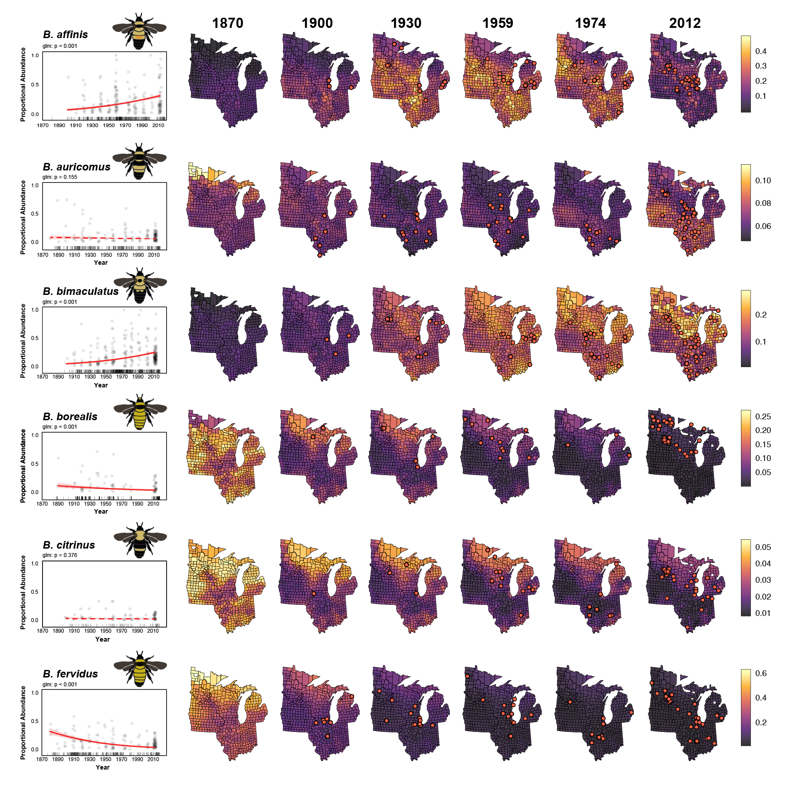{ width=100% }

\clearpage

\newpage

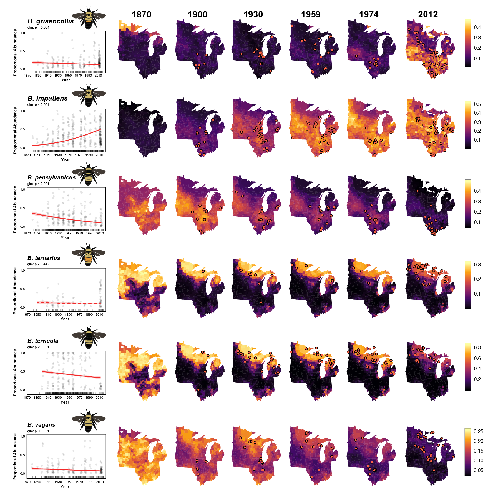{ width=100% }

**Supplementary Figure 6:** Fitted temporal trend of relative abundance when modeled with agricultural intensity metrics along with the predicted probability of occurrence for each study species in each county given crop diversity and proportion cropland in each county.  Darker colors denote smaller probability of occurrence, while lighter colors indicate larger probability of occurrence.  Solid red lines denote statistically clear trend in relative abundance over time (p < 0.05), while dashed lines denote statistically unclear trends (p > 0.05).  Points on temporal trend are slightly jittered for visibility.  Red points on each map are randomly selected occurrence records with a maximum of 50 plotted per year.

\clearpage

# References