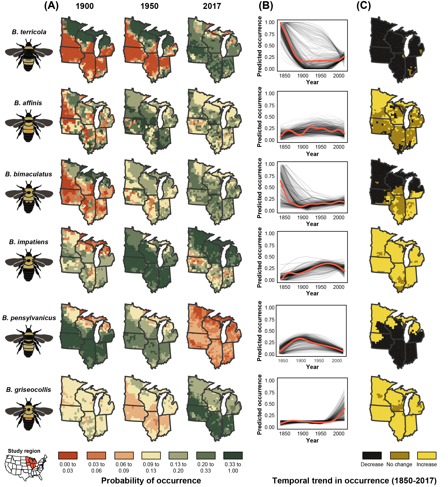
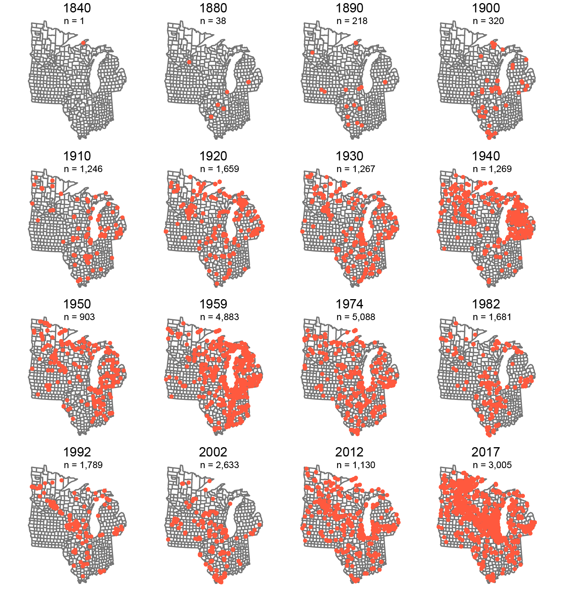

\captionsetup[table]{labelformat=empty}

# Significance statement
Recent concerns about global insect and bee declines have suggested that modern agricultural expansion and productivity-focused agricultural intensification are a potential reason for the observed declines. However, this hypothesis has not been formally tested, largely due to a lack of historical data on the relationship between agricultural land use change and important taxa. We combined datasets from 130 years of bumble bee records, important species of both agricultural and conservation concern, and a synthesis of long-term agricultural census records to show that agricultural intensification, including the extent of agricultural land, richness of crops grown, as well as management practices implemented on the ground, are key predictors of bumble bee occurrence and for some species are associated with their declines.

# Introduction
Agriculture is a primary way in which humans alter terrestrial landscapes and is cited as a principle cause of biodiversity declines worldwide [@Foley2005a; @Foley2011b; @Klein2007g; @Tilman2011; @Tscharntke2012]. In particular, the intensification of agriculture, that is, the widespread planting of crop monocultures, managed for high productivity promoted by fertilizers and pesticides, and high disturbance agronomic practices such as tillage, has been associated with the extensive loss of a number of ecosystem service providing taxa [@Benton2002; @Robinson2002; @Meehan2010a]. There is circumstantial evidence that agricultural practices are driving recently documented, large-scale decline of insects [@Hallmann2017; @Seibold2019]. Pollinating insects, specifically bees, have been particularly impacted, sounding an alarm among conservationists across the world [@Steffan-Dewenter2005c; @Tylianakis2013a].

Bumble bees (Apidae: _Bombus_) are a well-studied bee taxon that includes many species documented to be declining across Europe and North/South America [@Biesmeijer2006; @Colla2008; @Grixti2009; @Cameron2011; @Bartomeus2013; @Morales2013; @Wood2019]. Studies point to agricultural intensification as a key driver of bumble bee population decline [@Grixti2009; @Goulson2015c]. Intensification includes both attributes within a farming system (i.e., pesticide use, number and types of crops used), and the effects on agricultural landscapes (i.e., amount of land in cultivation compared to natural habitats not used for agriculture). Despite the hypothesized threat of agricultural intensification on bumble bees, no studies have specifically tested the hypothesis that long-term patterns of changes in agriculture are associated with changes in bumble bee populations. In general, this is due to a paucity of long-term data of both bumble bee occurrence and historical agricultural patterns at sufficiently large spatial scales.

While contemporary studies examining bumble bee responses to agriculture provide some insights, historical data from archives such as museum records, are important tools to explore patterns of bumble bee change over the course of decades, and offer insights of drivers at temporal and spatial scales that elude detailed, small-scale experimental approaches [@Meehan2011; @Rosenheim2017]. The continued addition of records to repositories such as the Global Biodiversity Information Facility (GBIF) combined with modern, extensive surveys of bumble bee fauna (e.g., Bumble Bee Watch, iNaturalist) offer widespread, species-specific spatial distribution patterns. Moreover, analyses of records from such repositories have benefited from statistical approaches that account for known biases in archival data [@Pearce2006; @Bartomeus2013; @Bartomeus2019].

To test the hypothesis that long-term bumble bee population trends are associated with patterns of agricultural intensification, we utilized an extensive data set of historical bumble bee museum records and modern citizen-science surveys for the North Central USA and combined this with a newly available digital dataset of agronomic metrics recently compiled from United States Census of Agriculture over the period 1870-2018 (Crossley et al. in review).

We predicted that increasing agricultural intensification, as measured by the amount cropland and cropland treated with insecticides, would be negatively associated with bumble bee relative abundance [@Williams2009; @Goulson2008c; @Goulson2015c; @Samuelson2018].  In contrast, we expected that features of agricultural landscapes that increase diversity, such as higher richness of crops grown, and low intensity agronomic practices, such as the presence of pastures and the use of cover crops, would be positively associated with bumble bee relative abundance [@Sirami2019].

# Methods
We focused our study in the USA on the North Central states of Minnesota, Wisconsin, Iowa, Illinois, Michigan, and Indiana as these states share a similar biogeographic contexts and agricultural history. We limited our analysis to bumble bee species whose core ranges overlapped these states [@Williams2014], including: _B. affinis_ Cresson; _B. impatiens_ Cresson; _B. griseocollis_ DeGeer; _B. bimaculatus_ Cresson; _B. auricomus_ Robertson; _B. ternarius_ Say; _B. vagans_ Smith; _B. borealis_ Kirby; _B. citrinus_ Smith; _B. pensylvanicus_ De Geer; _B. fervidus_ Fabricius; _B. rufocinctus_ Cresson; and _B. terricola_ Kirby. Four species, _B. fraternus_, _B. perplexus_, _B. ashtoni_ (bohemicus), and _B. variabilis_, were not included in our analyses as they lacked sufficient records to meaningfully interpret changes in relative abundance and county occupancy over time. Of the study species, three (_B. affinis_, _B. terricola_ and _B. pensylvanicus_) are known to be in decline nationally and are of conservation concern [IUCN Red List; @Colla2008; @Jacobson2018a].

## Bumble bee record data
We obtained bumble bee records from the Global Biodiversity Information Facility (GBIF), querying for all records within our study region. These data were combined with records from the North American Bumble Bee Watch program by the Xerces Society for Invertebrate Conservation. In total, 25,271 records were compiled from GBIF from 1877 to 2017 and 2,611 from Bumble Bee Watch from 2007 to 2018 for a total of 27,882 unique records over 358 of 535 total counties in the study region (Fig. S1). The species contained in each dataset were mutually inclusive. We then filtered records to include only those which were appropriately geo-referenced (i.e., had associated longitude and latitude). Each record was assigned to a county based on its collection coordinates so that they could be matched to county-level agricultural census data. Bee and agricultural census data are therefore compared at the county-level.  Because 95% of records were from 1890 and beyond, we are confident that county assignments are accurate, as changes in county geographic extent in this region were largely complete by 1890 (Crossley et al. in review).

Temporal comparisons of museum and incidental records can be challenging due to non-standardized collection techniques as well as collector and spatial biases [@Bartomeus2013; @Richardson2018; @Bartomeus2019]. To account for this, we analyzed records using a variety of techniques to attempt to control for such biases. First, we filtered the dataset to include only “single individual” sampling events (i.e., unique combination of species, date, location, and collector), following @Richardson2018. All analyses described below were conducted using both the full and reduced datasets. Filtering to “single individual” sampling events did not impact our conclusions (Fig. S2), and thus we present results from the full dataset.

## Calculating bumble bee relative abundance
In order to estimate changes in bumble bee populations over time, we calculated the relative abundance of each species within each county by agricultural census year. Bumble bee records were binned with the closest agricultural census year (see section below “Pairing bumble bee records with historical agriculture dataset”), and we divided the total number of records of a given species by the total number of records for all species within each county-census year combination. We only calculated relative abundance where species were observed (i.e., no pseudo-absences were used). Additionally, we limited our analysis to only include county-year combinations with greater than 5 total bumble bee records to eliminate counties with limited sampling effort and where low numbers may artificially inflate the relative abundance of given species.

## Estimating change in county occupancy
Changes in relative abundance may not fully capture declines if species remain stable in relative abundance in occupied counties while the number of occupied counties decreases over time, i.e., there are range restrictions but the relative abundance where they are found remains unchanged. To explore this possibility, we used the approach of @Bartomeus2013 and created a set of temporal bins of records such that there were approximately the same number of bee observations per temporal bin (`rbin` package in R). We used several binning strategies to determine if the number of bins affected our results [@Bartomeus2013], including a total of 5, 8, and 15 temporal bins. To account for changes in county-level occupancy (i.e., a proxy for the species range), we modeled the number of occupied counties per equal-record temporal bin using the midpoint year for each bin for each bumble bee species predicting number of counties occupied as a function of the time using a generalized linear model.

## Calculating temporal patterns of diversity
To estimate how bumble bee species richness has changed over time, we rarefied bee records to generate estimates of mean species richness for each equal-record temporal bins with 95% confidence intervals using the `iNEXT` package [@Hsieh2016].  All 15 species accumulation curves rapidly reached an asymptote, indicating that sample sizes were sufficient to capture bumble bee community diversity within each bin (Fig. S3). We then fit a linear model to determine the change in species richness over time. Because each time bin contained a different number of years, we used the midpoint of each bin as the value from which to construct the model. We also conducted a permutation test to determine if the correlation between species richness and time could have been observed by chance alone, since the assumption of normally distributed data for such a small sample in our linear model (e.g., n=5 bins) may be violated. Using the maximum number of permutations (given the number of bin time points), we randomly shuffled the temporal bin order, calculating the correlation between bin and species richness estimates in each permutation, with the p-value equaling the fraction of permuted correlation coefficients greater or less than the true chronological correlation coefficient. Estimated species diversity trends were consistent regardless of the number of bins (Fig. S4), however p-values varied with number of bins (significant and marginally significant trend for 15 and 8 bins, respectively, but not for 5 temporal bins).  We present results from the 15-bin analyses for estimation of species richness over time in order to portray the highest resolution of the estimated species richness pattern.

## Historical agricultural data
To assess the extent, diversity, and intensity of agriculture, we used county-level agricultural census data projected and geographically corrected by Crossley et al. (in review). Briefly, Crossley et al. (in review) analyzed the spatial patterns of 18 crops (occupying at least 5% of county area) at the county-level and computed county proportion of crop area and crop richness from 1840-2017, correcting for changing county boundaries using areal-weighting techniques. Our objective was to estimate county-level (n=535 counties) agricultural metrics, which included aspects of both extensive and intensive farming practices. We limited our metric calculations to the 18 most common crops which together represent over 80% of cropland area study region. For each county by census year, we calculated crop richness (range 0-18) and the proportion of county area in cropland (range 0-1) as our metrics of agricultural intensity.

From 1982 onward, the USDA Census of Agriculture also collected data for additional aspects of agricultural management that are hypothesized to influence bumble bees. These included the proportion of land in a county in pasture and cover crops, as well as proportion of cropland treated with insecticides [@Meehan2011; @Meehan2015; @Meehan2016a]. We extracted these variables from the database but used them in a separate analysis for this more recent period (see "Statistical analyses" section below).

## Pairing bumble bee records with historical agriculture dataset
Because agricultural census data are collected every 10 years, not every bumble bee record was collected in a year coinciding with an agricultural census. Accordingly, we pooled bee records such that they were within ± 5 years of the nearest agricultural census date (e.g., bumble bee records from 1925-1935 were paired with the 1930 Census of Agriculture data). While this pairing may not perfectly reflect the state of agriculture experienced by collected bumble bees, we posit that it is still meaningful given that large, county-level changes in agricultural practices occurring over several decades are unlikely to manifest in time spans less than five years. Nevertheless, to verify this assumption we performed additional analyses with a stricter ± 2-year pairing rule (i.e., dropping bee data from years outside of these narrower windows) and found similar results (Fig. S5). We thus present the analysis with the full dataset and ± 5-year pairing.

## Statistical analyses
Relating changes in bumble bee relative abundance to agricultural intensity
We constructed statistical models to examine whether changes in metrics of agricultural intensification were related to bumble bee relative abundance. For each bumble bee species, we fit a generalized linear model with a binomial error structure to predict county-level relative abundance (for a given agricultural census year, number of records of a given species divided by total number of bumble bee records in that year) as a function of (1) number of crops grown within a county, (2) the proportion of county area in agriculture, and (3) the year of the agricultural census data associated with that bumble bee record. This allowed us to determine temporal patterns in species relative abundance while taking into account variation in agricultural intensification. Observations were weighted by the number of bumble bee records in a county by agricultural census year, effectively giving more weight to counties that had greater sampling intensity. We assumed that these counties provided more accurate estimates of species relative abundance at any given time. For all models, we examined variance inflation factor (VIF) for each term and determined there was no problematic multicollinearity (all VIF values below 5).

Because of the spatial nature of these data, we tested for spatial autocorrelation in model residuals. As the structure of each species GLM model above contains the same counties from multiple agricultural census years, testing for spatial autocorrelation on the entire model is misleading as only spatial autocorrelation within a given agricultural census year may be problematic. As such, we used the agricultural census time period with the greatest number of records for a given species to test for spatial autocorrelation. For each species, we constructed a generalized linear model fitting relative abundance as a function of proportion cropland and number of crops as described above. We then tested model residuals for spatial autocorrelation using a Moran’s I test in the `spdep` package [similar to @Meehan2011; and @Meehan2015] using a p-value of 0.05 at the critical threshold. Of the 13 study species, _B. affinis_, _B. griseocollis_, and _B. impatiens_ showed significant spatial autocorrelation. To account for this, we fit spatial error models for these three species using the `spdep` package and used the GLM framework for the remaining species. We chose spatial error models given the results of Legrange multiplier tests, similar to @Meehan2011.

We also tested for temporal autocorrelation within the residual response of each species in models from the entire span of the dataset from 1870-2018. For each species model, we visually examined residuals plots and residual lag correlation values using the `acf` function in R. No species showed temporal autocorrelation across the range of the dataset, as such we did not incorporate any temporal autocorrelation structure to our models.

To visualize the estimated change in relative abundance and range, we used our fitted models from 1870-2018 to predict species occurrence across our study area using county-level agricultural intensification metrics. These maps describe the predicted probability of occurrence in each county as function of crop diversity and proportion of a county in cropland. We selected 6 roughly equally spaced time points that spanned the length of our dataset (1870, 1900, 1930, 1959, 1974, and 2012) for which we used fitted models to generate predictions. These maps help to depict how county-level bumble bee relative abundance changed over time as predicted by agricultural intensification variables.

Another series of models were constructed adding the additional hypothesized drivers of bumble bee relative abundance that were available for the period after 1982. Generalized linear models with a binomial error structure were fit to predict county-level species relative abundance as a function of the proportion of county in pasture, proportion of county in cover crops, proportion of county treated with insecticides, and the agricultural census year. By adding additional putative drivers to our original model, we were able to see if the response of the proportion cropland and crop richness remained consistent given additional drivers that may be collinear. Because the additional variables are known to be correlated to proportion cropland and crop richness, we examined VIF for each model.  In this analysis of the more recent bee observations we removed proportion cropland from models due to high multicollinearity (VIF > 10 in several models) and because we were more interested in exploring the effects of the additional variables on bee occurrence.  All data cleanup, analyses, and plots were conducted in R [Version 3.4.6, @R].

# Results
## Changes in agricultural intensification
From the onset of available land-use records in the 1870s, agricultural landcover increased rapidly and began to plateau by the 1910-20s. The areal extent of cropland peaked in the study region in 1950 (45% ± 0.9% of county area, mean ± standard error). Since then, it has decreased almost 10% to an average of 34% ± 0.9% in 2012 (Fig. 1A,B). There are within-region differences in agricultural cover with northern areas of the study region remaining relatively low in agricultural cover, while the highest intensity of agricultural cover occurs in the “corn belt” that stretches through southern Minnesota, Iowa, southern Wisconsin, central and northern Illinois, and northern Indiana. Of the 18 crops for which we compiled data (Crossley et al. in review), an average of 12 ± 1 were grown per county from 1880 – 1950. Since 1950, this number has declined ~50%, with counties today growing on average 6 ± 1 crops (Fig. 1 C,D).

The additional agricultural intensification variables that we utilized, available for the last 3 decades, showed diverging patterns, with proportion of pasture declining 90% from 1982 to present from an average of 3% of county area in 1982 to 0.3% in 2012, while the proportion of total county area treated with insecticides increased 54% from an average of 11% of county area in 1982 to 17% in 2012. (Fig. S6). Cover crops increased 430% from an average of 0.5% in 1982 to 2.6% in 2012. These changes occurred over similar spatial extents, primarily concentrated in the corn-belt counties throughout the middle of the study region.

## Species richness has declined
Rarefied species richness estimates for the study region declined significantly over the last 130 years; 20% over the study period from approximately 15 to 12 species from 1824-1925 to present, respectively (Fig. 2, Linear model: t1,13 = 6.084, p = 0.0283; Permutation test: p = 0.03). A sharp drop in estimated species richness occurred between in the 1950s, followed by a slight rebound in the next 50 years.

## Change in county occupancy varies by species
Over the last 130 years, the fraction of counties in which species were found, a proxy of spatial extent of a species’ distribution, showed 4 species increasing in occupancy over time, 5 stable, and 4 declining (Fig. 3). There was a marked expansion of common species (e.g., _B. griseocollis_, _B. bimaculatus_, _B. auricomis_, and _B. impatiens_).  In contrast, all species that are currently of conservation concern (_B. pensylvanicus_, _B. affinis_, and _B. terricola_, _B. fervidus_) showed decreases in the number of counties in which they were found over time, despite an increase in sampling effort during the more recent time periods.

# Patterns of bumble bee relative abundance are related to agricultural intensity
In addition to variability in the spatial extent of bumble bee species over time, the relative abundance of species when they are found also changed markedly over time. Overall, we found that 7 of 13 species decreased in relative abundance, while 4 remained stable and 2 increased over the study period, even after accounting for agricultural intensification variables used in this analysis (Fig. 4A, Table S2, Fig. S7).  Moreover, patterns in bumble bee relative abundance showed strong associations with agricultural intensification metrics (Fig. 4B, C). Generally, species whose relative abundance increased over time, such as _B. impatiens_ (Fig. 5 A, B), were generally unaffected by higher proportions of agriculture. In contrast, for species whose relative abundance declined over time, such as _B. terricola_ (Fig. 5 C, D), counties with higher proportions of agriculture were associated with larger declines in species relative abundance.  Crop richness, though, had either a positive or neutral effect on relative abundance for almost all study species.

A larger amount of cropland in a county, after accounting for changes in bee relative abundance over time, was associated with a decrease in relative abundance 6 species and an increase in 5 species showed a positive association with increasing agriculture (Fig. 4B). Among species whose relative abundance declined from 1870-2018, the proportion of county in agriculture was negatively associated with relative abundance in 4 species. The strongest decline in relative abundance associated with proportion of cropland was for _B. terricola_.

In contrast, an increasing crop species richness within a county was associated with an increase in bumble bee relative abundance of 4 species, while 3 species decreased in abundance. The responses of declining species to crop richness was mixed, with 1 decreasing, 1 increasing, and 5 remaining stable in relative abundance as crop richness increased (Fig. 4C). However, the effects of crop richness on bumble bee relative abundance were generally smaller than the negative effects of increasing the amount of cropland in a county.  The relative abundance of one declining species, _B. fervidus_, was negatively related to all crop metrics.

For more recent years (1982-2018) when additional types of agricultural data were available, we found that the extent of pasture, cover crops, and use of insecticides also influenced bumble bee relative abundance (Fig. 6, Table S3). For example, an increasing amount of cover crops within a county was positively associated within increases in the relative abundance of 3 bumble bee species, and a decrease in 3 species, and 7 remained stable (Fig. 6C). Of the 2 species whose relative abundance declined from 1982-2018, _B. terricola_ and _B. pensylvanicus_, both were species of conservation concern and both had higher relative abundance in counties with more cover crops.

An increase in the proportion of land in pasture was associated with higher relative abundance of 4 bumble bee species (Fig. 6D, Table S3). Interestingly, the relative abundance of _B. terricola_ had a strong positive association with increased proportion of pasture. The remaining 9 species were not sensitive to changes in the proportion pasture in a county.

Finally, we found that as the proportion of a county treated with insecticides increased, the relative abundance of 4 species decreased (Fig. 6E, Table S3). Surprisingly, four species increased in relative abundance with increasing insecticide use, while the remaining 5 remained stable as insecticide use increased. Again, _B. terricola_, a species of conservation concern, was most sensitive to pesticide use patterns with its relative abundance lower in counties where there was a higher proportion of cropland treated with insecticides.

# Discussion
Using bumble bee observations recorded over 130 years across 6 north-central US states and a novel dataset on the historical patterns of agricultural land use and practices, we explored the hypothesis that agricultural intensification is associated with bumble bee declines. In doing so, we take special care to account for biases associated with historical collections and employed a variety of techniques including subsampling and sensitivity analyses to determine whether our chosen methods skewed results [@Bartomeus2019]. Irrespective of the approaches used, we consistently identified declines in over half of study species with clear associations to metrics of agricultural intensity. In addition to providing further evidence of bumble bee declines throughout the Midwestern US, both in spatial extent and relative abundance we document that even after temporal trends are accounted for, there is evidence that increases in agricultural intensification favors a select few species of bumble bees in the landscape at the expense of others.

With few exceptions, species whose relative abundance was found to be increasing or stable either had positive or neutral relationships with agricultural intensification metrics. For example, species such as _B. impatiens_ appear to thrive in areas and/or times of intensive agricultural intensification. In contrast, species in decline such as _B. terricola_ were sensitive to agricultural intensification and were less common in areas with proportionally more cultivated land.

Yet, our results suggest that the extent of agricultural land is not the sole predictor of the fate of bumble bee species, as the manner in which agriculture is practiced also affects abundance patterns. For example, increases in the extent of pasture and higher crop richness, both agricultural features of the landscape, generally had positive relationship with bumble bee relative abundance. This was true especially for species of conservation concern. That is, species that were declining were negatively affected by large areas of the cropland that were dominated by few crops, while they were relatively more common when landscapes were more agriculturally diversified.  Another indicator of agricultural intensification, the proportion of cropland to which insecticides are applied, was generally associated with negative effects on the relative abundance of bumble bees. This is consistent with studies that show a significant, negative impact of insecticides on bumble bee behavior [@Feltham2014], colony growth [@Mallinger2015a; @Whitehorn2012] and reproduction [@Whitehorn2012; @Siviter2018a].

These patterns suggest potential opportunities in agricultural landscapes for bumble bee conservation.  Even landscapes with a high areal extent of agriculture may still support both common and declining bumble bee species provided there is a high diversity of crops, perennial features such as pasture, and limited insecticide use. @Sirami2019 found a similar pattern for farmland biodiversity: increasing the diversity of crops and decreasing field size had a large, positive effect on multi-trophic indices of biodiversity. Our results provide additional evidence that agricultural landscape heterogeneity is key to supporting farmland biodiversity [@Benton2003; @Fahrig2011b].

In contrast to recent studies examining trends in biodiversity [e.g., @Dornelas2019], our analyses did not reveal a net balance in the number of increasing and decreasing bumble bee species. Of the 13 species analyzed, only 2 were found to increase over the study dataset (1870-2017), while 4 remained at similar levels, and 7 were found to have declined significantly in relative abundance. The declining species in our study match those found to be in decline elsewhere, including in individual state analyses within our study region @Grixti2009; @Wood2019], the US East coast [@Richardson2018; @Jacobson2018a], Canada [@Colla2008], and North America [@Cameron2011; @Colla2012]. A few species are of particular concern (e.g., _B. terricola_ and _B. pensylvanicus_), both of which we observed decline significantly in relative abundance and range extent over the study period, follow patterns seen in other studies [@Jacobson2018a; @Wood2019], and suggest that protection efforts may be warranted if these patterns of decline continue. For the federally endangered _B. affinis_, we found that county occupancy declined significantly, though interestingly in counties where it is found in the upper Midwestern US, relative abundance did not change, contrary to other longitudinal studies [@Colla2012; @Richardson2018]. When examining patterns of _B. affinis_ decline across its entire range, there is clear evidence for extensive range reductions and local extirpations [@Cameron2011; @Colla2012; @Wood2019]. The subset of the range observed in our study has the most extensive modern records of _B. affinis_, suggesting that our observed regional patterns may differ from range-wide population trends.

An increase in proportion of agriculture and a reduction of crop richness may not necessarily be the direct causal factors of bee declines, but rather could be associated with, or indicators, such as other agricultural practices or anthropogenic processes [e.g., @Kerr2015; @Soroye2020] that have more direct effects on bumble bees. Interestingly, climate change-related forces may be expected to affect bees in a linear fashion, as global warming increased over the last century, however bee declines became more noticeable only in the second half of the last century.  While this may suggest a threshold response, agricultural intensification not associated with an increase in land in cultivation in the post-war era accelerated during this time. That is, most agricultural land conversion occurred in the first half of the 20th century, while it was the loss of crop diversity and pastures, and an increase in insecticide use [@Meehan2011; @Meehan2015] that where the major factors changing in agriculture after the 1950’s. This suggests that agricultural intensification per se, in addition to other factors, is a likely driver of bumble bee declines.

Agricultural intensification is also correlated with a decrease in the amount of other natural habitats that support diverse floral habitat such as grasslands [@Smith1998; @Brown2011] and bumble bee forage plants [@Carvell2006b; @Scheper2014], as well as increases insecticide use [@Meehan2011; @Meehan2015]. A shift from the diverse cropping systems of the early to mid 1900’s to largely monocultural systems in recent years has also altered the temporal continuity of available floral resources @Schellhorn2015c; @Timberlake2019] and total pollen availability, which has been shown to negatively impact bumble bee health [@Vaudo2015; @Cameron2020], colony growth and development [@Williams2012b; @Hass2018a], and may be of particular concern for species with more limited diet breadths [@Kleijn2008; @Wood2019]. Future studies could be designed to explore the relationships described in this paper in order to obtain a more detailed and mechanistic understanding of how select agricultural factors are impact bumble bee populations.

## Conclusions
Over the last 130 years, agricultural intensification has elicited strong pressures on animal populations, potentially favoring particular winners and losers in bumble bee communities in our agricultural landscapes. Our study supports a growing literature documenting the extent and temporal patterns of bumble bee declines in the Midwestern US, and further provides a first test of the hypothesis that agricultural intensification as a driver of changes in bumble bee abundance and community composition over the last century.  This work provides support to the hypothesis that the expansion and practices associated with modern productivity-based agriculture are potential drivers of other catastrophic declines observed in insect and arthropods in agriculturally dominated landscapes [@Hallmann2017; @Seibold2019]. The combination of our historical analysis along with a growing body of observational and experimental evidence suggests that changes to agricultural practices and policies that promote agricultural diversification at the landscape level may be required to limit additional declines of bumble bees in agricultural landscapes.

# Acknowledgements
We would like to thank Neal Williams, Christelle Guédot, John Orrock, Russ Groves, Charlie Nicholson, Erin Lowe, Ben Iuliano, Tim Meehan, Jamie Strange, and Sydney Cameron for the valuable feedback that improved this manuscript. Many thanks to Rich Hatfield and the Xerces Society for Invertebrate Conservation for providing Bumble Bee Watch data. Data and code for all analyses, figures, and the manuscript will be made publicly available upon publication at https://github.com/jhemberger.
\clearpage

\newpage
# Figures and Tables
{ width=100% }
**Figure 1:** Patterns of agricultural intensification in two metrics: (A, B) proportion of county under cultivation and (C, D) number of crops grown per county. Inset graphs (B,D) depict general trend of these variables for each state in the study area as modeled by a Loess curve.
\clearpage

\newpage
{ width=100% }
**Figure 2:** Temporal trend of rarified bumble bee species richness from 1877-present using the 15-bin approach. Each point represents a date range that is standardized to contain an approximately equal number of bumble bee records (thus the date range differs for each point), and it is plotted at the midpoint year of the date range. Error bars are 95% confidence intervals. The fitted line is a linear model predicting estimated species richness as a function of temporal bin order using the midpoint of the temporal bin as the predictor. Carpet plot represents temporal collection year for all records from 1877 to present.
\clearpage

\newpage
{ width=100% }
**Figure 3:** (A) Fitted model coefficients for each species for change in county occupancy over time. (B) For each species, plotted temporal trends of county occupancy over time with fitted GLM models with 95% confidence interval.
\clearpage

{ width=100% }
\newpage
**Figure 4:** Fitted model coefficients (± 95% confidence interval) for the relative abundance of each study species for (A) temporal trend of the species, (B) proportion of county in cropland, and (C) the number of crops grown in a county. Models were fitted using the entire dataset from 1870-present. The relative abundance trend from 1870-present (a) denotes point colors for b & c: yellow points are species whose relative abundance declined, gray points are no change in relative abundance, and black points denote increases in relative abundance.
\clearpage

\newpage
{ width=100% }
**Figure 5:** Predicted probability of occurrence for two example species, _B. impatiens_ (A,B) and _B. terricola_ (C,D) in each county given crop diversity and proportion cropland in each county. Darker colors denote smaller probability of occurrence, while lighter colors indicate larger probability of occurrence. Red points on each map are randomly selected occurrence records with a maximum of 50 plotted per year. (B,D) Fitted temporal trend of relative abundance when modeled with agricultural intensity metrics. Solid red lines denote statistically clear trend in relative abundance over time (p < 0.05). Points on temporal trend are slightly jittered for visibility. Color palettes derived using quantile binning. Values above maps are mean probability ± SEM for each response.
\clearpage

\newpage
{ width=100% }
**Figure 6:** Fitted model coefficients (± 95% confidence interval) for each study species for (A) temporal trend of the species, (B) number of crops grown in a county, (C) proportion of cover crop in a county, (D) proportion of pasture in a county, and (E) proportion of county treated with insecticides. Models were fitted using data from 1982-present (only years for which pesticide and pasture acreage are available across all counties). Point colors indicate species relative abundance trend from 1982-present: yellow points denote species whose relative abundance declined, gray points denote no change in relative abundance, and black points denote increases in relative abundance.
\clearpage

\newpage
# Supplementary Materials
## Appendix 1: Record locations and sample sizes
{ width=100% }
**Figure S1:** The location of bumble bee records binned from ±5 years of each US Census of Agriculture year considered in our analysis. The number of records is noted below the year. Points are partially transparent and jittered slightly for visibility.
\clearpage

\newpage
## Appendix 2: Analysis filtering data to unique species x location x collector x date combinations

To determine whether sampling effort by individuals skewed the results of our analysis, we fit our primary model (relative abundance ~ proportion cropland + number of crops + agricultural census year; results shown in Fig. 5) to a reduced dataset, filtering records to include only unique combinations of species, location, collector, and collection date. We found similar results in terms of the effect magnitude of predictors (proportion of cropland and number of crops), as well as the direction of the effect across study species.

{ width=100% }

**Figure S2:** Fitted model coefficients (± 95% confidence interval) for each study species for (A) temporal trend of the species, (B) proportion of county in cropland, and (C) the number of crops grown in a county. Models were fitted using the entire dataset from 1870-present but filtered to unique species x location x collector x date combinations. Point colors indicate species relative abundance trend from 1870-present: yellow points denote species whose relative abundance declined, gray points denote no change in relative abundance, and black points denote increases in relative abundance.
\clearpage

\newpage
## Appendix 3: Species rarefaction curves
{ width=100% }
**Figure S3:** Sample-based species accumulation curves for each of 15 temporal bins (different colors) from which estimated species richness was calculated (Fig. 2). Each accumulation curve is constructed for temporal bins with a roughly equal number of records. Solid lines are interpolated from data, while dashed lines are extrapolated to a 6,000 record limit.
\clearpage

\newpage
## Appendix 4: Species richness estimation for varying bin numbers
{ width=100% }
**Figure S4:** Trend in rarified bumble bee species richness from 1877-present for alternative numbers of temporal bins, each representing approximately equal numbers of bumble bee records: (A) 5 temporal bins and (B) 8 temporal bins. Each point is plotted at the midpoint of the temporal bin date range. Error bars are 95% confidence intervals. The fitted line is a linear model predicting estimated species richness as a function of temporal bin order using the midpoint year of the temporal bin as the predictor. Carpet plot represents temporal collection year for all records from 1877 to present.
\clearpage

\newpage
## Appendix 5: Analysis restricting to records within ± 2 years of agricultural census
As agricultural census records are collected every 10 years, we were required to pair bumble bee records to the nearest agricultural census (a difference of up to ± 5 years). This requirement might skew results if agricultural metrics display non-linear trends between census years. To determine if this was the case, we filtered records such that only bumble bee within ± 2 years of an agricultural census data were included. Modeling these data resulted in broadly similar patterns of species relative abundance trends and response to proportion agriculture. The response of species to number of crops showed the effect magnitude increase for some species, but the rank order of species responses was mostly similar (Fig. S2).

{ width=100% }

**Figure S5:** Fitted model coefficients (± 95% confidence interval) for each study species for (A) temporal trend of the species, (B) proportion of county in cropland, and (C) the number of crops grown in a county. Models were fitted using the entire dataset from 1870-present, but filtered to only include bumble bee records within ± 2 years of an agricultural census. Point colors indicate species relative abundance trend from 1870-present: yellow points denote species whose relative abundance declined, gray points denote no change in relative abundance, and black points denote increases in relative abundance.
\clearpage

\newpage
## Appendix 6: Spatiotemporal patterns of additional agricultural metrics
{ width=100% }
**Figure S6:** Patterns of agricultural intensification in two additional metrics from 1982-2012: (A) proportion of county area in pasture and (C) proportion of county area treated with insecticides. Color palettes derived using quantile binning. Inset graphs (B,D) depict general trend of these two variables for each state in the study area as modeled by a Loess curve. Values beneath years are mean proportion ± SEM.
\clearpage

\newpage
## Appendix 7: Raw changes in species relative abundance over time
For each species, we calculated relative abundance for each temporal bin as the number of records of a given species divided by the total number of records for all species in that temporal bin. We then tested whether there was a statistically clear change in relative abundance over time by fitting generalized linear models with binomial error distributions for each species using time (i.e., temporal bin) as the sole predictor with each point weighted by the number of records (17).

Of the 13 species included in our simple analysis of change in relative abundance over time, 6 saw statistically clear reductions in relative abundance: _B. borealis_, _B. fervidus_, _B. pensylvanicus_, _B. rufocinctus_, _B. terricola_, _B. vagans_ (Table S1). Similar to the patterns of estimated species richness, reductions in the relative abundance of these declining species seem to begin in the middle of the 20th century. There were 7 species which increased in relative abundance over time period covered by this dataset: _B. affinis_, _B. auricomus_, _B. bimaculatus_, _B. citrinus_, _B. griseocollis_, _B. impatiens_, and _B. ternarius_.

**Table S1:** Relative abundance estimates for each species across 8 time bins, sized in order to contain approximately equal numbers of bumble bee records per bin. Coefficient estimates and p-values derived from models fit to estimate trends in relative abundance over time, where relative abundance of each species is predicted by time bin fit using a generalized linear model, with N records representing the number of records for a given species.
{ width=100% }
\clearpage

\newpage
## Appendix 8: Model results 1876-2018
**Table S2:** Generalized linear model results for each study species including the sample size (number of counties for which relative abundance is calculated), model term, scaled coefficient estimate, 95% confidence interval and p-value. Each county is weighted by the total number of bumble bee records for a given time point (agricultural census year).
{ width=100% }
\clearpage

\newpage
## Appendix 9: Model results 1982-2018
**Table S3:** Generalized linear model results for each study species including the sample size (number of counties for which relative abundance is calculated), model term, scaled coefficient estimate, 95% confidence interval and p-value. Each county is weighted by the total number of bumble bee records for a given time point (agricultural census year).
{ width=100% }
\clearpage

\newpage
## Appendix 10: Probability of occupancy and temporal relative abundance trends for all study species
{ width=100% }
{ width=100% }

**Figure S7:** Fitted temporal trend of relative abundance when modeled with agricultural intensity metrics along with the predicted probability of occurrence for each study species in each county given crop diversity and proportion cropland in each county. Darker colors denote smaller probability of occurrence, while lighter colors indicate larger probability of occurrence. Solid red lines denote statistically clear trend in relative abundance over time (p < 0.05), while dashed lines denote statistically unclear trends (p > 0.05). Points on temporal trend are slightly jittered for visibility. Red points on each map are randomly selected occurrence records with a maximum of 50 plotted per year.

# References
